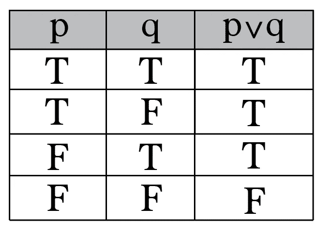

# JavaScript 中的逻辑 OR

> 原文：<https://medium.com/codex/logical-or-in-javascript-8b8e1dbead20?source=collection_archive---------36----------------------->

今天我学习了 JavaScript 中的逻辑 OR。

```
function splitPairs(text) {
return (text + "_").match(/../g) || [];
}
```

如果文本是一个字符串，这个简短的算法会将你的字符串分组为连续的字符串对。如果文本字符串的长度为奇数，则在最后一对的孤独元素上添加一个下划线。

例如:

```
splitPairs("HelloWorld")
```

会回来的

```
["He", "ll", "oW", "or", "ld"]
```

向“HelloWorld”添加一个 s 将返回

```
["He", "ll", "oW", "or", "ld", "s_"]
```

**工作原理**

该代码片段(text + "_ ")只是在文本末尾添加了一个下划线。

匹配部分将返回成对分开的文本列表。

最后一部分最有趣:|| []。

||是一个逻辑或符号。该代码片段旨在处理空白输入字符串的情况，在这种情况下，将返回“[]”而不是空值。

**逻辑 OR 是如何工作的？**

如果您是一名程序员/计算机科学家，在阅读本文时，您应该知道逻辑析取的真值表:



或者真值表

在 JavaScript 中使用逻辑 OR 时，这两个语句都可以称为“falsy”或“truthy”。

如果某个语句看起来像上面的某个语句，则该语句是“虚假的”:

*   空
*   圆盘烤饼
*   不明确的
*   0
*   []
*   ""或" "或`

基本上，一个空的数据结构可以被称为“falsy ”,一个逻辑 OR 操作符会把它归类为 false。

真值语句是任何有价值的数据结构，本质上:

*   [1]
*   50
*   “你好”

等等。

逻辑 OR 函数类似于布尔值的真值。

但是您可能看不到的是，逻辑 OR 将总是返回逻辑 OR 语句中的一个操作数。这意味着当逻辑 OR 运算符与非布尔操作数一起使用时，它将返回一个非布尔值。

那么它会返回什么值呢？

如果两个操作数都为“真”，则运算将返回运算中的第一个操作数**。**

如果一个操作数是“truthy ”,另一个是“falsy ”,则返回“truthy”元素。

最后，如果两个操作数都是‘falsy’，逻辑 OR 运算将返回运算中的第**个第二**个操作数。

**应用**

在页面顶部的 splitPairs()函数中，如果第一个操作数中有任何匹配，则逻辑 OR 的结果将是一个对列表。

但是，如果文本为""，则第一个操作数的计算结果将为" false "，这意味着将返回第二个操作数[]。

这就是为什么编程语言中的逻辑析取通常可以用作 if 语句的替身。如果第一个为真，则返回；否则，返回第二个。

**参考文献:**

[](https://developer.mozilla.org/en-US/docs/Web/JavaScript/Reference/Operators/Logical_OR) [## 逻辑 OR (||) - JavaScript | MDN

### 一组操作数的逻辑 OR (||)运算符(逻辑析取)为真当且仅当它的一个或多个…

developer.mozilla.org](https://developer.mozilla.org/en-US/docs/Web/JavaScript/Reference/Operators/Logical_OR) [](https://js.checkio.org/en/mission/split-pairs/) [## 双人任务。javascript 编码挑战。切克奥

### 将字符串分成两个字符对。如果字符串包含奇数个字符，那么缺少的…

js.checkio.org](https://js.checkio.org/en/mission/split-pairs/)