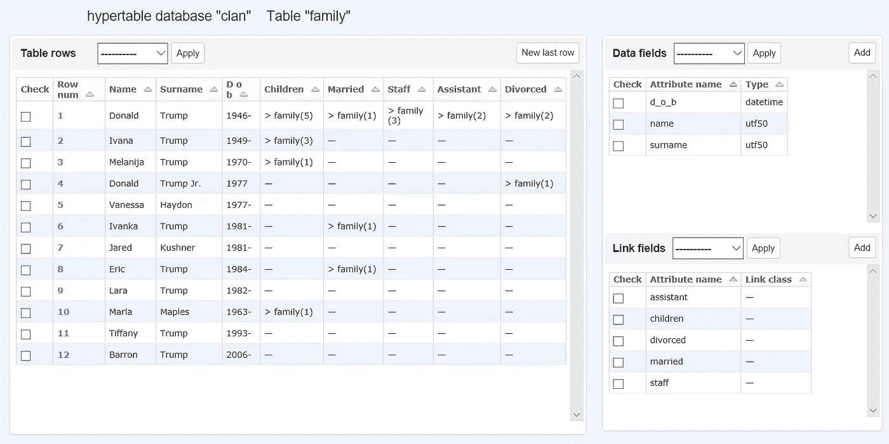

# 数据库“轮询”示例的逻辑表格网络模型——使用 HTMS 进行形式化。第二部分。数据操作、过滤和搜索

> 原文：<https://medium.com/codex/logical-tabular-network-model-of-database-polls-example-formalization-using-htms-634a858252a5?source=collection_archive---------17----------------------->

## 超表格或表格网络数据库——关系数据库和网络数据库概念与 Python 中面向对象编程的交叉点上的新方法

【这是*表格网络数据模型*系列的第 5 部分。点击这里查看所有[帖子的链接。本文提供了 HTMS 的一些类和方法的精简描述。完整描述见程序文档⁴ ⁵]](/@azur06400/tabular-network-data-model-series-f7b8469ed333)



图一。用于表格网络数据库的 HTed web 编辑器的屏幕截图。

## 主 HTMS 映射类

HTMS 逻辑层 API 包含了最重要的 ***Obj_RAM*** 类，用它可以将对象从程序代码映射(转换)到表的行，反之亦然。

每个对象(该类的一个实例)要么对应于某个表中的一行，该表包含其数据类型 HT 属性(DTA)字段的子集(在最简单的情况下，包含数据而不是链接的列，包含整个数据字段集)，要么用于向数据库添加新行。

该类还具有提供筛选和搜索数据的操作的方法。

当初始化具有特定 HT 的类的对象时，必需的参数是:

*   `table` ( *对象*)-ram 中已经存在的特定表( ***表*** object⁴)的实例；

可以另外指定参数`new`:如果“*True”*，则创建一个新的数据库，作为一组文件和一个新的类；如果“*False”*(默认情况下)，则现有数据库“打开”，即打开其文件，并根据其中的信息创建该类的对象实例。

***Obj_RAM*** “行”实例的主要属性有:

*   **id —** 该对象在表中对应的行的物理编号，或者 ***None*** 表示在 RAM 中创建的实例尚未保存为表中的行；
*   **字段** —字典，其中关键字是 HT 属性的名称，值是它们的值；
*   **表名** -符号表名；
*   **HT_Obj_name** -符号 HT 名称。

主要的 **Obj_RAM** 方法有:

1.  **get_from_table** `rows` —所需行的物理编号列表(元组)；如果为空，则选择将在整个表格中继续。`with_fields` —具有用于过滤行的搜索模式的字典。
2.  **get_clone** `()`该方法使用`fields`字典中的`id = ***None***`和“空”属性值在 RAM 中创建一个新实例。
3.  **link_refs** `(link_field='', to_table_objects=())`该方法用于添加(更新)RAM 中“行”对象之间的链接。它为指定的`link_field`(RTA 的符号名)更新对象中的字段值—添加到指定的`to_table_objects`(“rows”实例的元组)表行的链接。
4.  **source** `(source_class=None, only_fields=set(), with_fields={})`获取引用它的对象列表。
5.  **unlink**该方法用于移除(更新)RAM 中“行”对象之间的链接。
6.  使用指定的属性名`link_field`获取该对象引用的对象列表。这用于 HT 中的直接导航。`only_fields`–对象中必须存在的表格的一组字段(列)，`ref_class`–仅从给定表格创建对象列表(如果未指定，则从任何表格)。`ref_class`表格数据属性的名称(非 RTA)，或一组这样的名称。将出现在此方法返回的每个实例中的表数据列集。如果该值是一个空集(默认情况下)，那么将使用所有表数据属性创建对象。
7.  **保存** `()`如果对象具有正确的标识符字段`id`，则将对象保存在表格行中(更新其字段)。如果`id==0 or None`，则新的一行被添加到表中(在末尾)，并且值`id`被设置为等于表行数加 1。

**更新**(2022 年 8 月 12 日)

从 HTMS 第三版(2022 年 8 月)开始，有两种链接:简单的**链接**(在 HTMS 第二版中)和**编号或“加权”链接**。编号(“加权”)链接—是一个简单的链接加上**权重**(实数):三元组(表号、行号、权重)。

新的 **Obj_RAM** 方法(来自 HTMS 版本 3.1):

1.  **权重** `(weight_field =’’, to_table_objects= ())`方法用于添加(更新)内存中对象之间的编号链接(权重)。它为指定的权重字段更新对象中的字段值，并将编号链接添加到表的指定对象(行)中。
2.  **un weight**方法按指定的属性名(带编号链接的表字段)删除 RAM 中指定 Obj_RAM 对象的编号链接。
3.  **weight _ change**方法用于更新 RAM 中对象之间的权重。它为指定的 weight_field 更新对象中字段值中的实数(weight)。
4.  **weight_refs** `(weight_field =’’, only_fields=set(), with_fields={})`使用指定的属性名(权重字段)获取该对象引用的对象列表。这用于 HT 中的导航。

## HTMS 的程序代码示例

**从 JSON 文件开始填充数据库的实用函数** seed() **的例子。**

投票示例的 JSON `samples_file`文件

```
[
    {
        "text": "What is your favorite time of the year?",
        "choices": ["Winter", "Spring", "Summer", "Autumn"]
    },
    {
        "text": "Where do you like to spend your holidays most of all?",
        "choices": ["At home", "While traveling", "In the house of children (parents)"]
    },
    {
        "text": "What programming language do you prefer?",
        "choices": ["C", "C++", "Java", "Python"]
    }
]
```

功能程序代码

```
**import** json
**import** datetime
**def** seed():
    **from** config **import** polls_db, users, polls, answers, comments
          **#** *for polls_db, users, polls, answers, comments
 *         **#** *definitions see* [*previous post*](/codex/hypertable-management-system-htms-for-tabular-network-databases-1e9ef617f0ad)
    samples_path = ""  **#** path to JSON samples_file **#** *reading and filling out a dictionary from JSON file:*
    **with open**(samples_path, "r", encoding="utf-8-sig")
        **as** samples_file:
        samples_polls = json.load(samples_file) **#** *creation of "generic" objects for working with table rows:*
    poll_obj_model =   Obj_RAM(polls)  **#** *polls table*
    answer_obj_model = Obj_RAM(        **#** *answers table*
        answers,
        only_fields={ **#** *object is created with necessary attributes:*
            "answer_text",
            "answer_number",         **#** *serial number*
        },
    ) **#** *creation of the initial database - the «answers« loop* **#***is embedded into the «polls« loop:* **for** sample_poll **in** samples_polls:
        poll_obj = poll_obj_model.get_clone() **#** *temp object for poll* **#** *attributes value are saved:* poll_obj.fields["poll_text"] = sample_poll["text"]
        poll_obj.fields["poll_pub_date"]=
            datetime.datetime.now().strftime("%d.%m.%y %H:%M")
        poll_obj.fields["poll_status"] = **b**"\x01"
             **#** non-zero byte as a sign of poll activity
        poll_obj.save() **#** saved in a new row (after the last)
        n = 1
        answers = ()    **#** temporary tuple of objects with answers
        **for** sample_choice **in** sample_poll["choices"]:
            answer_obj = answer_obj_model.get_clone()
                **#** temporary object for answer
            **#** attributes value are saved:
            answer_obj.fields["answer_text"] = sample_choice
            answer_obj.fields["answer_number"] = n
            answer_obj.save()  **#** the object is saved in a new row
                               **#** (after the last)
            answers += (answer_obj,) 
                **#** tuple of objects with answers is complemented
            n += 1
        **#** write tuples with links the answers into the poll row
        poll_obj.link("poll_answers", answers)
```

**一个函数的例子** get_queryset **创建一个带有轮询的对象列表(queryset 用于基于类的视图)**

```
**def** get_queryset(self):
    poll_obj = Obj_RAM(        **#** *temporary object for poll*
        polls,
        only_fields={"poll_pub_date", "poll_text"},
            **#** *only with the necessary attributes*
    )
    queryset = poll_obj.get_from_table(
        **#** selection from polls of all "active" polls
        with_fields={"poll_status": b"\x01"}
            **#** *with_field "poll_status" filtering*
            **#** *filter is a dictionary, where the keys are*
            **#** *attribute names, and the values* 
            **#** *are the selection conditions* )
    **return** queryset
```

**一个函数的例子** get_queryset **形成一个带有轮询答案的对象列表**

```
**def** get_queryset(self):
    answer_obj = Obj_RAM(answers,
        only_fields={"answer_text", "answer_number"}
    )
    poll_obj = Obj_RAM(only_fields={"poll_head"})
    poll = poll_obj.get_from_table(
        **#** *method get_from_table here is used to display* **#***only one row of the desired poll by its physical number* **#***passed via "pk" argument from Django URL*
        int(self.kwargs["pk"])
    )
    **if** poll == []:
        **return** []
    poll = poll[0]
    queryset = poll.ref(  **#** *get objects through the links from RTA* **#** *‘poll_answers’*
        "poll_answers",
        only_fields={"answer_text", "answer_number"},
            **#** *only with the necessary attributes*
    )
    **return** queryset
```

**一个函数的例子** get_queryset **用投票结果创建一个对象列表**

```
**def** get_queryset(self):
    answer_obj = Obj_RAM(
        answers,
        only_fields={"answer_text", "answer_number"}
    )
    poll_obj = Obj_RAM(polls, only_fields={"poll_head"})
    poll = poll_obj.get_from_table(**int**(self.kwargs["pk"]))[0]
    queryset = poll.ref(
        "poll_answers",
        only_fields={
            "answer_text", 
            "answer_number", 
            "answer_votes"
        },
        ref_class=Answers,
    )
    **#** *calculation of the sum of all votes cast for the poll:* votes = 0
    **for** choice **in** queryset:
        votes += (choice.fields["answer_votes"]
            **if** choice.fields["answer_votes"] != None
            **else** 0
        ) **#** *calculation of the percentage of votes for answers in percent:* **for** choice **in** queryset:
        choice.percent = **str**(
            choice.fields["answer_votes"]/**float**(votes)*100
            **if** choice.fields["answer_votes"] != **None** **and** votes > 0
            **else** 0
        )[:5]                **#** *show no more than 3 decimal places* **return** queryset
```

**用于将投票结果保存在数据库中的函数** vote **的示例(通过 Django 投票表单中的 URL 调用)**

```
**def** vote(request, poll_id):
    **from** config **import**  my_db, users, polls, answers, comments
    poll_obj = Obj_RAM( polls, only_fields={"poll_text"})
    poll = poll_obj.get_from_table(rows=**int**(poll_id))[0]
    answer_obj = Obj_RAM(answers, only_fields={"answer_votes"})
    **try**:
        selected_choice = answer_obj.get_from_table( 
            **#** *the number (id) of the user selected answer* rows=**int**(request.POST["choice"])
            **#** is retrieved from the Django form
        )[0]
    **except** (KeyError):
        **#** *if the user has not made a choice* **#** *(i.e., the choice field in the form is not defined)* queryset = poll.ref(
            **#** *poll form with answers is reloaded* "poll_answers",
            only_fields={"answer_text", "answer_number"},
            ref_class=Answers,
        )                  
        for choice in queryset:
            choice.number = choice.id
            choice.text = choice.fields[ 'answer_text' ]
        **return** render(
            request,
            "….html",
            {
                "poll_text": poll.fields["poll_ text"],
                "poll_id": poll.id, 
                    **#** *"id" - an automatically generated attribute*
                    **#** *of the object with the physical number of*
                    **#** *the corresponding table row* "choices": queryset,
                "warning_message": "Please choose one answer",
            }
        )
    **else**:
        **#** *check that the user has already voted on this poll:* user_obj = Obj_RAM(users, only_fields="user_name")
        user_id = request.session["user_id"]
            **#** *"user_id - the username in the Django Admin* 
            **#** *session dictionary* user = user_obj.get_from_table(user_id)[0]
        all_user_choices = user.ref(
            "user_answers",
            only_fields={"answer_votes"},
            ref_class=Answers
        )
        all_poll_choices = poll.ref(
            "poll_answers",
            only_fields={"answer_number"},
            ref_class=Answers
        )
        **if** all_user_choices != [] **and** all_poll_choices != []:
            all_user_choices_ids = \
                {user_choice.id **for** user_choice **in** all_user_choices}
            all_poll_choices_ids = \
                {poll_choice.id **for** poll_choice **in** all_poll_choices}
            **if** (all_poll_choices_ids **and** \
                all_user_choices_ids) **!=** **set**():
                **#** *already voted* **return** render(
                    request,
                    "….html",
                    {
                        "poll_text": poll.fields["poll_ text"],
                        "error_message": "You have already voted !",
                    }
                ) **#** *did not vote - add a link and increase the counter*:
        user.link( "user_answers",(selected_choice,))
        **if** selected_choice.fields["answer_votes"] **==** **None**:
            selected_choice.fields["answer_votes"] = 1
        **else**:
            selected_choice.fields["answer_votes"] += 1
        comment_text = request.POST.get("comment")
        **#**  *add comment if available*
        **if** comment_text **!=** "":
            new_comment = Obj_RAM(comments).get_clone()
            new_comment.fields["comment_text"] = comment_text
            new_comment.save()
            selected_choice.link(
                "answer_comments",
                (new_comment,)
            )
            user.link("user_comments",(new_comment,))
        user.save()
        selected_choice.save()
        **return** HttpResponseRedirect(
            reverse("…", args=(poll_id, selected_choice.id))
        )
```

我计划继续撰写关于表格网络数据模型和我的 HTMS 实现的文章。

本文授权文本: [CC BY-NC-ND 4.0](https://creativecommons.org/licenses/by-nc-nd/4.0/)

所示代码的许可: [CC BY-NC-SA 4.0](https://creativecommons.org/licenses/by-nc-sa/4.0/)

# 引文

[1]: *笼式系统。*github.com/Arselon/Cage

HTMS。[github.com/Arselon/HTMS](https://github.com/Arselon/HTMS)

[3]: *HTMS 对象级别*。[github.com/Arselon/HTMS/tree/main/htms_obj](https://github.com/Arselon/HTMS/tree/main/htms_obj)

【4】:*HTMS 中层。[github.com/Arselon/HTMS/tree/main/htms_mid](https://github.com/Arselon/HTMS/tree/main/htms_mid)T21*

【5】:*HTMS 低水平。*[github.com/Arselon/HTMS/tree/main/htms_low](https://github.com/Arselon/HTMS/tree/main/htms_low)