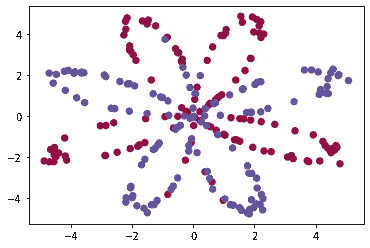
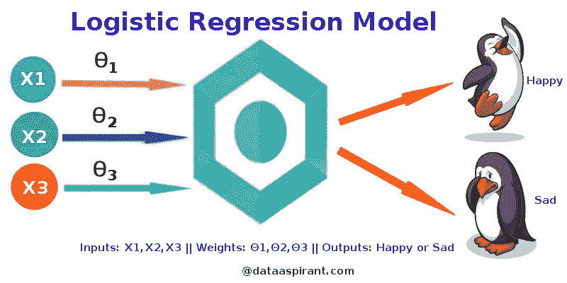
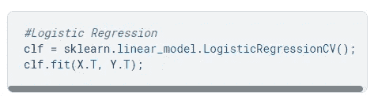
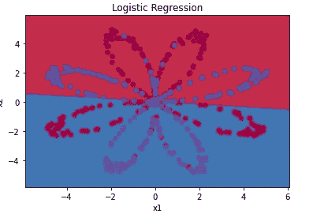
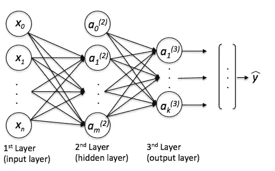
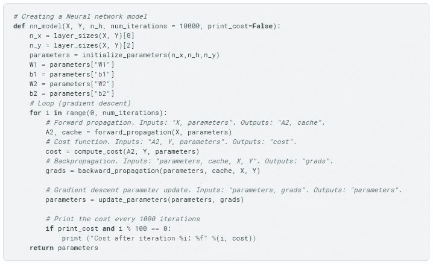
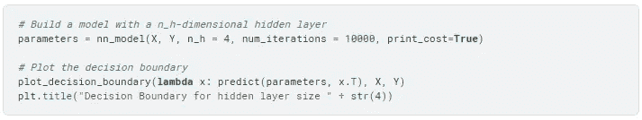
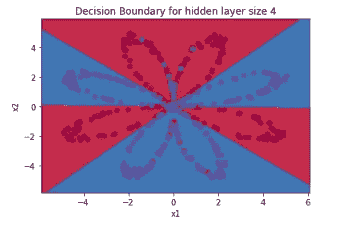

# 逻辑分类器与神经网络

> 原文：<https://medium.com/codex/logistic-classifier-vs-neural-network-121f27b5b5e3?source=collection_archive---------14----------------------->

我正在学习分类器，看到一篇文章强调了神经网络形成复杂决策边界的能力，并对逻辑分类器做得不好的数据进行分类。了解数据集类型的相似性和差异以及它们的“舒适区”非常有趣。

我用 [*planar 的‘花’2 类数据集*](https://planar-utils.readthedocs.io/en/latest/rst/dataset.html) 做了同样的尝试。

Planar 的“花”数据集

数据集不容易进行线性*分离，因此为这种比较提供了良好的输入。首先，使用逻辑分类器对数据进行分类，然后使用单层神经网络进行分类。*

*您可以在这里*查看 [*代码*](https://github.com/viccaay/Blog-codes/blob/main/Logistic_Reg_vs_NN.ipynb) *。*

说到数据集，有 **500 个**示例，其中 **250 个**属于**‘蓝色’类**，而 **250 个**示例属于**‘红色’类**。 *X* 是形状的二维列表/数组**【2500】**。行代表 *x* 和 *y* 坐标，它有 500 列(代表示例)。

X 输入的形状

*Y* 形状为**【1500】**。代表数据的标签( ***红色:0，蓝色:1*** )。

Y 形标签的形状

# 逻辑分类器:

逻辑分类器是一个没有隐藏层的神经网络，使用 T42 激活函数。使用在输出节点使用的激活函数(例如 sigmoid 函数),逻辑分类器的输出可以与输入相关。因此*对于具有线性关系的数据和输出非常有效，但是对于非线性相关的数据*却不能。

Logistic 回归模型(来源:[http://data aspirant . com/2017/03/02/how-logistic-Regression-Model-works/](http://dataaspirant.com/2017/03/02/how-logistic-regression-model-works/))

为了展示这一点，我从 *sklearn* 库中导入了 *LogisticRegressionCV* ，并将数据(X 和 Y)放入其中。

基于分类器的输出绘制决策边界。

使用逻辑分类器的决策边界

输出的**精度**为 **46%** 。我们可以看到，该模型在这个数据集上表现不佳。

逻辑分类器通常用于对分类数据进行二元分类。

[*你可以在这里阅读更多关于逻辑量词*](https://towardsdatascience.com/logistic-regression-detailed-overview-46c4da4303bc) 。

我们可以看到，需要一个更“复杂”的边界来对数据进行分类。为此，我们使用逻辑分类器的超集，即神经网络。

# 神经网络:

神经网络可以发现大多数模型无法识别的数据之间的潜在关系。节点处使用的非线性激活函数允许神经网络找到数据之间的复杂关系。

只有一个隐藏层的简单神经网络。来源:[https://sebastianraschka . com/FAQ/docs/logisticregr-neural net . html](https://sebastianraschka.com/faq/docs/logisticregr-neuralnet.html)

在这种情况下，我用**一个隐层**构建了一个神经网络，因此总共有三层，**一个**输入层，一个隐层和一个输出层。输入层的节点没有任何关联的激活函数。隐藏层中的节点具有' **tanh** 激活功能，输出节点具有' **sigmoid** 激活功能。

[*你可以在这里阅读更多关于神经网络的内容*](https://www.analyticsvidhya.com/blog/2021/05/beginners-guide-to-artificial-neural-network/) 。

一个简单的神经网络

数据适合简单的神经网络。迭代 *10000* 次，以减少*成本/损失*。

来自神经网络的决策边界能够更准确地分类。**准确度分数**为 ***93* %** 相当可观。

使用神经网络的分类

这是神经网络的许多应用之一。神经网络由于其逼近非线性数据的能力而成为从业者的普遍选择，而非线性数据是许多“真实”世界问题的特征。诸如自然语言处理、视觉识别、自动驾驶、欺诈检测、游戏等任务使用复杂的神经网络。

谢谢你的阅读。希望这是有益的。让我知道你对此的想法。日安！