# 逻辑回归

> 原文：<https://medium.com/codex/logistic-regression-577585504e3c?source=collection_archive---------10----------------------->

逻辑回归是一种常用的分类模型。在这个模型中，因变量或目标值是一个离散的二进制值，即 1 或 0 表示通过或失败，赢或输，真或假。


照片由[福蒂斯·福托普洛斯](https://unsplash.com/@ffstop?utm_source=medium&utm_medium=referral)在 [Unsplash](https://unsplash.com?utm_source=medium&utm_medium=referral) 拍摄

虽然它是一个分类模型，但术语回归在其名称中表明该模型的工作方式类似于预测建模的回归。我们不是拟合回归线(就像线性回归一样)，而是拟合一条“S”曲线，称为***S 形曲线*** ，它预测两个值 0 或 1。这条“S”曲线表示事件的 ***最大可能性*** 。

# 逻辑回归方程

我们将从直线方程推导出逻辑斯谛方程。假设有两个特征 x1 和 x2，那么特征和目标值之间的线性关系将是`y = Ax1 + Bx2 + C`，但是这里 y 的范围是负无穷大到无穷大。

对于逻辑回归，我们需要 y 为 0 或 1，因此我们将方程操作为`y/(1-y)`，现在范围为 0 到无穷大。为了使范围为 0 到 1，我们取对数，所需的逻辑方程由`log(y/(1-y))`给出

# SIGMOID 概率

目标 y 的概率被限制为 0 或 1，这被称为 sigmoid 概率。数学上，

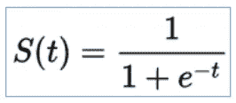

sigmoid 概率

*   这里的“t”是数据值，即特征“X”的值
*   S(t)代表为真或为假的概率，即因变量“Y”的值

这个数学函数给出了一个“S”曲线，其有限极限为 0 到 1，当“t”接近***-无穷大*** 时为 0，当“t”接近***+无穷大*** 时为 1

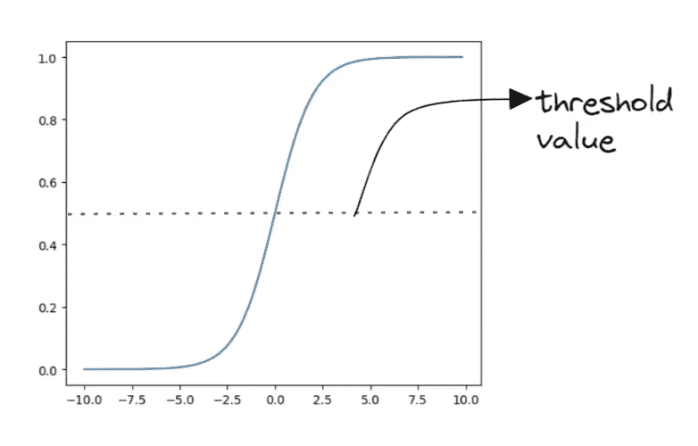

给出值 0 或 1 的 sigmoid 函数

# 混淆矩阵

混淆矩阵是用于评估分类模型性能的矩阵，该矩阵将目标变量的预测值与其实际值进行比较。

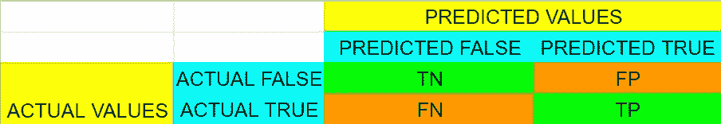

混淆矩阵

*   TN:真阴性(预测正确的实际错误数)
*   TP:真阳性(预测正确的实际真值的数量)
*   FN:假阴性(实际为真的预测假的数量)
*   FP:假阳性(预测为真，实际为假的数量)

# 混淆矩阵的重要性

混淆矩阵用于确定一些重要的衡量标准，如准确度、精确度、召回率/敏感度和 f-1 分数。

> **精度**

它只是表示模型预测目标值的准确程度，由以下公式给出:

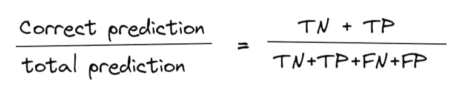

> **精度**

它指的是预测中达到的正确性，它只是告诉我们总预测阳性中的实际阳性，它由以下公式给出:

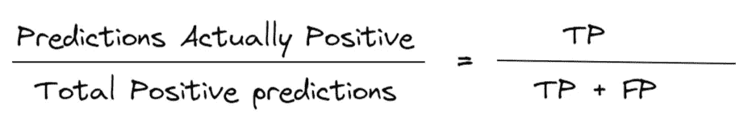

> **回忆**

它通过确定有多少实际阳性被正确预测来告诉我们模型的敏感性，其计算方法如下:

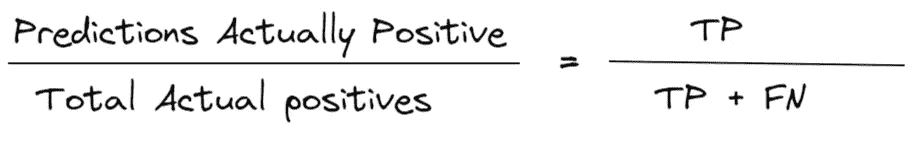

> **F-1 得分**

它有助于我们同时评估召回率和精确度来比较两个模型，它的计算方法是:

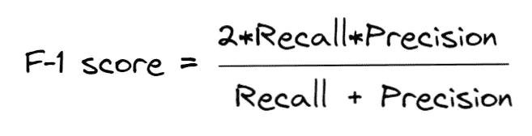

# PYTHON 中的逻辑回归

我们将使用 Scikit Learn 库在取自[kaggle.com](https://www.kaggle.com/)的[泰坦尼克号数据集](https://www.kaggle.com/competitions/titanic/data?select=train.csv)上实现逻辑回归和混淆矩阵。在本例中，我们使用了 train.csv 数据集。

*   导入所有必需的库

```
import numpy as np
import pandas as pd
from sklearn.linear_model import LogisticRegression
from sklearn.metrics import accuracy_score,precision_score
from sklearn.metrics import recall_score,confusion_matrix
from sklearn.model_selection import train_test_split as tts
```

*   读取数据

```
data=pd.read_csv("./titanic.csv")
print(data.shape)
```

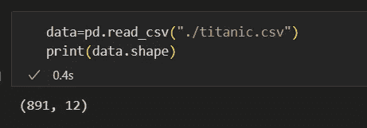

```
data.head(5)
```

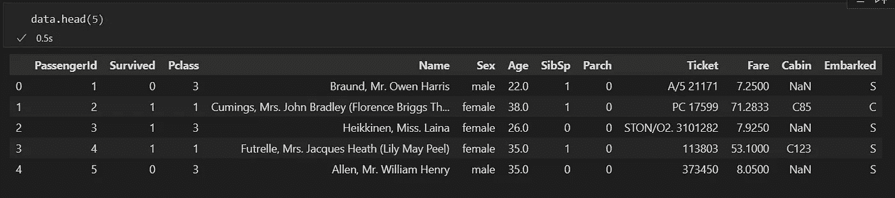

```
data.describe()
```

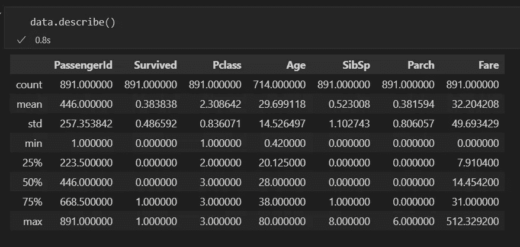

```
data.Survived.value_counts()
# count the number of survivors
```

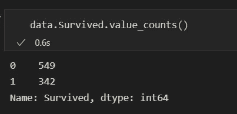

*   数据清理(在本例中，我们没有执行大范围的数据清理)

```
#considering only important fields
columns=['Pclass','Survived','Sex','Fare','Age']
data=data[columns]
data.head()
```

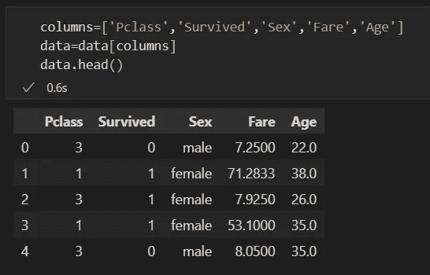

```
#returning true at the places where null values are present
print(data.isnull())
```

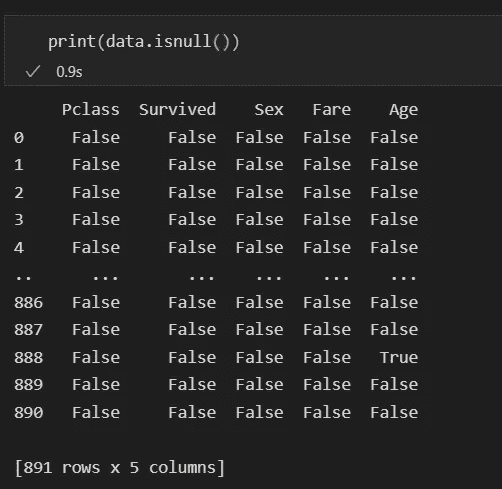

```
#removing null data points from the dataset
data.dropna(axis=0,how='any',inplace=True)
#we can see that the data points are reduced because null data points are removed
```

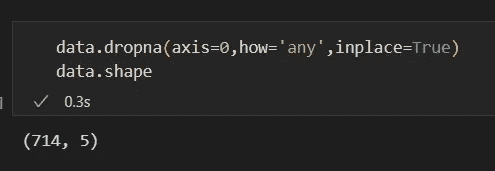

*   分割数据用于训练和进行预测

```
#splitting the target column and the features
X=data[['Pclass','Fare','Age']]
Y=data['Survived']#splitting the data for training the model
x_train,x_test,y_train,y_test=tts(X,Y,test_size=0.2,random_state=42)print(x_train.shape)
print(x_test.shape)
print(y_train.shape)
print(y_test.shape)
```

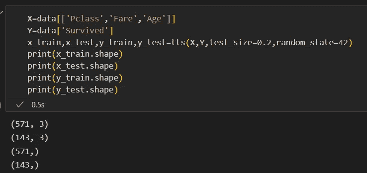

*   训练模型并预测目标值

```
model=LogisticRegression()
model.fit(x_train,y_train)predicted_y = model.predict(x_test)
print(predicted_y.shape)
```

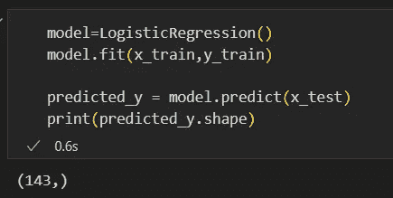

*   使用混淆矩阵测量准确度、精确度、召回率和 F-1 分数

```
c_matrix=confusion_matrix(y_test,predicted_y)
print(c_matrix)
```

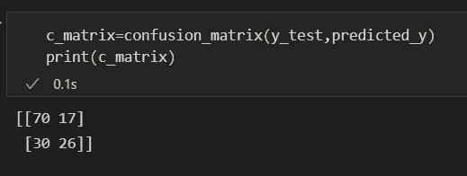

```
print("True Negtive = ",c_matrix[0][0])
print("False Positive = ",c_matrix[0][1])
print("False Negtive = ",c_matrix[1][0])
print("True Positive = ",c_matrix[1][1])
```

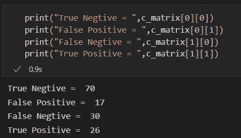

```
print(accuracy_score(y_test,predicted_y))print(precision_score(y_test,predicted_y))print(recall_score(y_test,predicted_y))
```

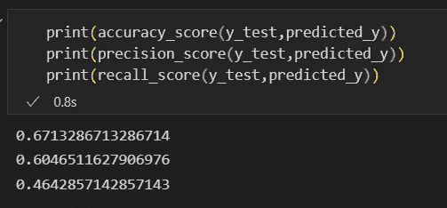

*   您可以通过使用上述公式手动计算所有这些度量来验证这些度量。度量的接受是基于需求的，例如，我们可以为每个度量设置一个阈值，如果该度量给出了所需的值，则模型被接受。

# 逻辑回归用例

我们可以在目标可以分为两类的所有场景中使用逻辑回归，例如

*   垃圾邮件检测
*   贷款许可
*   考试结果预测
*   灾难中的幸存

在所有这些情况下，结果是二进制(0，1)，例如对于垃圾邮件检测系统，实体将是垃圾邮件或者不是垃圾邮件；对于贷款审批，银行要么批准贷款，要么不批准贷款；对于生存预测，这个人要么生存要么死亡。

> 我希望你们都明白什么是逻辑回归，以及我们如何衡量模型的准确性。
> 
> 并保持联系以了解更多关于机器学习的信息。