# 逻辑回归和最大似然估计函数

> 原文：<https://medium.com/codex/logistic-regression-and-maximum-likelihood-estimation-function-5d8d998245f9?source=collection_archive---------3----------------------->

约翰尼斯·格罗尔在 [Unsplash](https://unsplash.com?utm_source=medium&utm_medium=referral) 上的照片

在本文中，我试图以最简单的方式解释逻辑回归算法及其背后的数学原理。

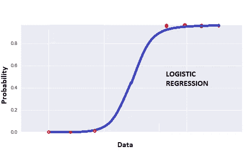

代表二项式分类的 Sigmoid 曲线

逻辑回归是机器学习的分类算法，其中输出变量是分类的。它属于监督学习方法，其中使用带有标签的过去数据来建立机器学习模型。

为什么叫逻辑回归而不是逻辑分类？实质上，逻辑回归模型输出与预测变量具有线性关系的概率(或 logit 形式的对数优势比)。当您将阈值附加到这些概率值时，它会将结果分类为 1 或 0(二项式逻辑回归)。因此，即使逻辑回归是一种分类算法，它也有回归这个词。

上图所示的 S 形曲线是一条 S 形曲线。逻辑回归函数也称为 sigmoid 函数。逻辑回归函数的表达式为:

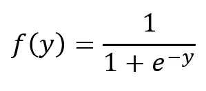

逻辑回归函数

其中:

**y = β0 + β1x(单变量 Logistic 回归情况下**

**y = β0 + β1x1 + β2x2 … +βnxn** (多元逻辑回归情况下)

单变量逻辑回归意味着仅使用一个预测变量预测输出变量，而多变量逻辑回归意味着使用多个预测变量预测输出变量。

逻辑回归函数将 **logits** 也称为 **log-odds** 的值从**∞到+∞** 转换为介于 **0 和 1** 之间的范围。

现在让我们试着简化我们所说的。设 **P** 为事件发生的概率。所以事件不会发生的概率是 **1-P.**

**几率**定义为某一特定事件发生的概率与该事件不发生的概率之比。

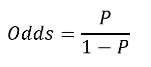

赔率表达式

我们知道逻辑回归函数给我们概率值。所以我们可以写:

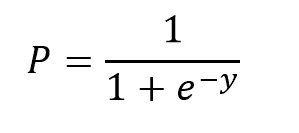

逻辑回归函数的简化表达式

现在既然我们提到了**对数赔率**，让我们取**赔率**等式两边的自然对数，代入 **P.** 的值

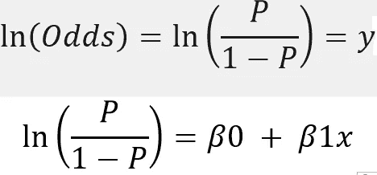

因此，我们得到了更简化形式的逻辑回归函数方程，并且我们可以说**对数优势**与预测变量 **x** 具有线性关系。

**为什么逻辑回归优于线性回归？**

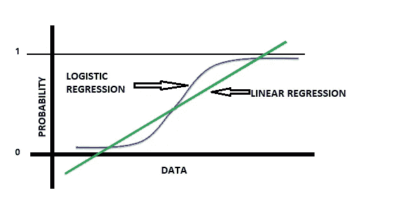

逻辑回归和线性回归的区别

当涉及二项式分类(0/1)时，我们需要在被分类为 0 或 1 的值之间创建一个边界。在线性回归中，我们知道输出是一个连续变量，所以画一条直线来创建这个边界似乎是不可行的，因为值可能从∞到+∞。

由于逻辑回归模型使用 sigmoid 函数输出概率，可以映射到 0 或 1，因此在分类的情况下，它优于线性回归。

如果你想知道更多关于线性回归的工作原理，可以看看我写的关于线性回归的文章。

 [## 线性回归——简单举例说明！！

### 我试图用最简单的方法和例子来解释线性回归。

medium.com](/mlearning-ai/linear-regression-simple-explanation-with-example-fba51b2c181d)  [## 线性回归背后的数学。

### 在本文中，我将尽可能简单地解释与线性回归相关的各种数学概念…

medium.com](/mlearning-ai/the-mathematics-behind-linear-regression-fb4db1ebd7b5) 

# 最大似然估计

为了让我们的模型预测输出变量为 0 或 1，我们需要找到最佳拟合的 sigmoid 曲线，该曲线给出β系数的最佳值。也就是说，我们需要在 0 和 1 值之间创建一个有效的边界。

现在一个成本函数告诉你你的值和实际值有多接近。因此，这里我们需要一个成本函数，最大化获得期望输出值的可能性。这样的代价函数被称为**最大似然估计(MLE)** 函数。

让这个代价函数表示为 P(Y；z)。我们有一些由 **Y** 表示的样本数据点。所以 **Y** 代表‘n’个观察值，比如 Y1，Y2…yn。我们需要找到这个未知参数 **z，**，使得观察到 **Y** 的概率最大化。 **z** 是决定变量取值为 0 还是 1 的偏差。

记住这是一个监督学习算法。所以我们会有实际观测值和预测观测值。我们的成本函数应该使预测值接近实际值的概率最大化。

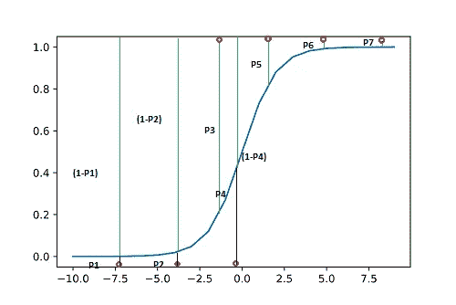

Sigmoid 曲线和概率

从上图中，我们可以看到被分类为 0 或 1 的点以及与它们相关联的各自的概率。从 P1 到 P7 有 7 个点和 7 个相关概率。

为了正确分类，对于 0 分，我们需要 P1、P2 和 P4 的概率尽可能小，对于 1 分，我们需要 P3、P5、P6 和 P7 的概率尽可能高。我们也可以说，(1-P1)，(1-P2)，P3，(1-P4)，P5，P6，P7 应该尽可能的高。

联合概率只不过是概率的乘积。所以乘积:[**(1-P1)*(1-P2)* P3 *(1-P4)* P5 * P6 * P7]**应该是最大值。

这个联合概率函数只不过是我们的成本函数，为了得到最佳拟合的 sigmoid 曲线，应该将它最大化。或者我们可以说预测值接近实际值。

现在来看我们的成本函数，让 **J(z)** 是 **z** 的函数，使得

**J(z)= P(Y；z) = P(Y1，Y2…Yn；z)**

这里的假设是所有的 Y 都是独立的。

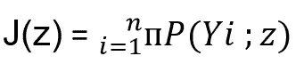

成本函数是所有概率 P(Yi)的乘积

两面取自然原木:

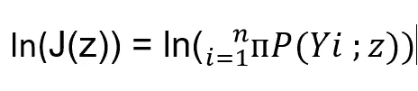

记录两边的日志

因为乘积的对数变成总和:

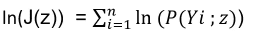

乘积的对数是总和

J(z)也可以写成 L(z|Yi) (L 为似然)。对于给定值 **z** 和观察样本 Yi，该函数给出观察样本值的概率。因此，如果 Yi=1，表达式变为 **z** ，如果 Yi 为 0，表达式变为 **1-z** :

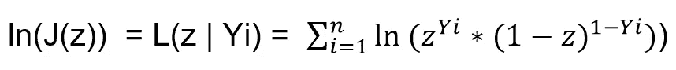

进一步解这个方程，我们得到:

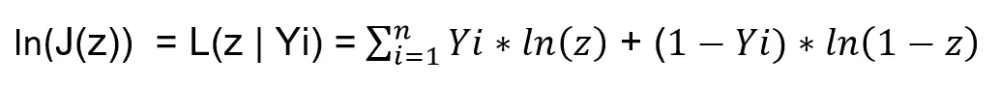

将该方程相对于 **z** 进行微分并将导数设置为零，我们使用封闭形式的解计算最大值:

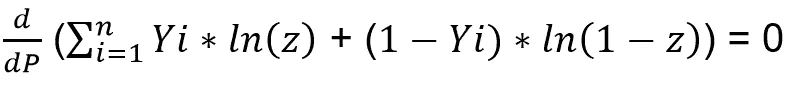

进一步求解，这个方程变成:

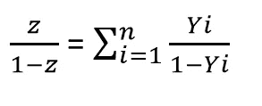

右边的项表示 1 的数量与 0 的数量之比。因此，该函数在以下情况下达到最大值:

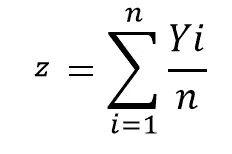

希望你喜欢阅读这篇文章。请随意评论并给出您的反馈。

*参考文献:*

1.  [*https://faculty . Washington . edu/ezivot/econ 583/mle lectures . pdf*](https://faculty.washington.edu/ezivot/econ583/mleLectures.pdf)
2.  [*https://stats . stack exchange . com/questions/127042/why-nots-logistic-regression-called-logistic-class ification*](https://stats.stackexchange.com/questions/127042/why-isnt-logistic-regression-called-logistic-classification)

***可以在 LinkedIn 上联系我:***[***https://www.linkedin.com/in/pathakpuja/***](https://www.linkedin.com/in/pathakpuja/)

***请访问我的 GitHub 简介获取 python 代码:***[***https://github.com/pujappathak***](https://github.com/pujappathak)