# 逻辑回归

> 原文：<https://medium.com/codex/logistic-regression-eee2fd028ffd?source=collection_archive---------2----------------------->


学完回归的基础，就该学分类的基础了。还有什么比逻辑回归更简单的呢！

建议您在开始本教程之前，先阅读本 [**线性回归教程**](/codex/linear-regression-on-single-variable-f35e6a73dab6) 。这是线性回归的完整指南，逻辑回归使用了几个与线性回归相关的思想。说完了，我们开始吧！

## 什么是逻辑回归？

这是一种分类算法，适用于输出变量为*分类*的情况。逻辑回归的目标是发现特征和特定结果的概率之间的关系。

举个例子，

邮件:垃圾邮件/不是垃圾邮件？

在线交易:欺诈(是/否)

这里，

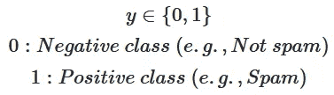

在这篇文章中，我们将建立一个逻辑回归模型来预测一个学生是否被大学录取。

## 为什么是逻辑回归，而不是线性？

在简单线性回归中，将所有数据绘制到一个图表(x 和 y)上，将所有数据拟合到一条最佳拟合线，然后将输入预测为相应的 y。另一方面，逻辑回归将所有数据拟合到一条 S 曲线，只有两种可能的输出(两种分类)，分别表示为顶线和底线。

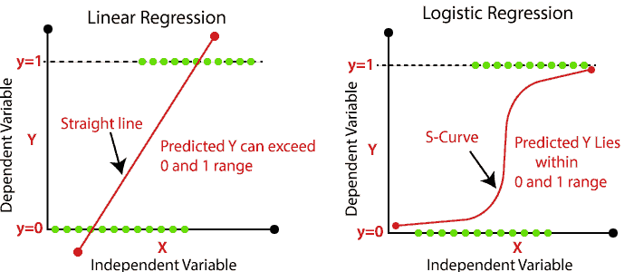

线性和逻辑回归

## Sigmoid 函数

S 曲线不是指字母 S 的形状；相反，它代表的是乙状结肠函数。这是因为 sigmoid 函数完全符合我们将数据分为两组的目的。sigmoid 公式如下，其中 x 是输入的数量。

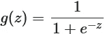

乙状结肠的

在英语中，sigmoid 只是基于输入要素的加权和的概率计算。加权和的公式如下:

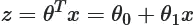

在编写 sigmoid 函数之前，让我们初始化数据集。

```
import numpy as np
import pandas as pd
import matplotlib.pyplot as pltdata = pd.read_csv("ex2data1.txt", header=None)
data.head()
```

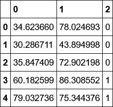

data.head()

这里“0”代表学生在 1ˢᵗ考试中的分数，“1”代表学生在 2ⁿᵈ考试中的分数，“2”代表学生是否被录取(1)或不被录取(0)。

让我们将数据可视化，

```
X = data.values[:, :-1]
y = data.values[:, -1]pos, neg = (y==1).reshape(100, 1), (y==0).reshape(100, 1)plt.scatter(X[pos[:, 0], 0], X[pos[:, 0], 1], c='r', marker='+', label="Admitted")
plt.scatter(X[neg[:, 0], 0], X[neg[:, 0], 1], marker='o', label="Not Admitted", s=10)
plt.xlabel("Exam1 Score")
plt.ylabel("Exam2 Score")
plt.legend(loc=0)
```

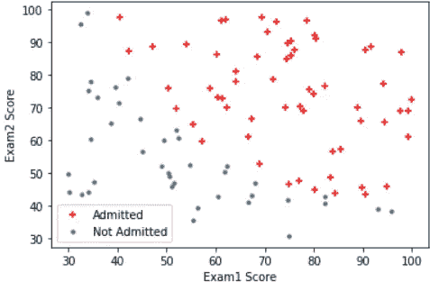

在逻辑回归的情况下，假设(h)由以下等式表示:


假设

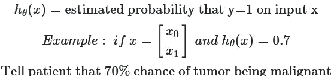

假设的图示:

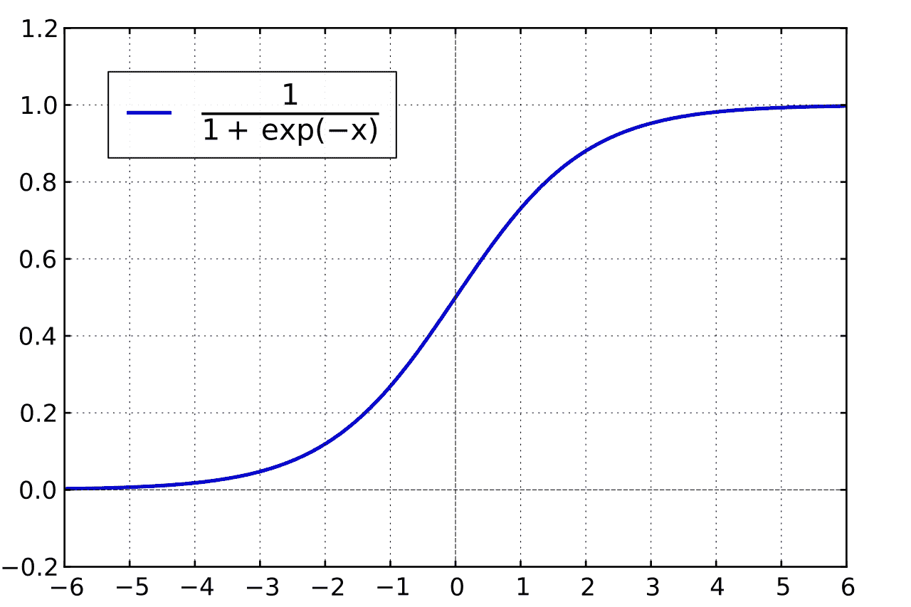

假设

```
def sigmoid(z):
    return 1 / (1 + np.exp(-z))print(sigmoid(0))
print(sigmoid(10))
print(sigmoid(1))
```

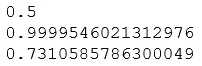

Sigmoid 结果

从上面的数字我们可以看出，

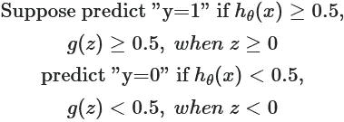

## 逻辑回归决策边界

由于我们的数据集有两个特征:test1 和 test2，逻辑回归假设如下:

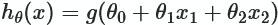

逻辑回归分类器将预测“入院”,如果:

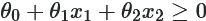

这是因为逻辑回归“*阈值*被设置为 g(z)=0.5，请参见上面的逻辑回归函数图进行验证。

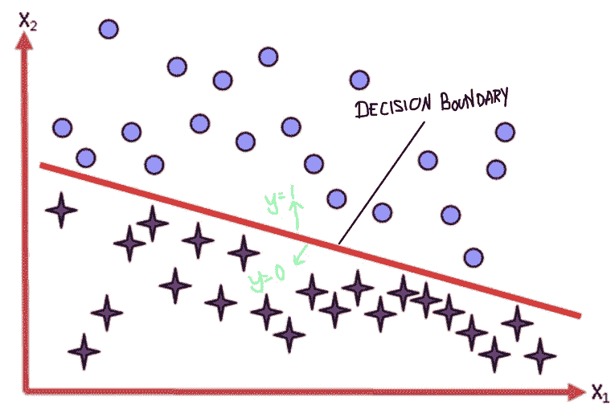

## 价值函数


记号

我们先来定义两个兴趣点的 logistic 回归代价函数:y=1，y=0，也就是假设函数预测录取或不录取时，

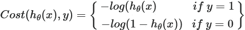

简化的成本函数如下:

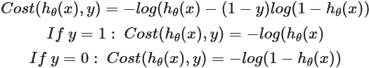

然后，我们在这两项的 **y** 中取一个凸组合，得出逻辑回归成本函数:

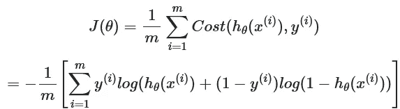

```
def Costfunction(X, y, theta):
    m=len(y)

    h_theta = sigmoid(X@theta)
    y_pos = -y.T @ np.log(h_theta)
    y_neg = (1-y).T @ np.log(1-h_theta)
    error = y_pos - y_neg

    cost = 1/m * sum(error)
    grad = 1/m * (X.T@(h_theta - y))

    return cost[0] , grad
```

在使用数据计算成本之前，我们应该将我们的数据标准化(要了解更多关于标准化的信息 [***点击此处***](/codex/linear-regression-on-multiple-variables-1893e4d940b1) ***)。*** )

```
def featureNormalization(X):
    mu = np.mean(X, axis=0)
    sigma = np.std(X, axis=0)
    X_Norm = (X - mu)/sigma
    return X_Norm, mu, sigmam, n = X.shape
X, mu, sigma = featureNormalization(X)
X = np.column_stack((np.ones((m, 1)), X))
y = y.reshape(m, 1)initial_theta = np.zeros((n+1, 1))
cost, grad= Costfunction(X, y, initial_theta)
print("Cost of initial theta is", cost)
print("Gradient at initial theta (zeros):", grad)
```

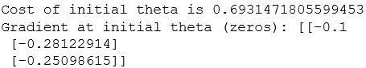

## 梯度下降

逻辑回归的梯度下降算法看起来与线性回归的梯度下降算法相同。对于梯度下降的情况，搜索方向是逻辑回归成本函数相对于参数θ的负偏导数。在其最基本的形式中，梯度下降将沿着θ的负梯度方向迭代(称为*最小化序列*)，直到达到收敛。

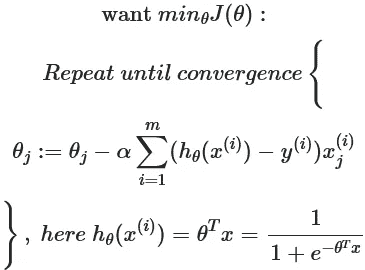

```
def gradientDescent(X, y, theta, alpha, n_iters):
    m=len(y)
    J_history =[]

    for i in range(n_iters):
        cost, grad = Costfunction(X, y, theta)
        theta = theta - (alpha * grad)
        J_history.append(cost)
    return theta, J_historytheta, J_history = gradientDescent(X=X, y=y, theta=initial_theta, alpha=1, n_iters=400)
```

## 绘制决策边界

这里，决策边界如下:

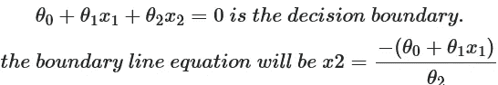

```
plt.scatter(X[pos[:,0],1],X[pos[:,0],2],c="r",marker="+",label="Admitted")
plt.scatter(X[neg[:,0],1],X[neg[:,0],2],c="b",marker="x",label="Not admitted")
x_value = np.array([np.min(X[:,1]),np.max(X[:,1])])
y_value = -(theta[0] +theta[1]*x_value)/theta[2]
plt.plot(x_value,y_value, "r")
plt.xlabel("Exam 1 score")
plt.ylabel("Exam 2 score")
plt.legend(loc=0)
```

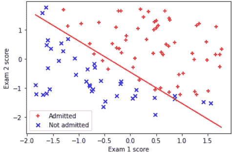

## 预言

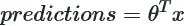

```
x_sample = np.array([45, 85])
x_sample = featureNormalization(x_sample)[0]
x_sample = np.append(np.ones(1), x_sample)
prob = sigmoid(x_sample.dot(theta))
print("For a student with scores 45 and 85, we predict an admission probability of ",prob[0])
```

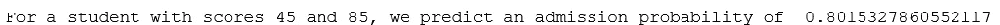

从上面的输出可以看出，45 分和 85 分的学生有 80%的概率被大学录取。

```
def predict(X, theta):
    p = sigmoid(X@theta) >= 0.37#select your own threshold
    return p
```

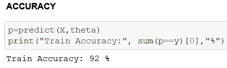

## 结论

今天，我们看到了逻辑回归的假设、成本函数和梯度下降背后的概念。然后用 python 的 numpy，pandas 和 matplotlib 从头开始创建。数据集和最终代码上传到 github。

查看这里[逻辑回归](https://github.com/jagajith23/Andrew-Ng-s-Machine-Learning-in-Python/tree/gh-pages/Logistic%20Regression)。

# 如果你喜欢这篇文章，那么看看我在这个系列中的其他文章

## 1.[什么是机器学习？](/@jagajith23/what-is-machine-learning-daeac9a2ceca)

## 2.[机器学习有哪些类型？](/codex/what-are-the-types-of-machine-learning-53360b7db8b4)

## 3.[一元线性回归](/codex/linear-regression-on-single-variable-f35e6a73dab6)

## 4.[多元线性回归](/codex/linear-regression-on-multiple-variables-1893e4d940b1)

## 5.[什么是神经网络？](/@jagajith23/what-are-neural-networks-3a0965e2ebfb)

## 6.[使用神经网络的数字分类器](/@jagajith23/digit-classifier-using-neural-networks-ad17749a8f00)

## 7.[利用 K 均值聚类进行图像压缩](/@jagajith23/image-compression-with-k-means-clustering-48e989055729)

## 8.[使用 PCA 对人脸进行降维](/@jagajith23/dimensionality-reduction-on-face-using-pca-e3fec3bb4cee)

## 9.[使用异常检测来检测网络上的故障服务器](https://jagajith23.medium.com/detect-failing-servers-on-a-network-using-anomaly-detection-1c447bc8a46a)

# 最后做的事

*如果你喜欢我的文章，鼓掌👏一个追随者将是绝对的坏蛋和*这是有益的媒体推广这篇文章，使其他人可以阅读它*。我是 Jagajith，我会在下一个里抓住你。*