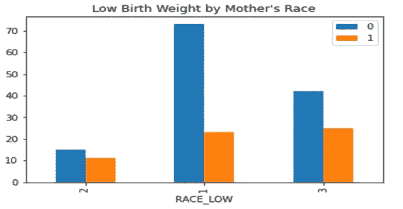
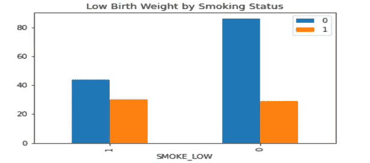
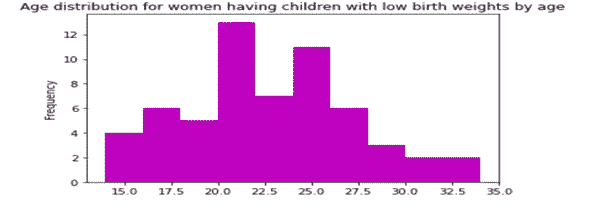
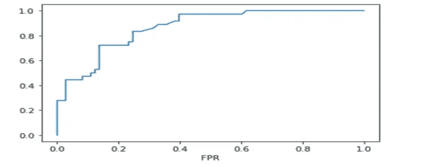

# 带 Spark 的逻辑回归

> 原文：<https://medium.com/codex/logistic-regression-with-spark-1125e2c25312?source=collection_archive---------7----------------------->

## [法典](http://medium.com/codex)

在这篇文章中，我将深入 Spark，分析低出生体重数据集。

包含这里分析的数据集的 csv 文件可以在我的 repo 中找到:[https://github . com/vanessuniq/Logistic-Regression-With-Spark](https://github.com/vanessuniq/Logistic-Regression-With-Spark)

以下是我分析的代码:

 [## 机器学习低出生

### 编辑描述

vanessuniq.github.io](https://vanessuniq.github.io/Logistic-Regression-With-Spark/machineLearningLowbwt) 

**低出生体重数据的 Logistic 回归**

**目标**

低出生体重是婴儿的一个重大担忧，因为它使他们的身体更脆弱，使他们更难进食、吸入、生长、保持体内热量水平或抵抗感染。这项分析的目的是评估影响新生儿低出生体重的因素，并提高孕妇的认识。低出生体重可以通过母亲、营养和财务因素进行评估，考虑低出生体重的重要属性，因为它可以引发在婴儿中观察到的许多疾病。在这项分析中使用了一个逻辑回归模型来识别使用符合条件的母亲的医疗记录预测低出生体重的强制性因素。

**数据集描述**

低出生体重数据集由 189 个观察数据组成，代表 1986 年马萨诸塞州斯普林菲尔德 Baystate 医疗中心的婴儿出生情况(Hosmer，Lemeshow 和 Sturdivant，2013 年)。该数据集有 9 个变量，感兴趣的变量是新生儿的出生体重，这是一个描述出生时体重不足儿童风险的二元变量(0 表示正常出生体重至少为 2.5 公斤，1 表示出生体重低于 2.5 公斤)。预测变量包括母亲的年龄(数字)、种族(分为 3 级)、怀孕期间的吸烟状况(分为 2 级)、早产史(分为 2 级)、高血压史(分为 2 级)、母亲子宫易激惹(分为 2 级)以及妊娠早期的医生就诊史。ID 变量用作唯一标识符，与研究无关。

**数据探索**

数据探索显示，数据集严重不平衡，约 31%的观察值为出生时体重低的婴儿，69%为正常体重的婴儿。

+ — -+ — — -+

|低|计数|

+ — -+ — — -+

| 1| 59|

| 0| 130|

+ — -+ — — -+

**表 1:低出生体重频率表**

此外，在分析母亲的种族与低出生体重发生率的关系时，发现 42%的黑人妇女的孩子出生时体重较低，而白人为 24%，其他种族为 37%。这导致人们认为黑人女性生下低出生体重孩子的风险更大。

**图 1:按母亲种族分列的低出生体重儿**

同样，怀孕期间吸烟的女性比不吸烟的女性风险更高。数据显示，40%的吸烟妇女生下低出生体重儿，而在不吸烟的妇女中，这一比例要低得多(25%)。

**图 2:按吸烟状况分列的低出生体重母亲**

最后，发现年龄变量在数据集上分布良好，两个类别(低体重和正常体重)的平均年龄大致相同；然而，出生体重不足的情况主要发生在 20 至 25 岁的妇女身上。

**图 3:生育低生育率子女的妇女的年龄分布**

**数据建模**

在构建模型之前，数据集没有经过预处理。鉴于数据集的规模较小，它被划分为 60% (108 例)的训练集和 40% (81 例)的测试集。这样做是为了让模型有足够的盲数据来测试其效率。此外，应用随机种子以确保分析是可重复的。最后，模型的最大迭代次数为 50，regParam 参数设置为 0.001，以优化结果。

**结果**

该模型在训练集上的正确分类率为 76.1%，在测试集上的正确分类率为 67.9%。两组之间的精确度大大降低了(大约 8%)。这一结果表明模型被过度拟合。这可能是因为没有足够的数据来训练和测试模型，以及低出生体重病例和正常体重病例之间的不均衡。准确率也从训练集的 69.2%大幅下降到测试集的 44.4%，召回率从 50%下降到 33.3%。这表明衍生模型在识别低出生体重的实际病例方面表现不佳(< 2.5kg) in newborns. Likewise, the F score sharply decreased from 58% in the training set to 38% on the test set, as it is dependent on the recall and precision values. Furthermore, the model showed an area of 0.4 under the PR curve, which is due to weak recall and precisions values observed, and an area of 0.58 under the ROC curve, which is not far from the minimum value of 0.5, but distant from the maximum value of 1.0\. This again confirmed the model failing to identify relevant cases in the data.

**图 4:低出生数据集的 ROC 曲线**

**结论**

建立了一个逻辑回归模型来预测与低出生体重相关的危险因素。研究发现，母亲的种族和吸烟状况是低出生体重儿患病率的强有力预测因素。然而，建立的模型在测试集上的准确率为 67.9%，F 值为 38%。结果表明，该模型不仅不能对未知数据进行分类，而且几乎不能识别婴儿出生体重低的真实情况。由于数据集相当小并且具有严重不平衡的目标变量(130 个正常病例对 39 个低病例)，逻辑回归在这里表现不佳。由于数据集的规模较小，增加测试集中的案例数量可能无法解决过度拟合的问题。可以尝试缩放目标变量以平衡其分布。

在运行模型之前预处理数据集可能会提高模型的准确性。Logistic 回归受缺失值和非正态分布的影响。另外，输入变量必须对目标变量有意义，才能产生可接受的结果。评估所有变量与目标变量之间关系的一种方法是运行相关矩阵。清理数据集并仅使用重要的输入可以极大地提高该模型的准确性。另一个限制可能是一些分类变量的宽泛性(比如简单地使用吸烟变量的是或否是不够细致的)。包括随机森林、决策树、支持向量机或朴素贝叶斯在内的其他几种机器学习算法可能是分析该数据集的良好候选。决策树可以适用于这种分析，因为它可以更好地处理小数据集，方法是使用平行于输入轴的边界以递归方式分割数据，直到达到收敛。此外，决策树可以通过在每个节点分配权重来处理未处理的数据集。或者，可以在这里使用朴素贝叶斯，因为它需要较少的训练时间，这适用于输入变量相对较小的小测试集。朴素贝叶斯算法比其他判别算法(如逻辑回归)收敛更快。鉴于朴素贝叶斯算法的简单性，这里可以避免过度拟合的问题。

**参考文献**

Hosmer，D. W .，Lemeshow，s .，& Sturdivant，R. X. (2013 年)。应用逻辑回归(第 3 版。).纽约州纽约市:威利。