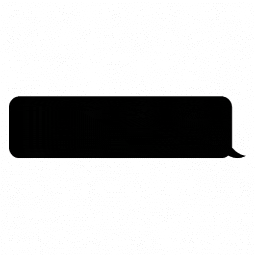

# SSMPL 的徽标原型

> 原文：<https://medium.com/codex/logo-prototypes-for-ssmpl-afaf72325c44?source=collection_archive---------3----------------------->

## 为一个更好的网络设计构件。

由作者创建的设计原型。

几天前，可访问性专家 Jason Knight 发表了一系列文章的第一部分，提出了 HTML 的替代品 SSMPL。

> “我们需要接受语义标记，但要清理 HTML 工作方式中奇怪的不一致之处。标签的概念是…