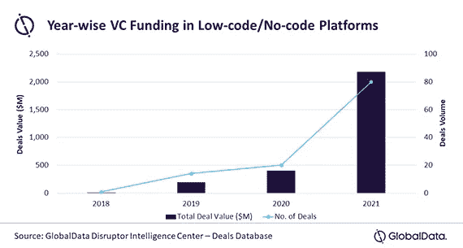

# 低代码和无代码:工具还是玩具？

> 原文：<https://medium.com/codex/low-code-no-code-tools-or-toys-26e4ad317eaa?source=collection_archive---------8----------------------->

## 根据其支持者的说法，低代码&无代码革命将接管整个技术行业

根据其支持者的说法，低代码和无代码(LCNC)革命已经席卷了技术领域。

克里斯里德在 [Unsplash](https://unsplash.com?utm_source=medium&utm_medium=referral) 上的照片

初创公司和行业巨头都在称赞新软件开发方法的好处，这种方法比以往任何时候都更快、更有效、更容易获得。

低代码和无代码技术声称可以解决各种问题，从开发人员短缺到允许普通商业用户创建应用程序。

是这样吗？

# 越来越多的资金和兴趣

为此，许多企业已经获得了数亿美元来兑现他们的承诺。

举几个例子，按字母顺序，值得一提

*   [阿扁](https://www.appian.com/)
*   [气泡](https://bubble.io/)
*   [Carrd](https://try.carrd.co/mrxv1hhh) —简单的登录页面
*   [创作](https://www.creatio.com/page/low-code-software?activity=sthlowcode)
*   [门迪克斯](https://www.mendix.com/)
*   [快速移动](https://quixy.com/our-platform?utm_source=STH&utm_medium=cpc&utm_campaign=STH_lowcode)
*   [重新装备](https://retool.com/)
*   [Zoho 创建者](https://www.zoho.com/creator/?utm_source=STH&utm_medium=Website&utm_campaign=lowcode)

这份名单是绝对不完整的，如果你觉得我错过了一些大人物，请告诉我，我会更新它。

无论如何，有真正的兴趣和真正的钱流入这个新的和有前途的行业。

交易和投资的数量惊人。

与无代码和低代码平台相关的交易价值和交易数量

现任者也注意到了这项投资。

低代码和无代码开发选项可从 SaaS 重量级公司获得，如 Salesforce ( [Outsystems](https://www.outsystems.com/) )和微软( [PowerApps](https://powerapps.microsoft.com/en-us/) )。

根据一些人的说法，大约在 2021 年底，LCNC 有超过 200 家创业公司和供应商。

在过去的几年里，人们的兴趣和搜索量显著增加。

过去五年中与无代码(蓝色)和低代码(红色)相关的搜索增长

尽管兴趣越来越大，但关于低代码和无代码开发工具更适合开发人员还是典型的商业用户，仍然存在一些争议。

# 谁是 LCNC 平台的客户？

到今天为止，我们看到了针对不同客户的各种 LCNC 平台。

## 开发者用户

其中一些针对开发人员，以解决开发人员短缺问题。

然而，我认为这就像说 WordPress 应该有助于减少开发者短缺，因为它允许每个人创建一个网站。当然，WordPress 被数百万人和企业使用，但是它实际上为 WordPress 开发者创造了一个新的市场。

## 商业用户

其他一些 LCNCs 声称允许普通商业用户创建应用程序。

我再一次相信这和微软 Power BI 以及类似工具的承诺是类似的。最终，普通业务用户委托给 BI 分析师，创造了一个新的市场或者至少是新的工作角色。

## 垂直行业:设计师

此外，LCNC 可能非常适合具有明确定义的用例的垂直行业，或者适合目标用户也是买家的情况。

例如，现在有几家公司让设计师可以通过拖放技术，轻松地将他们的概念快速转化为真正的手机或网络应用。这对设计师来说真的很有吸引力。

LCNC 倾向于提供模块化组件

然而，需要开发资源来为需要更多定制的大型企业客户服务，因为拖放技术是不够的。

# 结论

对于大多数非技术工人来说，LCNC 平台被认为是最重要的市场推动者。这在某种程度上已经有了一些早期的暗示。

然而，考虑到定制应用程序开发继续强劲扩张，而且由于无代码/低代码的主导地位，吸引技术人才的速度并未放缓，因此仍有很长的路要走。

我相信，我们不会用 LCNC 平台取代通用软件开发，而是会看到传统软件开发与 LCNC 工具和应用共存。