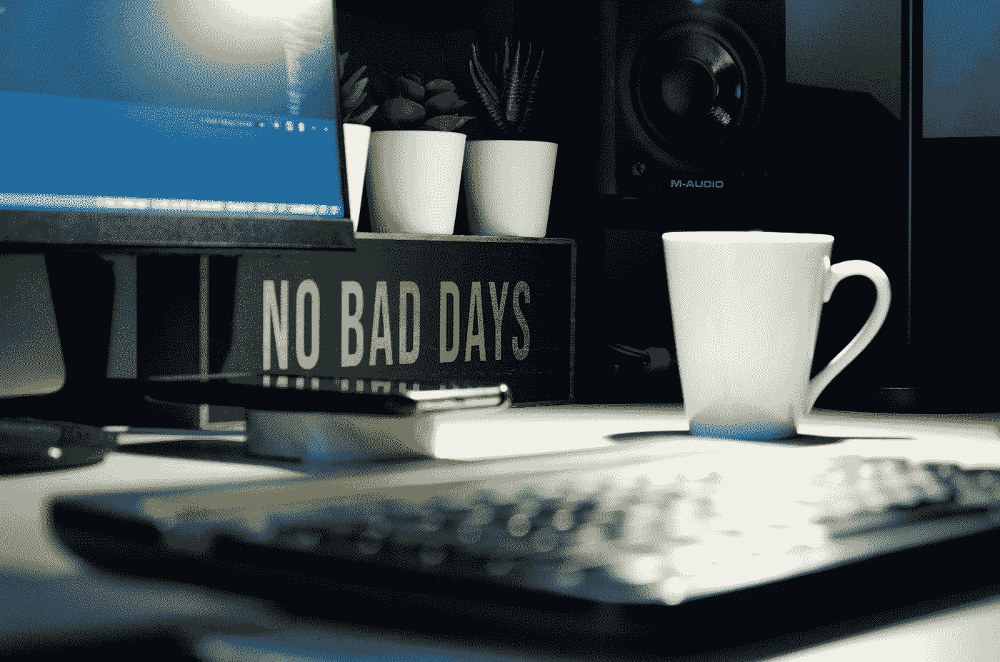

# 低代码:经济的未来

> 原文：<https://medium.com/codex/low-code-the-future-of-the-economy-ec136d4750e4?source=collection_archive---------14----------------------->

## **低** - **代码**开发可以减少开发时间，为更多的开发者创造需求！

照片由[瑞兰德·迪恩](https://unsplash.com/@ryland_dean?utm_source=medium&utm_medium=referral)在 [Unsplash](https://unsplash.com?utm_source=medium&utm_medium=referral) 上拍摄

随着经济的衰退，越来越多的美国人开始掌控自己的未来。虽然有些人会创建雇佣他人的公司，但许多人会发展自己的公司，将他们的技能带到网上。经济衰退让数百万人有机会…