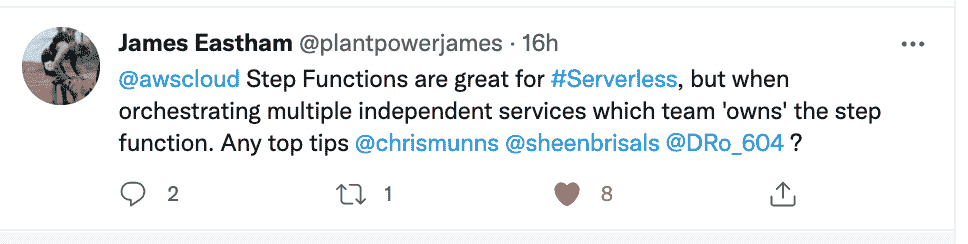
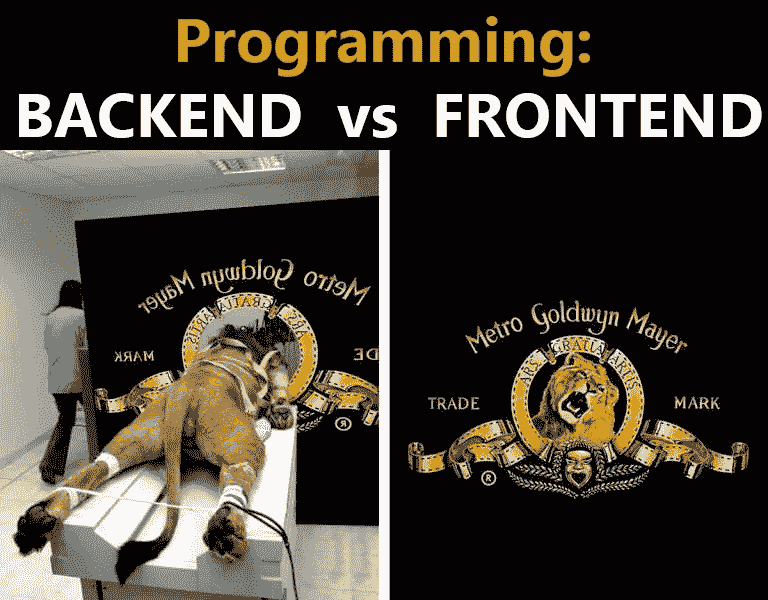
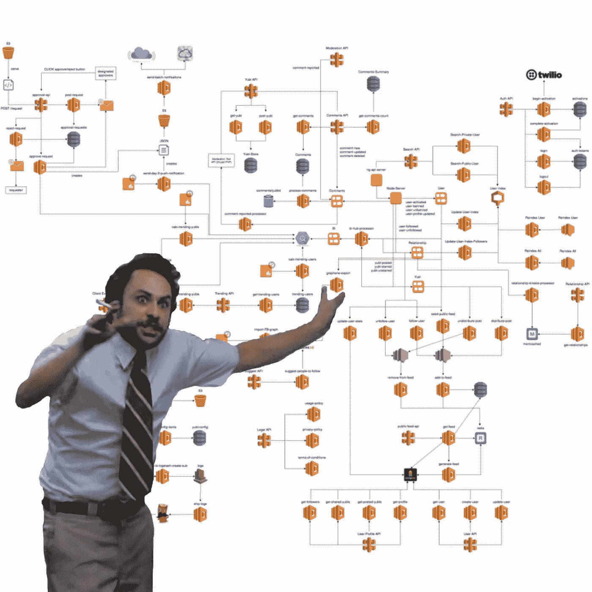
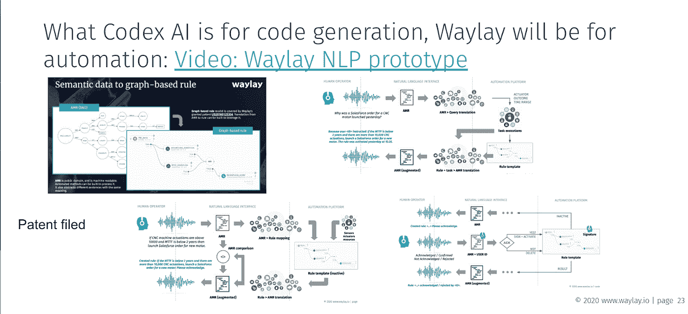

# 低代码对无代码，以及关于图灵完备性和康威定律的一些注释

> 原文：<https://medium.com/codex/low-code-vs-no-code-and-few-notes-on-turing-completeness-and-conways-law-d37376bb6f81?source=collection_archive---------11----------------------->

# 无代码

没有任何代码可以促进预定义组件的重用，通常使用拖放界面或 web 表单。这种平台总是包括身份和访问管理之类的东西，最重要的是不需要任何代码来将组件缝合在一起，因此减少了工程师花时间设计数据库、API 或内部工作流的需要。它们总是与特定的任务和受众相关，比如 web 开发、电子表格、分析、市场自动化等。Airtable、Zapier、Webflow、Retool、Waylay[Digital Twin solution](https://www.waylay.io/products/waylay-digital-twin/benefits)以及类似的应用程序都可以在这个类别中找到。

# 低位代码

另一方面，低级代码有不同的目标和用户角色。关于低代码的主要误解是，低代码中的“低”意味着几乎没有任何编码知识的人是这种平台的用户。

在我看来，低代码平台的目标是让开发人员能够以非常快的速度编写和部署他们的应用程序，只需最少的设置工作，并增加对平台提供的开箱即用功能的信心。从这个意义上说，低代码平台降低了应用程序开发过程的复杂性，缩短了上市时间。低代码平台的基本构建块通常是一小段代码，包装成可重用的组件，可应用于不同的用例，就像乐高积木一样。

那么，这与无代码有什么不同呢？无代码也是将组件(代码片段)缝合在一起。首先，低代码应该允许开发人员开发和发布新的组件，这需要编码。第二，平台必须允许这些代码片段以异步方式连接和同步，这并不像听起来那么简单(在这个[视频](https://www.youtube.com/watch?v=UbCOmr7Pxac)中有更多关于这个主题的内容)。

有两种方法来看待第二个挑战。第一个是创建一个垂直的特定低代码平台，通过以预定义的方式为“低代码”提供一个安全网来限制他们的行为，该安全网是关于如何缝合的，不给错误(或操纵，取决于你如何看待它)留下任何空间。由于这是由“让普通案例更快”的理念驱动的，它也限制了可能的用途，因为任何更具挑战性的或工具提供商没有预见到的事情都变得很难，如果不是不可能的话。如果最终应用程序的目的与预定义组件所提供的稍有偏差，就必须编写可扩展代码或完全重写组件。大多数低代码平台需要用特定的语言编码，有时是专有语言，这使得最终目标的实现更加复杂。

第二种方法是提供一个水平的、通用的低代码平台，这有助于创建定制组件(使用代码)，并提供将它们作为更大应用程序的一部分进行组合和执行所需的引擎、API 和用户界面。这种方法带来了更大的灵活性，但需要注意的是，垂直方面需要构建在上面，只需要付出稍大的努力(因为平台概念是与领域无关的)。在下一节中，我们将讨论为什么我们认为从长远来看这是更好的方法。

# 图灵完备性及其与低代码和 RPA 工具的关系

当有经验的开发人员和系统架构师听到又一个基于模型的低代码平台时，他们总是持怀疑态度。他们觉得很快就会发现“陷阱”:他们将需要绕过框架强加的限制，而不是框架来帮助他们实现。

在可计算性理论中有一个术语叫做图灵完备性。如果有人说“我的新东西是图灵完备的”，这意味着原则上，它可以用来解决任何计算问题。软件语言是图灵完备的。当无服务器成为主流时，人们普遍认为无服务器是“低代码乐高积木方法”的最佳候选。这让我们想到了图灵完全自动化的故事。如果我们要使用代码片段来实现应用程序逻辑，我们需要一个极其强大和灵活的规则引擎来编排它们，而不需要重新用编程语言来编码，否则我们将完全失去低代码的好处。

那么，为什么相信 Waylay 就是答案呢？首先，像 RPA 领域的许多解决方案一样，Waylay 平台提供了广泛的组件和服务集合，适合各种使用情形，就像瑞士军刀一样。但让它脱颖而出的是它的“秘方”:最强大的规则自动化引擎，它可以以一种几乎完全的方式编排这些组件，同时仍然提供低代码体验。你可以在这个[链接](https://www.waylay.io/platform/benchmark)上找到更多相关信息。这就是我们带给市场的不同之处！

# 康威定律及其与拦路抢劫的关系

任何设计系统(广义定义的)的组织都会产生一个设计，其结构是组织的沟通结构的复制。

——梅尔文·康威

Waylay 是一个专门构建的 OT/IT 自动化低代码平台。它也是许多角色相遇的地方:OT 专家、It 人员(无服务器程序员、集成架构师、后端和前端开发人员)、数据科学家和企业所有者。让他们聚集在一个单一的“平台位置”，在那里他们可以一起协作、贡献和交付解决方案，这听起来像是不可能完成的任务。

如果我们要挑战物理定律，在这种情况下，康威定律，我们必须考虑到这些人物角色中的每一个对低代码/无代码都有不同的期望和知识，而且，他们不一定有兴趣阅读这么长的博客来捕捉这两个概念之间的语义差异。因此，让我们回头看看人物角色，看看 Waylay 能为他们提供什么。

# 前端、后端人员以及无服务器和集成架构师的崛起

用一个刻板印象来说，前端人员都是关于 react/vue、webpack、css 和用户体验的。他们不一定对发生在幕后的所有细节感兴趣。他们与企业主密切合作，确保一切看起来都很漂亮且可用，如图所示。对于他们来说，低代码平台没有任何意义，因为他们将使用已经提供了高级抽象的 API 与之交互。他们更不喜欢无代码，因为任何出色的用户体验和漂亮的垂直应用都不可能只使用无代码工具来交付。

对于前端人员，在 Waylay 我们提供[剧本](https://docs-io.waylay.io/#/videos/?id=how-to-create-a-playbook)。当将我们的规则引擎集成到您的自动化场景中时，运行任务的一些输入参数很可能来自另一个数据库或应用程序。为了避免在应用程序中对输入参数和模板之间的映射进行硬编码(例如一个特定传感器的电子邮件地址)，Waylay 引入了模板变量的概念，表示为与模板相关联的 JSON 模式。这允许模板创建者(例如集成架构师)预先指定运行时需要哪些输入参数，这使得在其上构建前端应用程序变得非常容易，因为有许多表单构建器是基于 JSON 模式开箱即用的。有了这个功能，客户可以在 Waylay 模板的基础上立即构建自己的无代码应用程序。请看这个[视频](https://www.youtube.com/watch?v=ctkDC0BYYX0)，超级简单。

后端人怎么样？在我看来，经典意义上的后端——带有灯堆和整体结构是不错的——如果你也同意的话。尽管如此，我们相信在现代云计算时代，这项工作将会消失，并被其他角色所取代，如开发人员、无服务器编码人员或集成架构师。

在 Waylay 中，我们扮演最后两个角色:无服务器的编码人员，他们了解 API 的一切，以及包装成可重用组件的代码片段，通常不超过十几行代码。对于集成架构师来说，Waylay 是一个有趣的梦想成真，因为他们利用这些组件以真正的低代码方式捕获端到端流作为模板。针对前端无代码部分的相同剧本特性使他们能够在模板上放置多态旋转，进一步增强了它的灵活性。

# 加班专家

人们对 SCADA、PLC、机器和工业过程了如指掌。这些是战壕里的人。当其他角色谈论 IIoT 时，他们经常感到相当激动，感觉他们正在侵入他们几十年来积累的经验和深刻知识的领域——这是你无法在 21 天内掌握和“自学”的。他们更喜欢使用或多或少的因果关系来定义问题，也就是说，基于知识建模技术来创建自动化规则，并且如果需要的话，通过让黑盒模型超越运行异常检测和预测来指导修复动作等，被 ML 所迷惑，而不是相反。

对他们来说，Waylay 是一个非常棒的工具，因为规则引擎使他们能够将自己的经验和专业知识与云技术的最新进展相结合。然而，他们通常缺乏编码技能，所以如果我们想让这些人加入 Waylay，我们通常需要让他们与集成架构师和/或数据科学家配对。

# 数据科学家

这里我注意到了一点代沟。年轻的数据科学家非常擅长 Python，因为在这方面，大学课程在过去十年中受到了行业需求的极大影响和改进。前几代人仍然更喜欢使用 Matlab 或没有代码的工具。

Waylay 对这两个群体都有好处。借助 Waylay，我们可以[从所有最先进的机器学习框架中部署机器学习模型](https://docs-io.waylay.io/#/features/byoml/)，如 sklearn、TensorFlow、PyTorch 或 XGBoost，并对实时或历史数据进行推理。使用 Waylay APIs 或我们的 Python SDK 部署机器学习模型是一项相当简单的任务，但它仍然需要一定程度的机器学习概念和编码知识，如 Python 和 Jupyter 笔记本。

然而，当数据科学家从事异常检测或预测建模等特定用例时，他们首先面临其他挑战，这些挑战需要在到达低代码平台之前解决。

*   这个问题应该使用哪种类型的 ML 算法？
*   哪个 ML 平台最符合问题？
*   数据的质量是否足以解决这个问题？

例如，在这个[视频](https://www.youtube.com/watch?v=VtLJeB6aanU)中，我们处理的问题是，作为 Waylay，我们如何让数据科学家在没有编程经验的情况下创建一个机器学习模型。如前所述，没有代码平台是使非技术用户能够通过在画布上拖放软件或数据来构建应用程序(在这种情况下是 ML 模型)的应用程序。这些 ML/AI 平台使之前没有任何编码经验甚至没有机器学习知识的用户能够使用无代码从数据集开始构建机器学习模型。

有了 [BigML](https://bigml.com/) ，作为这种人工智能平台的一个例子，你可以用一种简单的方式从零开始创建一个机器学习模型，而不需要知道很多关于编码的知识，使用他们的 dashboard(无代码)或他们的 Python SDK(低代码)。通过该应用程序，可以对某个数据集进行实验，尝试不同的 ML 算法并微调数百个超参数。

Waylay 的亮点不仅在于运行使用这种平台构建的 ML 模型，更重要的是，它满足了模型告诉我们一些事情后发生的下一个问题，比如机器上有异常:现在怎么办？这就把我们带到了下一个角色:企业主。

# 企业主

企业主不关心编码，他们为什么要关心？但是，公民开发者的想法仍然吸引着他们。组织中的每个人都被授权在更短的时间内贡献和交付工作软件的想法是每个企业主的梦想。不再需要与所有这些可怕的软件人员交谈，也不再需要建立漫长而昂贵的集成项目！

在我看来，在我们将 NLP 整合到自动化创作中之前(这是[正在做的事情](https://www.youtube.com/watch?v=7Wl0IEHToDY))，这在一定程度上仍然是一厢情愿的想法。对于企业主来说，Waylay 平台的最佳用途是一方面与集成架构师配对，另一方面与前端开发人员配对，以完成面向用户的应用程序。

# 构建 OT/IT 低代码自动化工具的最大挑战是什么，Waylay 能做些什么

从这个分析中我们可以看到，在任何 OT/IT 采用周期中，两个最重要的角色组，业务所有者和 OT 人员，如果没有集成架构师或无服务器开发人员的帮助，什么也做不了。这就是挑战所在。

当谈到解决这一挑战时，有两种思想流派。一个是 AWS 方式，这在某种程度上让我想起了一个旧的 SAP 业务模型:让事情变得复杂，并确保系统架构师和公司有足够的动力在上面提供端到端的解决方案。与过去不同的是，基于云的解决方案带来了另一个挑战，即最终解决方案还会影响 OPEX 成本，因为使用量/容量组件决定了生产中的大部分运行成本。

AWS 的低代码视觉

> UI 就是它看起来的样子。UX 就是这样运作的。

另一种方法是“类似苹果”的方法，而 ***Waylay IO 的使命是将苹果的体验带给所有这些社区。***

让一些东西看起来漂亮只是解决方案的一部分，更重要的是当你让它如何工作以及最终客户如何将 Waylay 集成到他们的解决方案中变得显而易见。最终产品还包括[出色的文档](https://docs-io.waylay.io/#/)、记录良好的 API 调用、精彩的视频，以及人们可以聚集和分享他们的产品知识和经验的合适场所。这就是我们提供的:

*   简化开发和部署的低代码门户
*   轻松集成支持 API 的服务
*   AI/ML 部署无泪
*   出色的调试和可观察性
*   所有必要的工具都放在一个地方
*   从开发到生产在“没有时间”
*   Waylay 的平台内置了与 Auth0 类似的先进安全领域
*   按使用付费

‍Next 到低代码自动化工具，我们还提供无代码[数字孪生解决方案](https://www.waylay.io/products/waylay-digital-twin/benefits)，主要针对企业主。它不会遇到这个问题，因为它在 Salesforce 生态系统中完全沙箱化。它简单、强大，但仅限于特定的用例，因为非代码工具总是如此。‍

# 未来怎么样，NLP 来拯救？

有没有可能用一种新的颠覆性的方式来解决没有代码自动化工具的问题？正如我们所见证的， [CodexAI](https://openai.com/blog/openai-codex/) 即将颠覆整个软件开发行业。你输入一个句子，代码就出来了。

在 Waylay，我们已经在研究原型，并为基于 NLP 的自动化申请了专利。这是一个真正的不基于代码的解决方案，在第一个实例中，它将被限制在或多或少等同于规则调用的语音控制。我们正在开发的一种更具雄心的方法是基于基于传感器库发现的功能自动生成规则(机器 X，如果压力> 100，温度> 40，则创建一个 Salesforce 票证，并将 SMS 票证发送给 John ),这将为未来的审计提供语音指纹。通过这种方式，我们设想在不久的将来(见[视频](https://www.youtube.com/watch?v=ctkDC0BYYX0))，我们将授权所有 OT/IT 人物通过使用自然语言、语音或类似的生成自由文本的设备来表达他们的意图，从而利用 Waylay。

我们认为我们在这方面领先于竞争对手的原因不是因为在 NLP 方面的 Waylay 进展，而是因为 NLP 领域其他人的最新工作与我们的专利规则引擎相结合，提供了行业所需的一组强大的可解释功能。这使得可以使用 NLP 领域的最新发展来创建高级规则，例如 GPT-3。Waylay 已经就这一主题申请了专利，并且已经处于非常先进的生产阶段。我们计划在 2021 年第三季度推出第一款嵌入我们游戏机的工作原型，并计划在 2021 年第四季度/2022 年 Q1 早期将其推向市场。

有用的链接

[https://medium . com/charge VC/where-next-for-no-code-8f9d 21354 cc9](/chargevc/where-next-for-no-code-8f9d21354cc9)