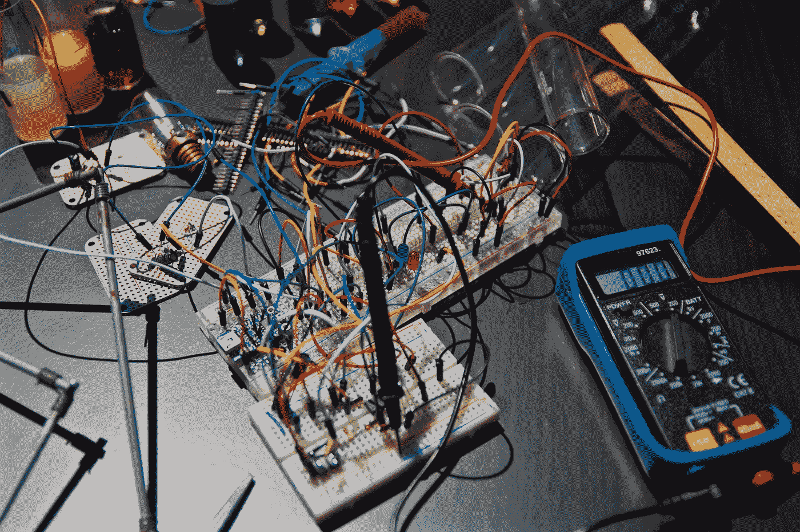

# 低耦合和高内聚

> 原文：<https://medium.com/codex/low-coupling-and-high-cohesion-af77df4cc005?source=collection_archive---------14----------------------->

## 设计原则

## 精心制作组织良好的代码

[唐](https://unsplash.com/@tangzhengtao?utm_source=unsplash&utm_medium=referral&utm_content=creditCopyText)在[上拍照](https://unsplash.com/s/photos/train?utm_source=unsplash&utm_medium=referral&utm_content=creditCopyText)

随着我作为程序员经验的积累，我越来越欣赏写得好的代码。没有什么比发现一个声称能解决你的问题的库更糟糕的了，但是经过仔细的检查，它却是一堆混乱无序的函数和变量。我花了很多时间试图解析这样的代码，这些经历让我明白了编写自己的代码时结构和语法清晰的重要性，并促使我学习更多关于优秀软件设计的基础知识。

> 编写代码的时候，要把最终维护你的代码的人想象成一个知道你住在哪里的暴力精神病患者。—约翰·伍兹

编写有组织的、结构良好的代码可能不会影响应用程序的功能，但随着时间的推移，它会极大地影响代码的更新和维护。

耦合和内聚是好的代码设计的两个主要原则，与语言、框架或平台无关。你应该努力写出低耦合和高内聚的**代码。**

# 低耦合

尼古拉斯·托马斯在 [Unsplash](https://unsplash.com/s/photos/electrical-wires?utm_source=unsplash&utm_medium=referral&utm_content=creditCopyText) 上的照片

耦合指的是软件模块之间相互依赖的程度。理想情况下，您的各种组件和模块应该是独立的、自包含的程序，不依赖于其他组件的状态来实现内部功能。**全局变量是强耦合的一个例子**，应该尽可能避免。

调试一个涉及全局变量的错误会很快变得非常令人头疼。每个函数都有可能改变值，这意味着必须评估整个应用程序以确定问题出在哪里。相反，我们可以以参数和返回值的形式在函数之间传递值，将代码解耦，并允许更模块化的设计(以及更容易的调试/维护)。

# 高内聚力

内聚性是指一个模块的元素属于一起的程度。一个高内聚的系统将会有强相关的功能。您希望确保以有意义的方式对函数和属性进行分组。比如一个`Dog`类应该有`bark`、`fetch`、`sit`等。但这绝对不应该`meow`。你不想要一个带摄像头的拖把，或者一个带 wifi 功能的锅铲。将这些属性结合起来不会创造出一个有凝聚力的产品，而且最终会违反直觉。

内聚力高的代码将相似的功能组合成不同的组件。因此，内聚性和耦合性之间存在相反的关系，高内聚性的代码通常是松散耦合的。如果你把相似的功能组合到一个模块或类中，那么这个模块更有可能是独立的和自包含的。

# 结论

在编码时，我一直牢记低耦合和高内聚的原则，并明确发现它在设计类、组件和模块时很有帮助。当重构旧代码时，这是一个特别有用的原则，一个帮助你对代码库的组织做出正确决定的清晰指南。你用什么原则来帮助组织你的代码？在设计应用程序时，您是否发现自己在考虑内聚性和耦合性？