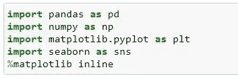
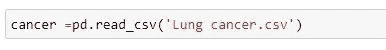
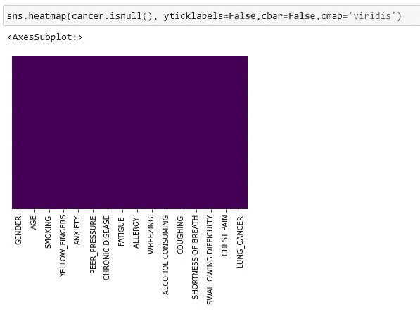
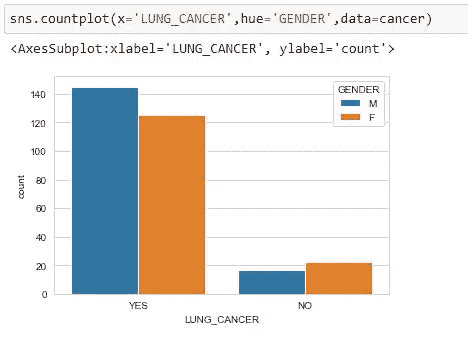
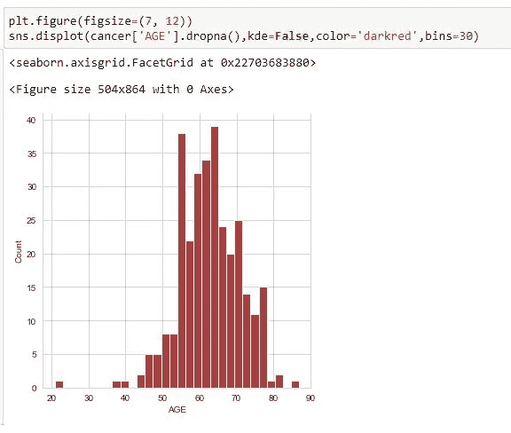
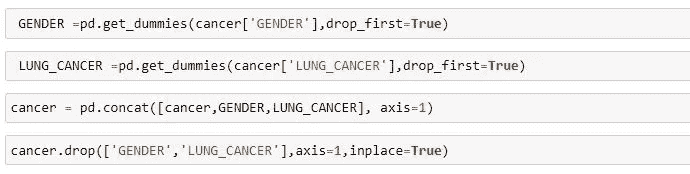
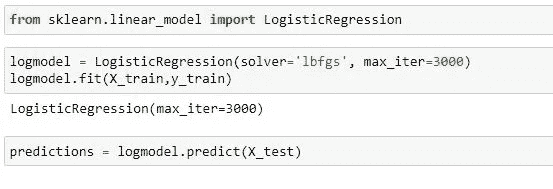
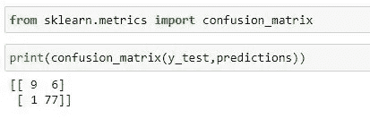
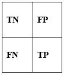
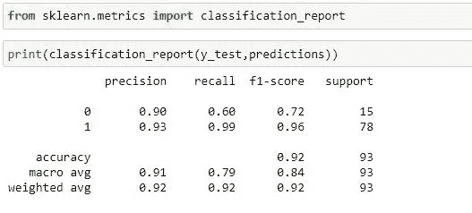

# 基于 LOGISTIC 回归模型的肺癌预测

> 原文：<https://medium.com/codex/lung-cancer-prediction-using-logistic-regression-model-f5f1306c853e?source=collection_archive---------13----------------------->

肺癌是一种始于肺部的癌症，在早期阶段通常不会引起症状和体征。症状和体征主要出现在疾病晚期。癌症预测系统的准确性使人们能够以最小的成本了解他们的癌症风险，并且还使他们能够根据癌症风险状况做出可能的最佳决定。

**关于项目**
在这个项目中，我在 python 中创建了一个使用逻辑回归模型的算法，它进行预测，使人们能够知道他们的肺癌风险状况。

**PYTHON 库导入**
一个库，它是我们包含在 PYTHON 代码中的函数集合，在需要时调用。使用库，可以导入预先存在的函数，这将有效地扩展代码性能。对于这个项目，我将导入以下库 pandas，numpy，matplotlib，seaborn，sklearn e.t.c .然后设置%matplotlib inline，因为我使用的是 Jupiter 笔记本

**获取数据**
我处理了肺癌 csv 文件，可以在这里访问。它有分类的客户信息，如性别，肺癌。然后它也有数值栏:
·年龄

吸烟

黄色 _ 手指

焦虑

同龄人的压力

慢性病

疲劳

过敏

喘息

饮酒

咳嗽

呼吸急促

吞咽困难

胸痛

**过程**
过程被采取，我将逐个讨论其中的几个。

1. ***读入肺癌数据集***

有几种读取文件的方法。在这个项目中，我使用了熊猫图书馆。它允许你用几个分隔符读取文件。

2.***info()方法***

它返回关于数据帧的基本信息。

**执行一些探索性数据分析(EDA)**

在我开始创建线性模型并做出相应的预测之前。我对数据做了一些探索性的数据分析，以使用可视化技术进一步探索数据，并使用图形表示检查假设。我将只使用 csv 文件的数字数据。

1.  在这里，我使用 seaborn 在数据集上创建热图，以查看我们是否有缺失数据，因为检查缺失值并正确处理它们是数据准备过程中的一个重要步骤，如果不对它们进行处理，它们可以:

*   导致变量之间的行为不能被正确分析。
*   导致对数据不正确的解释和推断

2.还创建了计数图，其中“是”代表肺癌患者，“否”代表非肺癌患者，原因是为了直观地了解男性和女性中哪个性别的癌症发病率最高，正如我们在下面看到的，男性比女性患肺癌的病例更多。

3.我也用 seaborn 创建了一个年代分布图。据观察，它通常分布在 60 岁至 65 岁之间，这意味着在这个年龄段有更多的人可能患有肺癌。

**转换分类特征**
从我们的数据集中,“性别”和“肺癌”列由分类特征组成，但由于我们的模型将处理数字特征，我需要使用 pandas 将分类特征转换为虚拟变量！否则，我们的机器学习算法将无法直接将这些特征作为输入。

**建立逻辑回归模型**

将数据分成训练集和测试集

在研究了数据之后，我进一步将数据分成训练集和测试集。我将变量 X 设置为等于数据集的其他特征，将变量 y 设置为等于“LUNG_CANCER”列的预测变量。此时，我导入了 Sklearn 模型，可以使用 sklearn 中的 model _ selection . train _ test _ split 将数据拆分为训练集和测试集，并设置 test_size=0.3 和 random_state=101

**训练和预测模型**
回想一下，我将数据分为训练集和测试集，现在我将根据我的训练数据训练和预测模型。我进一步从 sklearn.linear_model 导入了 LogisticRegression，并创建了一个名为 logmodel 的 LogisticRegression()模型的实例。

我们可以看到我们的模型实际上做得很好。现在让我们继续评估这个模型

**评估逻辑回归模型**

**混淆矩阵**
它是帮助访问模型中错误在哪里的表格，通常在分类问题中。这些行代表结果应该是什么样的实际类。而柱子代表我们所做的预测。使用此表，很容易确定哪些预测是错误的。

结果说明
从上述结果来看,“真”表示模型预测准确,“假”表示模型预测错误，或者我们可以说预测有错误。

***真阴性(左上*)**–病例阴性且预测阴性假 ***阳性(右上)***–病例阴性但预测阳性假 ***阴性(左下)***–病例阳性但预测阴性真 ***阳性(右下)***–病例阳性且预测阳性

**分类报告**

**结果解释**

***精度***
它倾向于测量正的预测值，以知道哪个百分比是真正的正。它不能衡量正确预测的负面结果。
真阳性/(真阳性+假阳性)

***【回忆(敏感度)***
它衡量的是模型在预测正面方面有多好。这意味着它查看真阳性和假阴性(即被错误预测为阴性的阳性)。回忆擅长于理解模型如何预测某事是积极的。

真阳性/(真阳性+假阴性)

***F1-Score***
它代表了精度和召回率的调和平均值。它倾向于考虑假阳性和假阴性两种情况，可用于检测不平衡数据集。它没有考虑真正的负值。2*(精度*召回)/(精度+召回))

感谢您浏览我的项目，非常感谢您的意见和建议，您可以在评论区留下您的意见，直接发邮件给我[这里](http://usangajonah@gmail.com)或者通过下面我的其他社交媒体平台联系我。

[领英](https://www.linkedin.com/in/jonahusanga)

[推特](https://twitter.com/Jobenofficial?t=6TktOENT1z8spq8ct1WUyw&s=09)

[数据集](https://drive.google.com/file/d/1kG9UtPNNMkbTZThetkBvmVA7ehkkqnNs/view?usp=drivesdk)

[完整代码](https://github.com/Usangajonah/E-commerce-data-prediction/blob/main/Prediction%20on%20Ecommerce%20data.ipynb)

[投资组合网站](https://usangajonah.github.io/)