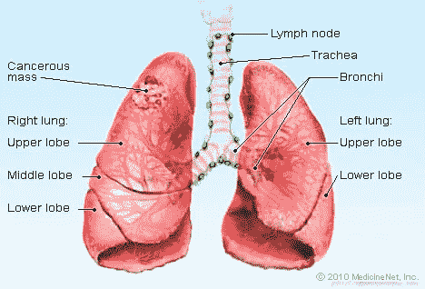
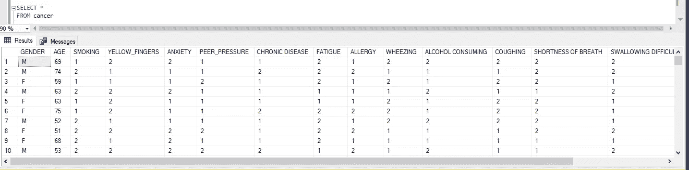
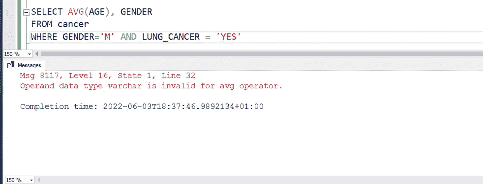
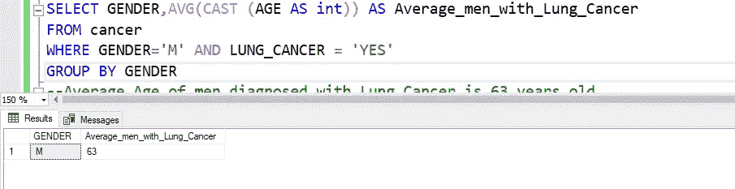
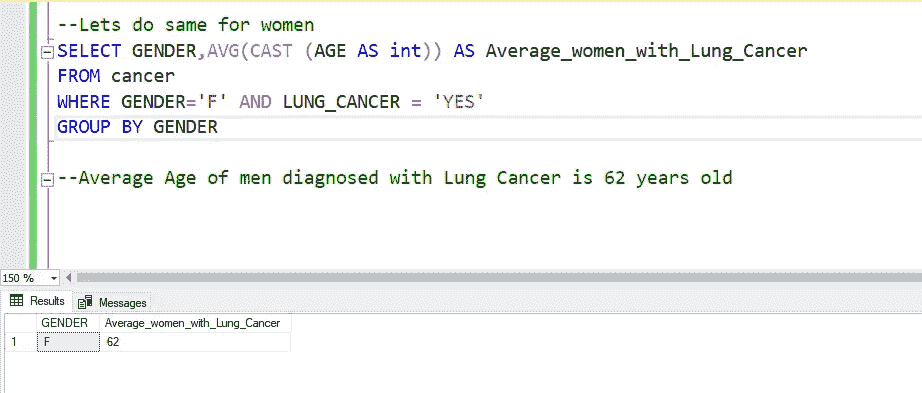
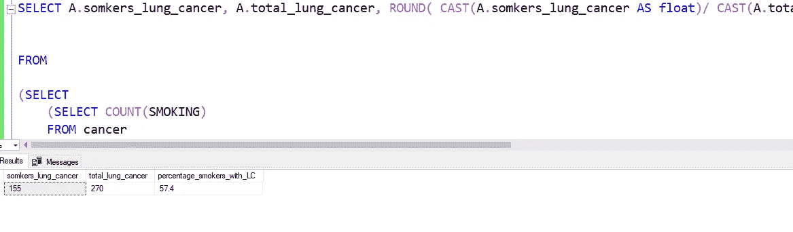
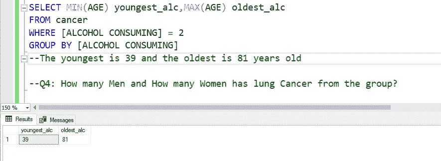
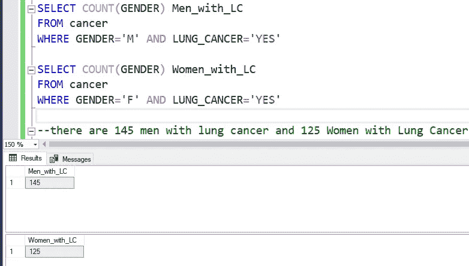
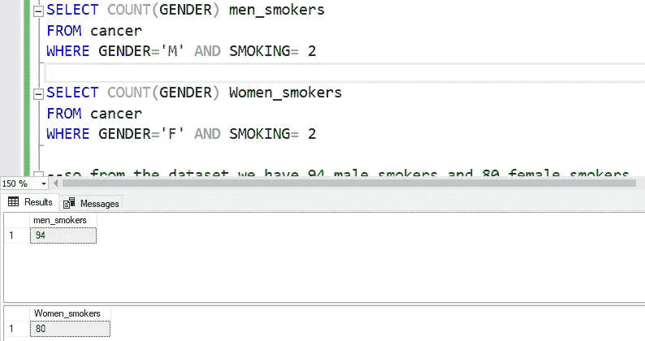
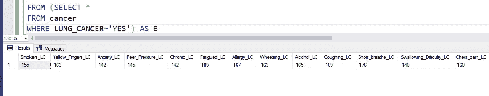

# 使用 SQL 数据操作和清洗的肺癌预测

> 原文：<https://medium.com/codex/lung-cancer-prediction-using-sql-data-manipulation-2edea9fd6d67?source=collection_archive---------11----------------------->

肺癌预测系统的有效性有助于人们以低成本确定他们的癌症风险，也有助于人们根据他们的癌症风险状况做出适当的决定。数据收集自在线肺癌预测系统网站。

肺癌图片

# 关于数据集

该数据集总共包含 16 个属性，收集自 309 名参与者。下面给出了这些的详细解释。

## 属性信息:

1.  性别:男，女
2.  年龄:患者的年龄
3.  吸烟:是=2，否=1。
4.  黄手指:是=2，否=1。
5.  焦虑:是=2，否=1。
6.  同伴压力:是=2，否=1。
7.  慢性病:是=2，否=1。
8.  疲劳:是=2，否=1。
9.  过敏:是=2，否=1。
10.  喘息:是=2，否=1。
11.  酒精:是=2，否=1。
12.  咳嗽:是=2，否=1。
13.  气短:是=2，否=1。
14.  吞咽困难:是=2，否=1。
15.  胸痛:是=2，否=1。
16.  肺癌:有，没有。

# 探索数据集

在探索该数据集时，我们将了解其他变量(属性)如何影响我们的因变量，在本例中是我们的**肺癌结果。**例如，我们希望了解在被诊断患有肺癌的参与者中，哪个独立变量的计数最高，这将使我们了解一个人被诊断患有或不患有肺癌的可能性。这里有一个 [**链接**](https://github.com/nuel000/Lung-Cancer-Prediction-Using-SQL-Data-Manipulation-and-Cleaning) 到查询以便于理解

## 让我们开始探索吧！

让我们看一下我们的行和列的一个片段

> 选择*
> 
> 癌症

现在我们已经熟悉了数据，让我们用数据来回答一些问题，以获得一些见解。

## 问题 1:我们想确定被诊断为肺癌的男性的平均年龄。

**查询**:

> 选择 AVG(年龄)，性别
> 
> 癌症
> 
> 其中性别='M '和肺癌= '是'

查询 1

请注意，当我运行第一个查询时，我得到了以下错误 ***“消息 8117，级别 16，状态 1，第 13 行—操作数数据类型 varchar 对于 avg 运算符无效。”***

这仅仅意味着，年龄列保存为数据类型 **varchar，**我需要将数据类型转换为 **integer，**来执行这个查询。

## 将年龄列数据类型转换为整数。

**查询**:

> 选择性别，AVG(CAST(年龄为 int))为平均肺癌男性
> 
> 癌症
> 
> 其中性别='M '和肺癌= '是'
> 
> 按性别分组

询问

我们可以看到男性确诊肺癌的平均年龄是**63**岁。

—让我们为女性做同样的事情

**查询**:

> 选择性别，AVG(CAST(年龄为整数))为平均 _ 女性 _ 肺癌
> 
> 癌症
> 
> 其中性别='F '和肺癌= '是'
> 
> 按性别分组

我们可以看到，女性被诊断为肺癌的平均年龄是 **62** **岁。**

## 问题 2:被诊断为肺癌的人中吸烟者占多大比例？

在这里，我们想确定是否有很大比例的肺癌患者是吸烟者。

*提示:我们将利用子查询来实现这个*

**查询**:

> SELECT A.somkers_lung_cancer，A.total_lung_cancer，ROUND(CAST(a . somkers _ lung _ cancer AS float)/CAST(a . total _ lung _ cancer AS float)，3)* 100 AS percentage _ smokers _ with _ LC
> 
> 从
> 
> (选择
> 
> (选择计数(吸烟)
> 
> 因为癌症
> 
> 其中吸烟= 2，肺癌=‘是’)，
> 
> (选择计数(肺癌)
> 
> 因为癌症
> 
> 其中肺癌= '是')为总肺癌
> 
> )A

询问

—根据我们的调查，57%的肺癌患者是吸烟者

## 问题 3:确定小组中喝酒的最年轻和最年长的人的年龄

**查询:**

> 选择最小(年龄)最小 _alc，最大(年龄)最大 _alc
> 
> 癌症
> 
> 其中[饮酒] = 2
> 
> 按[饮酒]分组

—最小的 39 岁，最大的 81 岁

询问

## 问题 4:小组中有多少男性和女性患有肺癌？

**查询:**

> SELECT COUNT(性别)Men_with_LC
> 
> 因为癌症
> 
> 其中性别='M '和肺癌= '是'
> 
> SELECT COUNT(性别)Women_with_LC
> 
> 因为癌症
> 
> 其中性别='F '和肺癌= '是'

——有 **145 名男性**患有肺癌，有 **125 名女性**患有肺癌

## 让我们来决定男女之间谁抽烟更多。

**查询:**

> 选择计数(性别)男性 _ 吸烟者
> 
> 因为癌症
> 
> 其中性别= M，吸烟= 2
> 
> 选择计数(性别)女性 _ 吸烟者
> 
> 因为癌症
> 
> 其中性别= F，吸烟= 2

因此，从数据集来看，我们有 94 名男性烟民和 80 名女性烟民

—因为我们已经推断出被诊断患有肺癌的男性多于女性，所以吸烟很可能是导致肺癌的一个关键因素

## 最后，让我们确定可以预测某人可能被诊断为肺癌的关键因素

—首先，我们创建一个包含所有诊断为癌症的个人的表，然后我们查看每个特征的计数，以确定哪些因素的计数最高(我们为此使用了子查询)

**查询:**

> 选择 SUM(案例 B .吸烟 WHEN 2 THEN 1
> 
> 否则 0
> 
> END)吸烟者 _LC，
> 
> SUM(案例 B .黄手指 WHEN 2 THEN 1
> 
> 否则 0
> 
> END)黄 _ 指 _LC，
> 
> SUM(案例 B .焦虑 WHEN 2 THEN 1
> 
> 否则 0
> 
> END)焦虑 _LC，
> 
> 总和(案例 B:EN 2 和 EN 1 的同行压力
> 
> 否则 0
> 
> END)同行 _ 压力 _LC，
> 
> 总和(病例 b[慢性病] WHEN 2 THEN 1
> 
> 否则 0
> 
> END)慢性 _LC，
> 
> 总和(情况 b[疲劳] WHEN 2 THEN 1
> 
> 否则 0
> 
> END)疲劳 _LC，
> 
> SUM(病例 b[过敏反应] WHEN 2 THEN 1
> 
> 否则 0
> 
> END)过敏 _LC，
> 
> SUM(案例 B . wh EN 2 th EN 1 喘息
> 
> 否则 0
> 
> END)喘息 _LC，
> 
> SUM(案例 b[酒精消费] WHEN 2 THEN 1
> 
> 否则 0
> 
> END)酒精 _LC，
> 
> SUM(病例 B .咳嗽 WHEN 2 THEN 1
> 
> 否则 0
> 
> END)咳嗽 _LC，
> 
> SUM(病例 b[气短] WHEN 2 THEN 1
> 
> 否则 0
> 
> END)Short _ breath _ LC，
> 
> 总和(案例 b【吞咽困难】WHEN 2 THEN 1
> 
> 否则 0
> 
> END)吞咽困难，
> 
> SUM(病例 b【胸痛】WHEN 2 THEN 1
> 
> 否则 0
> 
> END)胸口 _ 疼痛 _LC
> 
> 从(选择*
> 
> 因为癌症
> 
> 其中肺癌= '是')为 B

## 推论:从这个查询中，我们可以很容易地推断出

1.  如果病人抱怨以下情况，他们很可能被诊断为肺癌:疲劳、呼吸急促和咳嗽。因为这些是被诊断为肺癌的患者中出现症状最多的

注意:该数据集可以进一步研究并用于构建模型，以提供比这更准确的结果。

链接到我的 SQL 查询: [SQL 查询](https://github.com/nuel000/Lung-Cancer-Prediction-Using-SQL-Data-Manipulation-and-Cleaning)

……感谢阅读