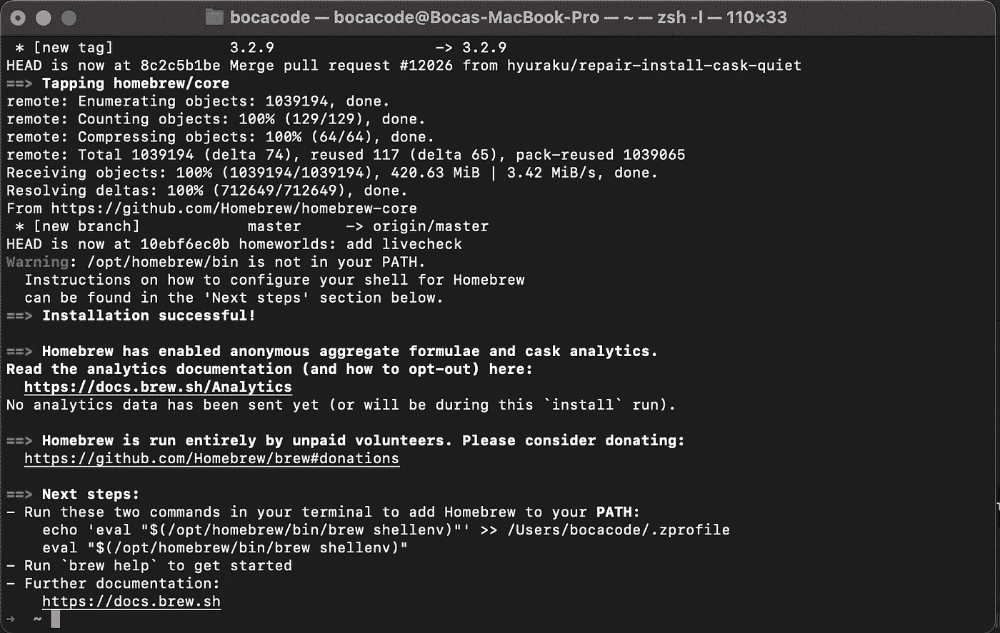

# M1 Mac 开发者设置

> 原文：<https://medium.com/codex/m1-mac-developer-setup-69771f5f977d?source=collection_archive---------0----------------------->


詹姆斯·哈里逊在 [Unsplash](https://unsplash.com?utm_source=medium&utm_medium=referral) 上拍摄的照片

安装全新的电脑可能会很有压力。然而，对于开发人员来说，让您为开发做好准备应该是一项简单、有趣且轻松的任务。

第一步是深呼吸，按照这个神奇的一步一步的教程。

# 步骤 0:

这一步对你们中的一些人来说似乎是显而易见的，但是对于我的初学者来说，请确保你是正在安装的计算机的管理员。


# 第一步:

下载 Visual Studio 代码作为您的代码编辑器。对于 M1 Mac，你需要安装苹果硅压缩。

【https://code.visualstudio.com/download 


确保 Visual Studio 代码位于您的应用程序文件夹中。


# 第二步:

一个好的开发人员经常与技术社区保持联系。很多社区和公司使用的一个有用的工具是 Slack。

点击下载按钮下载 Slack 并创建一个帐户。

[](https://slack.com/downloads/mac) [## Mac |下载

### 为移动设备和桌面免费下载 Slack。通过我们的 iOS、Android 应用保持对话

slack.com](https://slack.com/downloads/mac) 

# 第三步:

你首先需要在终端内部安装的是苹果开发者工具。

粘贴并**在终端**上运行这个命令来安装苹果开发者工具:

```
sudo xcode-select --install
```


# 第四步:

现在是时候用哦，我的 Zsh 来给你的终端拉皮条了！Oh My Zsh 是一个开源框架，用于管理您的 Zsh 配置、主题和插件。

[](https://ohmyz.sh/) [## 哦，我的 Zsh——一个令人愉快的开源 Zsh 框架

### Oh My Zsh 是一个开源的、社区驱动的框架，用于管理您的 Zsh 配置。听起来很无聊。让我们试试…

ohmyz.sh](https://ohmyz.sh/) 

粘贴并**在终端**上运行这个命令来安装 Oh My Zsh:

```
sh -c "$(curl -fsSL https://raw.githubusercontent.com/ohmyzsh/ohmyzsh/master/tools/install.sh)"
```


运行该命令后，您的终端将会改变颜色，在终端内部工作将会更加容易。

# 第五步:

大多数开发人员使用的一个重要工具是自制软件，因为它使安装软件更容易。

[](https://brew.sh/) [## 公司自产自用

### macOS(或 Linux)缺失的软件包管理器。

brew.sh](https://brew.sh/) 

粘贴并**在终端**上运行这个命令来安装自制软件:

```
/bin/bash -c "$(curl -fsSL [https://raw.githubusercontent.com/Homebrew/install/HEAD/install.sh](https://raw.githubusercontent.com/Homebrew/install/HEAD/install.sh))"
```


一旦运行该命令，它将要求您按下**回车键**继续。


确保遵循**接下来的步骤，**将自制软件添加到您的**路径中。**



一旦你运行最后两个命令，家酿将被安装。

# 第六步:

另一个重要的开发工具是 GitHub。GitHub 允许开发人员协同工作，它还可以将您的代码保存在笔记本电脑之外。

**创建账户:**

[https://github.com/](https://github.com/)

通过**粘贴以下命令安装 GitHub 命令行工具:**

```
brew install gh
```


通过**粘贴此代码:**通过终端登录您的账户

```
gh auth login
```

# 第七步:

安装 Yarn 以确保您未来项目的依赖性处于控制之下。

将以下命令粘贴到您的终端中以安装 Yarn:

```
brew install yarn
```

# 第八步:

下载 Node.js 是必要的，因为它允许您在浏览器之外运行 JavaScript。

重要的是下载至少 16.9.1 的最新版本。

[https://nodejs.org/en/download/current/](https://nodejs.org/en/download/current/)


# 结论:

**霍雷！现在你已经准备好开始编码和创建独特的项目了。记住，享受其中，正如我的导师托德·h·艾伯特博士会说的那样:“相信这个过程！”**


[蒂莫西·戴克斯](https://unsplash.com/@timothycdykes?utm_source=medium&utm_medium=referral)在 [Unsplash](https://unsplash.com?utm_source=medium&utm_medium=referral) 上拍摄的照片