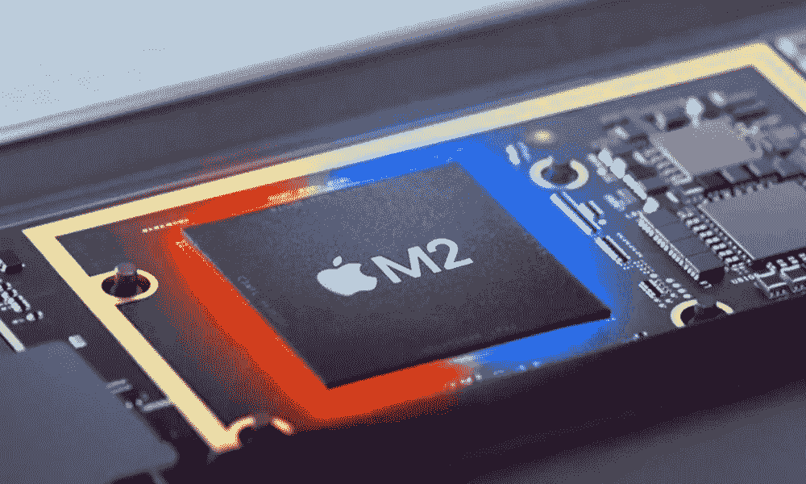
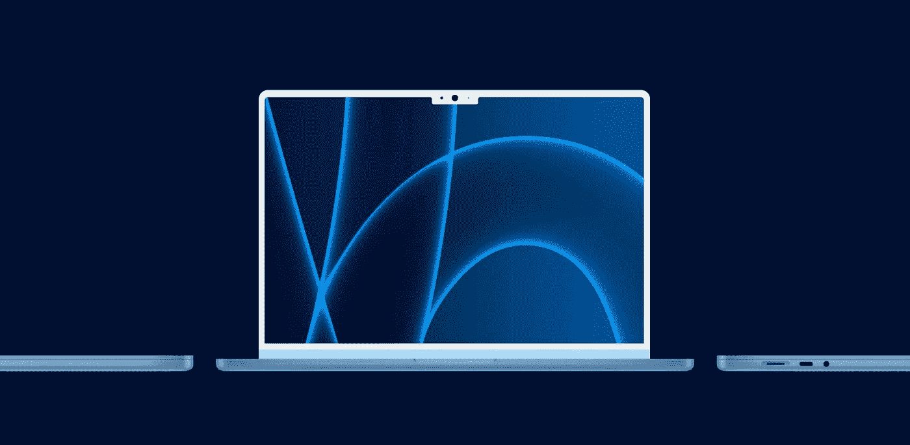
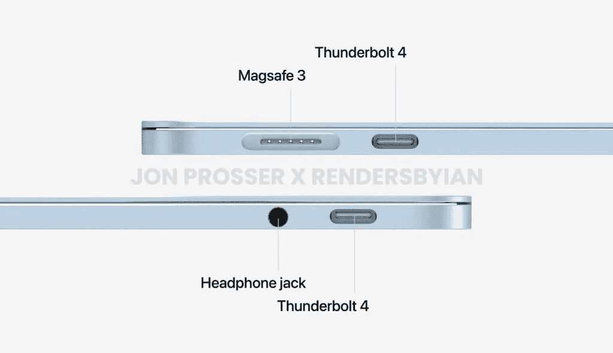
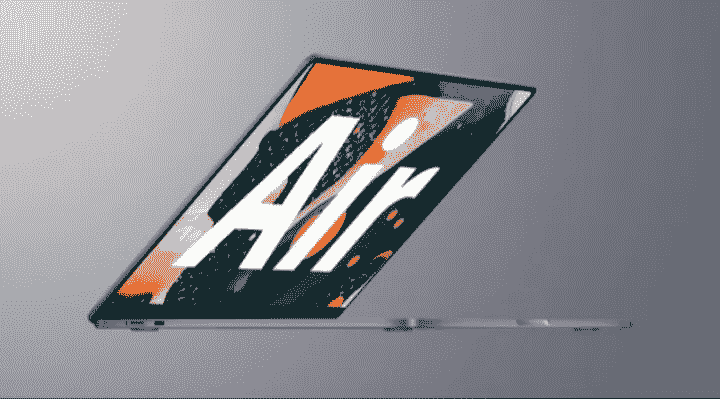

# M2 Macbook Air

> 原文：<https://medium.com/codex/m2-macbook-air-7b834204f9f5?source=collection_archive---------5----------------------->

# 设计

**苹果**正在为 **MacBook Air 进行重大的新设计，**有许多类似于 **iMac (2021)的颜色，**在屏幕的顶部中心有一个厚的凹口以减少边框厚度，**在凹口和边框上有一个白色改造**，它肯定会让人看起来很舒服。

Creidit:苹果/伊萨奇奥

# 等级

***约翰·普罗瑟(准确率 73.9%)*，**第一个报道 **Macbook air 重新设计的人**在与 ***DylanDKT(准确率 77.5%)确认了他的信息后，修改了他对机器的渲染，加入了一个**凹口**。***

*引领概念形象由* [*9to5Mac 的 Parker Ortolani*](https://9to5mac.com/2021/10/22/concept-how-a-new-macbook-air-could-adopt-the-best-parts-of-the-imac-and-macbook-pro/) *打造。*

你可能会问为什么苹果会这样做，我相信这是因为**缩小了屏幕其余部分的**边框**，就像他们对 14 英寸和 16 英寸 Macbook pro 所做的那样。**

# 充电

苹果还将在机器侧面包括他们长期喜欢的磁性 **Magsafe** 充电端口，并将配备 30w 适配器，现在不用担心，你仍然可以用 **Type-C** 充电，但端口将在一个平坦的表面上，没有楔形物。

# 网络摄像头升级！

**DylanDKT** 还表示，我们应该期待一个 1080p 的网络摄像头，就像 14 英寸和 16 英寸 Macbook pro 中的网络摄像头一样，从表面价值来看，这在纸面上是一个巨大的胜利，但正如在 **14 英寸和 16 英寸 Macbook pro 中看到的那样，**“**的摄像头美化了**“你的脸，并给你的完成带来了更淡的色调。

# 名字

苹果公司为他们的机器起的名字听起来像是一大堆“**热空气”**在这一点上，我的意思是看看它，这个名字最初是用来描述电脑有多轻，但随着苹果公司的产品系列中其他几磅重的产品，这个名字改变了它的意思，成为 mac 的其他产品的更便宜的替代品。

但是自从 **Ipad air(第四代)**发布以来，这个名字就不再有任何意义了，因为它明显比基准 Ipad 贵。

你可能会问新名字是什么？嗯，现在很难说，但街上的消息是，苹果公司将剥离“空气”的名称，只称之为 **Macbook。**

分享更多！