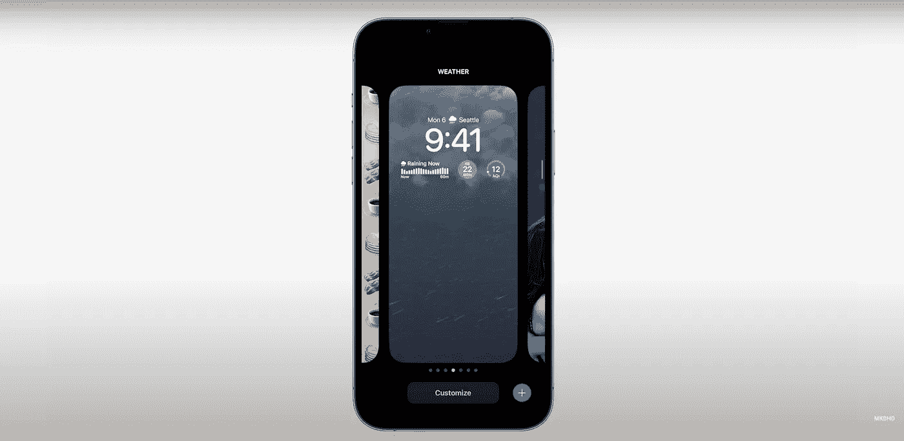

# M2 Macbooks 和 iOS 16(新)——2022 年苹果全球开发者大会(WWDC)

> 原文：<https://medium.com/codex/m2-macbooks-and-ios-16-new-apple-worldwide-developers-conference-2022-wwdc-c70c19218af3?source=collection_archive---------12----------------------->

# iOS 16

iOS 16 中有一系列新的锁屏功能，你可以添加小工具，改变时间和日期颜色，给壁纸添加颜色过滤器，哦，你可以有一个不同的锁屏预设库，从你的标准图像到这些超级光滑的空间动态图像。

来源——Apple.com