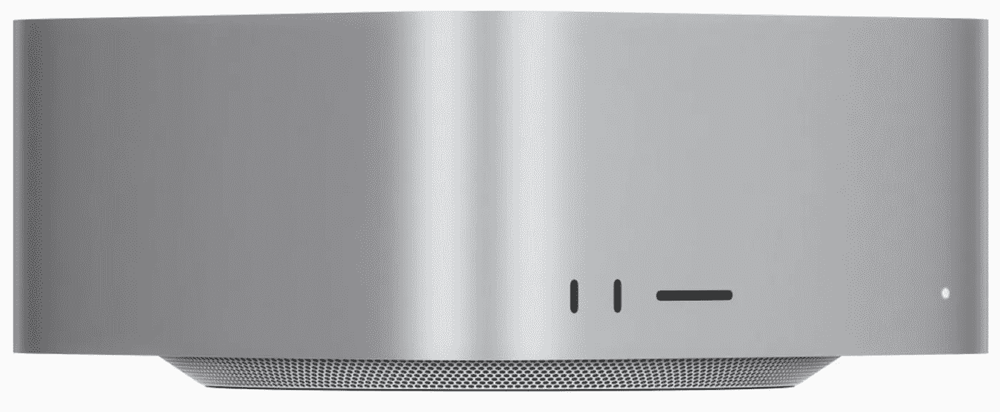

# Mac Studio，苹果十年来最不吸引人的设备

> 原文：<https://medium.com/codex/mac-studio-apples-most-uninspiring-device-in-a-decade-2de122b03afb?source=collection_archive---------2----------------------->

## 或者是英特尔和 AMD 面临的不吸引人的技术难题

ony Ive 并不是每个人都认为的苹果设计天才，但他也没有完全疯掉。据说他是迪特·拉姆作品的崇拜者，这些年来他确实做对了几件事。我的意思是，让我们面对它，苹果的一些产品就像…