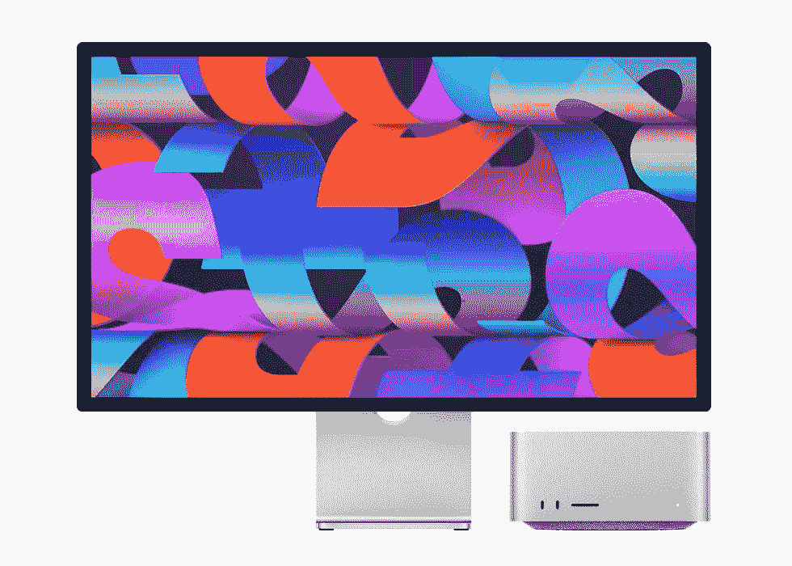

# Mac 工作室，M1 超和硬件的终结

> 原文：<https://medium.com/codex/mac-studio-m1-ultra-and-the-end-of-hardware-c30d57595b0?source=collection_archive---------1----------------------->

## 苹果公司新推出的功能强大的 M1 超芯片 Mac Studio 对电脑硬件和苹果公司的未来有什么看法？

当 M1 芯片发布的时候，有很多怀疑者说苹果的性能数据不可能是正确的。然后第三方测试证实苹果没有夸大其词…