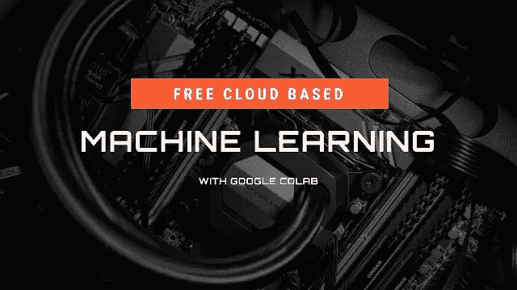

# 免费的云端机器学习

> 原文：<https://medium.com/codex/machine-learning-and-ai-have-been-a-dominant-skill-for-years-and-organizations-understand-is-a-7c79e44518d6?source=collection_archive---------4----------------------->



多年来，机器学习和人工智能一直是一项主导技能，各组织都知道这是保持竞争力的一项要求，特别是在 2021 年帮助扩大业务规模。机器学习可以在各种能力上提供帮助，包括深度分析、模式识别、自然语言处理、自动化等等。现在，将这些强大的技能集与编程和另一项强大的技能云计算结合起来，你就拥有了某种程度上的业务可扩展性独角兽

几十年来，我们一直依赖电子表格作为我们的分析平台，同时我们引入了具有分析头脑的人，他们可以将数据集吸收和处理到 MS excel 等工具中，并操纵数据，以便将其放在一个整洁的演示文稿中，总结几个小时甚至几周的工作。虽然我们仍然依赖电子表格，但意图已经发生了变化，越来越多的组织开始看到利用机器进行思考和数字运算以及人们帮助解释结果背后的价值。

那么，为什么没有每个人都加入 ML 的行列，停止他们的传统做法呢？嗯，运行现代机器学习算法需要大量的计算能力。虽然大型组织可以访问 CPU、大型 GPU，甚至 TPU，但中小型组织还不具备这种能力。例如，当谷歌公开他们的 transformer 模型时，培训是在几个月内完成的，使用 8-10 个大型 GPU 和几位科学家来完成一个生产就绪的开源框架。

那么，还没有大型基础设施的组织如何从中受益呢？云计算的出现为企业提供了访问企业级硬件和架构的机会，帮助他们只需按一下按钮就可以利用和扩展这些设备。首先，谷歌有一项名为 google colab 的服务，可以让你像运行笔记本一样运行自己的 Jupyter，并免费利用谷歌的 GPU、CPU 和 TPU(当然有限制)，或者选择付费版本以获得更多功能。好处是组织可以根据需要增加或减少需求，而不是投资昂贵的体系结构。它还为他们提供了一个平台来运行他们的机器学习模块，而无需安装任何软件。

看看这个 YouTube 视频，它介绍了使用 google colab 的机器学习协奏曲:

```
Machine Learning in the Cloud for Free | Google Colab [https://youtu.be/pURhhTb1Rn0](https://youtu.be/pURhhTb1Rn0)
```

现在，如果你想要更强大、更持久的东西，你可以利用更成熟的云平台，包括谷歌云平台(GCP)、微软 Azure 或亚马逊 AWS。这些平台提供从基础设施服务到平台的完整解决方案，甚至包括文本分析等全面的预训练模型

我还会在列表中添加一些其他的替代服务器，包括 Heroku、Digital Ocean 和 Linode，它们可以更容易地扩展或缩小，以满足您的业务需求

如果您的组织希望进入 ML 并了解更多关于他们如何利用机器学习和云计算的信息，请务必查看 [levers.ai](http://Levers.ai)