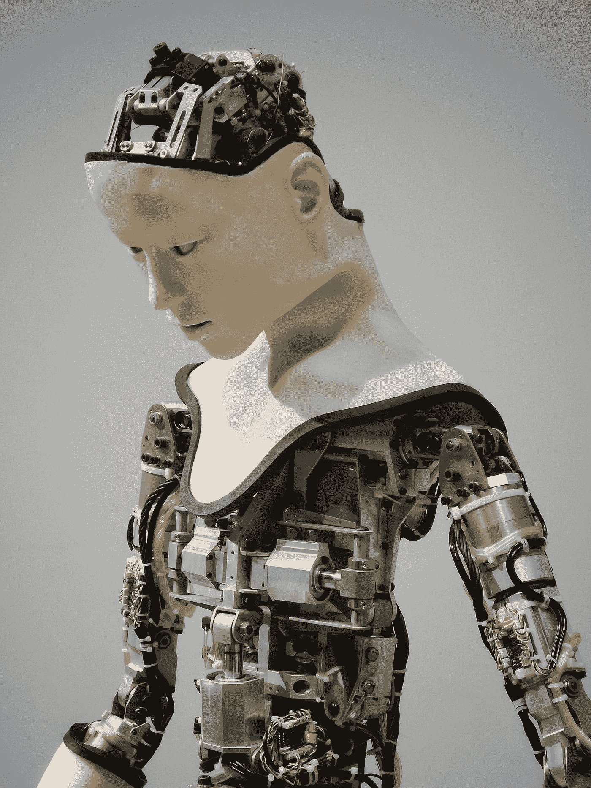
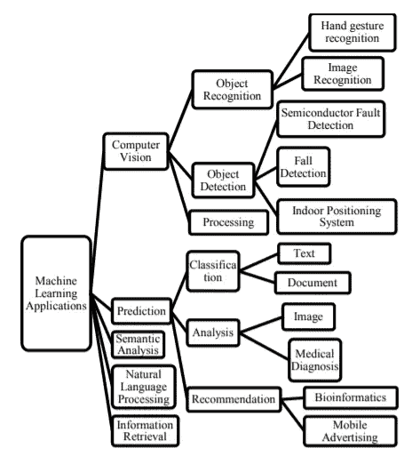
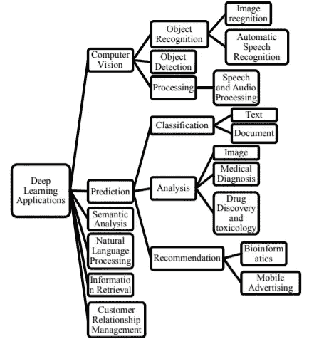

# 机器学习和深度学习应用:一项研究

> 原文：<https://medium.com/codex/machine-learning-and-deep-learning-applications-a-study-e70d32b3e6c5?source=collection_archive---------19----------------------->

人工智能(AI)是让机器人变得像人脑一样聪明的过程。在计算机工程中，人工智能指的是对“专家系统”的研究，专家系统是能够感知周围环境并采取行动以增加实现目标的机会的设备。当一个设备可以执行人类与其他人类思维相同的动作，如“学习”和“解决问题”，它就被称为“人工智能”。学习是机器的基本特征。因此，机器学习是人工智能的一个分支。因此，机器的标准更高。深度学习就是这种方法的一个例子。机器学习是其中的一个分支。

[附身摄影](https://unsplash.com/@possessedphotography?utm_source=medium&utm_medium=referral)在 [Unsplash](https://unsplash.com?utm_source=medium&utm_medium=referral) 上拍照

# 机器学习的应用

ML 的各种应用是——计算机视觉、预测、文本分析、自然语言处理和信息提取是各种应用领域中的一些。

1.  计算机视觉:基于视觉的领域包括子领域，如对象分类、对象识别和对象处理。
2.  分类、评估和建议是预测的几个子领域。机器学习已经被用于有效地管理文本分类、文本分类、图像识别、临床诊断、网络入侵检测预测和拒绝服务威胁预测。
3.  语义研究是将段落、短语和个人的复合句与整体写作质量联系起来的过程。如何训练计算机准确分析自然语言数据，被称为自然语言处理。在文档中寻找信息、探索文档、探索提供信息的元数据以及研究图像和声音数据库的研究被称为信息恢复。

作者图片

# 深度学习的应用

机器学习包括作为子集的深度学习。这是一个大规模的神经网络，有很多层和参数。神经网络设计用于大多数深度学习方法中。因此，它也被称为深度神经网络。在下面的示例中，讨论了一些最先进的深度学习应用突破:

1.  微软语音识别是大数据(MAVIS)中深度学习实现的一个例子。深度学习允许使用人类语音和话语来搜索音频/视频数据。
2.  谷歌的图片搜索服务在大数据环境中采用了深度学习。他们采用深度学习来理解图像，以将其用于图像注释和标记，这在图像搜索引擎、图像检索和图像索引中非常重要。
3.  在 2016 年的一场围棋比赛中，谷歌的 AlphaGo 算法战胜了 Lee Sedol，证明了深度学习具有非凡的认知能力。
4.  Deep Dream 是谷歌开发的一项技术，它可以分析照片，并根据自己的知识创建古怪和人工的艺术品。

作者图片

数据依赖性、GPU 硬件和特征工程是深度学习适合扩展应用的主要原因。术语“数据依赖”指的是对大量数据有效执行的深度学习技术。GPU 指的是图形处理单元，是一个稍微提升的处理器。

与机器学习相比，从数据中学习高级特征的能力，即所谓的特征工程，使深度学习与众不同。因此，未来几年可能会出现更多深度学习应用。

# 结论

通过对应用程序的检查，我们现在可以调查深度学习应用程序的任何最新领域，这些领域将产生更好的结果，并有助于该领域的当前研究。因为深度学习研究仍处于早期阶段，甚至还有新架构出现的空间。除此之外，还可以在分析和预测的子领域进行改进。