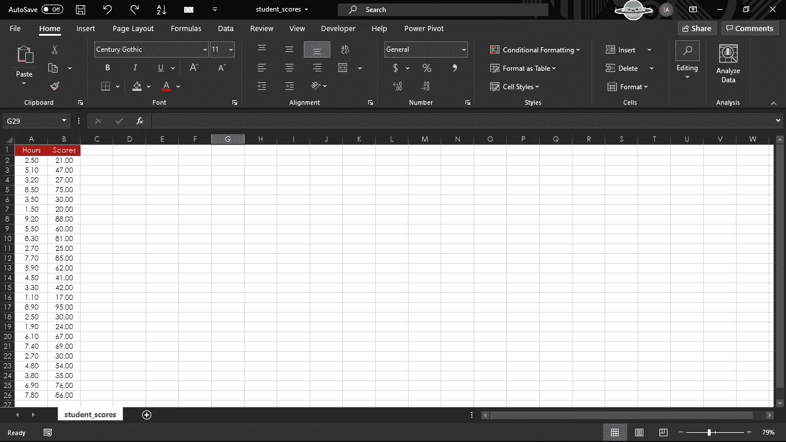

# 机器学习应用:预测学生的学习成绩

> 原文：<https://medium.com/codex/machine-learning-application-predicting-students-academic-performance-817386a7d4af?source=collection_archive---------2----------------------->

## 深入研究教育数据挖掘，使用监督线性回归来训练和评估机器学习模型，以预测学生的学业成绩。

训练机器学习模型。

# 介绍

## A. 背景——什么是机器学习？

M 机器学习是对通过经验和使用数据自动改进的计算机算法的研究。它是人工智能的一个子集，基于这样一种思想，即系统不仅可以从数据中学习，而且**可以识别隐藏的趋势和模式**，并在几乎没有人工干预的情况下进一步做出决策。可以说，机器学习是一种数据分析方法，它使从业者能够**促进管理层根据预期结果和给定数据做出更明智的决策**。

机器学习算法有很多种。最常见的类别有**监督学习**、**非监督学习**、**强化学习**。

机器学习的类型及其后续分支。

1.  监督学习是一种使用标记数据训练**模型的方法。所有材料都通过注释**手动标记**以指导机器使用相应的值，因此它可以使用正确的值预测新的、看不见的数据。**
2.  无监督学习是一种使用未标记数据训练**模型的方法。机器通过检测数据的特征自行对材料进行分类。**该方法不涉及人工分类**，因此最终预测误差较大。为了在无监督学习中实现一定程度的正确性，整合强化学习是必要的。**
3.  强化学习是一种方法，其中**模型使用从与环境**的相互作用中收集的观察结果，采取行动以最大化回报或最小化风险。**没有标记数据**，但是反馈给模型哪个步骤是正确的，哪个步骤是不正确的。根据反馈的质量，机器**逐渐修正其分类**并最终得到正确的结果。

# 应用

## A.用例—目标

涉及**机器学习技术**的教育领域研究最近呈现出陡峭的增长轨迹。一个叫做“教育数据挖掘”的新术语已经出现，即数据挖掘技术在教育背景**中的应用，旨在发现关于学生表现的隐藏趋势和模式**。

本项目旨在开发一个基于机器学习技术的学生学业成绩预测模型。由此产生的模型可用于识别任何学生在特定科目上的表现。

> 任务是根据学习的小时数预测学生的预期分数。

## B.数据描述

所需的数据将是为该分析提供的一个 **CSV(逗号分隔值)** **文件**。

CSV 文件的片段。

原始数据经过清洗、修改，并赋予其美观的外观，以便进行一般性解释。如上所示，有两列:**小时**和**分数**，每列**有 25 个值**。在查看该数据集时，在一般认知的帮助下，建立的**假设**是在我们的两个变量之间存在**正相关**。让我们更进一步，得出我们的假设是否正确的结论。

## C.要使用的库

Python 库是一组有用的函数，无需从头开始编写任何代码。到今天为止，Python 中有超过 137，000 个库。然而，我们将只利用四个来完成我们的任务；**熊猫**、 **NumPy** 、 **Matpotlib** 和 **Scikit-Learn** 。

*   Pandas 是一个为 Python 编程语言编写的开源软件库，用于高性能数据操作和分析。特别是，它提供了强大的**数据结构和操作来操作数字表和时间序列**。Python 与熊猫被用于各种领域，包括金融领域**经济领域*和其他商业领域*。**
*   **NumPy 是一个库，增加了对大型、**多维数组和矩阵**的**支持，以及处理这些数组的例程集合。NumPy 还提供了一个大型的**高级数学函数和逻辑运算**集合来在这些数组上执行。****
*   **Matplotlib 是一个**绘图库**，也是用于**数据可视化**的最流行的 Python 包之一。它提供了一个面向对象的 API，用于根据数组中的数据绘制 2D 图。**
*   **Scikit-learn 是一个用于建立模型的机器学习库，因为它有大量用于预测建模和分析的工具**。它具有各种算法，如**支持向量机**、**随机森林**和 **k 邻居**。****

> ****该项目为**数据科学家**提供了应用数据科学知识的机会，并明确地经历不同的流程。定义业务问题、需求引出、从外部来源检索和利用原始数据、解析和清理数据，以及通过机器学习算法和工具进行分析评估。最终分析得出的评估结论可以被利益相关者利用，包括但不限于学术顾问、教授和家长。由于该项目有许多方面需要考虑，**它是公开讨论的**并针对**企业家**和**利益相关者。******

# ****构建预测模型****

## ****A.分析方法****

****监督机器学习将被用于预测和分析学生的分数。对于这项任务，我们通过使用一种称为“**简单线性回归模型**”的技术来着手解决问题。它是一种统计模型，常用于**估计两个数量变量之间的关系**；一个因变量和一个或多个自变量使用一条线。该算法对于中小型数据库来说是快速有效的，并且对于从标记数据中快速发现洞察力是有用的。****

****我们的两个定量变量是:****

1.  ****每个学生在某一特定科目上的分数百分比。****
2.  ****每个学生学习某一特定科目的小时数。****

## ****B.数据分析****

******一、导入库&加载数据******

****我们将导入相关的库。请注意，Scikit-Learn 将在稍后导入。****

****正在导入的库片段。****

****下一步是将给定的数据加载到我在 Jovian 上使用的 Python 解释器中，继续进行模型的训练。Pandas 用于加载 CSV 文件，并在数据成功加载时给出排序确认。****

> ****注意:我已经将文件保存到我的系统中，与这个解释器在同一个目录下。****

****加载到 Python 解释器中的数据片段。最后会收到一条确认消息。****

******二。可视化数据&获得洞察力******

****在继续之前，我们将检查我们数据的技术信息摘要。使用的 **info()** 函数打印一个特定数据帧的简明摘要。该函数提供关于数据帧的信息，包括但不限于:****

*   *****指标类型*****
*   *****列数据类型*****
*   *****非空值*****
*   *****内存使用量*****

*****允许使用 info()函数查看关于我们的数据帧的信息的代码片段。*****

****基于上面给出的信息，我们可以重申，有两列分别称为*小时*和*分数*、，每列总共有 **25 个值**。因此，可以得出结论，在被馈送到机器学习模型的数据中有 **25 个元素。******

******小时**中的数据类型( *dtype* )为 **float** ，而**分数**中的数据类型( *dtype* )为**整数**。为了将来的目的，两列应该有**相同类型的数据**。****

****显示两种数据类型相同的数据帧信息的片段。****

****成功导入并将两列的数据类型转换为相同后，可以使用 **head()** 函数预览数据。****

****预览数据的代码片段。最后会收到一条确认消息。****

****注意 head()函数默认只预览顶部的五个元素。这可以通过简单地添加需要在括号之间看到的元素数量来定制。****

****显示了数据集的前十个元素的片段。****

****成为一名数据科学家需要综合技能。它们可以分为三类:技术技能、功能技能和软技能。特别是，功能技能包括拥有**良好的数字感**。人们应该能够分析和翻译这些数字所表达的意思。这需要牢牢把握统计数据和解释空间。幸运的是， **describe()** 函数为进一步的统计分析提供了一组重要的值。****

****显示数据集统计信息的代码片段。****

******三世。绘制数据******

****下一个阶段是输入分布分数，并根据要求绘制它们。数据点绘制在二维图上，以可视化数据集，并查看是否可以识别数据之间的任何关系。使用以下脚本创建该图:****

****一段代码导致绘制一个二维图形来标识数据集中的关系。****

****从上图可以明显看出**两个变量**之间存在正线性关系，即学习小时数与分数百分比**成正比**。****

******四世。为机器学习算法准备数据******

****大量的数据以不同的格式、结构和来源出现。数据科学家工作的一个重要部分是**通过**清理、组织和优化**最终用户使用的**这些数据。最终用户包括**业务干系人**、**分析师**和**程序员**。“准备好的”数据然后用于**解释结果**和**传递信息**给管理层**做出更明智的决策**。****

****指示没有空值的代码片段。****

****head()函数用于检查数据集的代码片段。****

****既然我们 100%确定我们的数据集没有空数据，下一步就是将数据分成**属性**(输入)和**标签**(输出)。****

****数据被分成属性和标签的代码片段。****

****既然我们的属性和标签已经就绪，下一步就是将这些数据分成训练集和测试集。这是通过使用 **Scikit-Learn 的**内置 **train_test_split()** 方法来完成的。****

****数据被分成两组的代码片段:训练和测试。****

****在成功地将数据分成训练集和测试集之后，最终是训练算法的时候了。如上所述，将使用**简单线性回归模型**。****

## ****C.训练机器学习算法****

****显示我们算法训练的代码片段。最后会收到一条确认消息。****

****既然训练完成了，我们就画回归线。****

****显示两个变量之间正相关的二维图形片段。****

****正如二维图上的回归线所示，我们的两个变量呈正相关。这进一步增加了我们之前的假设，现在这个假设可以被普遍接受为真。****

## ****D.做预测****

****现在我们的算法已经训练好了，是时候做预测了。****

****我们的 ML 模型做出的预测片段。****

****我们的 ML 模型对实际分数和预测分数进行比较的片段。****

****一个考虑了所有三个参数的代码片段。****

****根据结果，我们的机器学习模型正在暗示我们的**两个变量彼此成正比**。可以看出一些预测分数的高估和低估。****

## ****E.使用自定义数据进行测试****

****一段代码，其中给出了一个用于预测的随机数。****

****可以看出，对于几个 **9.25 小时**，预测得分为 **93.692** 满分 100 分(四舍五入到小数点后第三位)。****

## ****F.评估机器学习算法****

****最后一步是评估我们算法的性能。这最后一步对于在特定数据集上比较不同算法的性能非常重要。可以使用许多度量标准。然而，我们将使用均方差。****

****评估我们算法性能的代码片段。****

# ****结果和讨论****

****该项目的主要目标是确定这两种定量测量之间是否存在关系。如果是这样的话，那么我们必须为学生的学习成绩开发一个预测模型。回顾这些发现，我们已经从我们的机器学习模型中获得了足够的结果，可以称我们的假设为**被接受为真**。因此，在一个科目的学习小时数和该科目考试成绩之间存在正相关关系。****

****利益相关者如何利用我们的发现？****

*   ****讲师可以对学生进行分类，并采取早期行动来提高他们的表现。所有低于中位数或处于中位数的学生都可以得到学科专家的照顾，以期望在该学科中取得好成绩。****
*   ****由于早期的预测和解决方案已经完成，期末考试可以取得更好的成绩。对学生学习成绩的预测是利用他以前的记录独立完成的。这种结果使得利益相关者，即父母和讲师，能够将他们的注意力完全集中在那些缺乏耐心地坐几个小时来学习一门课程的人身上****
*   ****与该机构有联系的知名公司可以根据学生的要求搜索他们。在学术上有所表现的学生可以被讲师说服去指导那些挣扎中的学生。****
*   ****随着时间的推移，可以采取系统的方法来提高性能。一个采用 SCRUM 方法的敏捷环境可以被应用到实践中来提高生产力水平。可以在这些学生中进行分组，每个分组包含至少一个学习成绩高于平均水平的学生。****

# ****结论****

****由于许多不确定性，决定和致力于最佳实践和环境以提升学生的学术组合可能是一项具有挑战性且相当艰巨的任务。然而，这个时代的数据丰富，这要归功于社会的数字化，其中许多人类活动现在都在数字领域，以及先进的机器学习算法，使我们更容易获得对我们选择的主题及其相关实体的有意义的见解。这对大家都有帮助；利益相关者、企业家和企业主，根据研究和事实做出明智的决策。****

****谢谢你，****

****乌斯曼·阿夫塔布·汗****

******注**:本文所有内容均记载于**我的** [**GitHub**](https://bit.ly/2UrX9WH) **资源库**。如果你对破译全部密码感兴趣，请一定要来看看。****