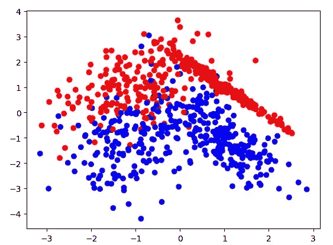
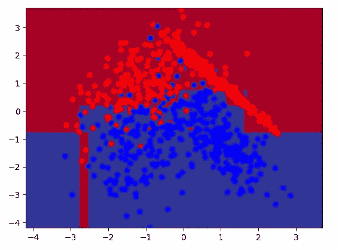

# 机器学习——随机森林分类器初学者指南(代码)

> 原文：<https://medium.com/codex/machine-learning-beginners-guide-to-random-forest-classifiers-the-code-d72ee34528eb?source=collection_archive---------14----------------------->

所以，如果你还没有检查过，我已经发布了关于这种机器学习技术背后的数学。如果这是你第一次遇到这个算法，我建议你在开始写代码之前先读一读。否则，我们就直接跳进去！


因此，我们将一如既往地导入我们需要开始的包:

```
import numpy as np
import matplotlib.pyplot as plt
from sklearn.tree import DecisionTreeClassifier
from sklearn.ensemble import RandomForestClassifier
from sklearn.datasets import make_classification
from sklearn.model_selection import train_test_split
```

在这里，我们将生成一个快速数据集来训练我们的模型。这将是一个非常简单的数据集，不是真实世界数据的真实反映，这纯粹是为了演示如何建立模型。

生成我们的数据非常简单:

```
x,y = make_classification(n_samples=1000,n_features=2,
                          n_informative=2,n_redundant=0)
```

从这一行代码中，我们将输入数据存储在“x”变量中，这将是一个(1000，2)矩阵，而相应的类响应保存在“y”中，这是一个 1000 项的长列表。从这里开始，我们想把它分成训练数据和测试数据。

```
x_train,x_test,y_train,y_test = train_test_split(x,y,test_size=0.25)
```

这将我们的数据分成 75%用于训练，25%用于测试模型。在我们创建模型之前，让我们将它显示在图上，以便更清楚地看到我们正在处理的内容。

```
plt.scatter(x_train[:,0],y_train[:,1],c=y_train,cmap='bwr')
plt.plot()
```

运行该脚本后，您应该会得到类似如下的输出:



好了，数据看起来已经很容易分割了，所以我们的模型应该表现良好！对于像这样的数据集，机器学习算法真的没有必要，但它肯定更有趣。

在我们构建实现随机森林分类器之前，让我们构建一个决策树分类器，因为它们更容易可视化。

```
tree = DecisionTreeClassifier(random_state=0,max_depth=5)
tree.fit(x_train,y_train)
```

这就是构建和训练决策树所需的全部代码！但它并不能真正帮助我们看到它是如何执行的，甚至它实际上是如何完成的。为了有所帮助，让我们在数据上创建一个网格，用我们的模型来预测每一点，结果应该是在我们的图上画出一些决策边界。

```
Min,Max = np.min(x_train),np.max(x_train)
x1 = np.linspace(Min,Max,100)
x2 = np.linspace(Min,Max,100)
x1g,x2g = np.meshgrid(x1,x2)
X = np.array([x1g.ravel(),x2g.ravel()]).T
Y = tree.predict(X)
plt.pcolormesh(x1g,x2g,Y.reshape(x1g.shape),cmap='RdYlBu_r')
plt.scatter(x_train[:,0],x_train[:,1],c=y_train,cmap='bwr')
plt.show()
```

因此，我们在这里所做的只是在我们的数据上创建一个点数组，并将它们输入决策树模型，以预测作为输出。根据结果，我们在训练数据图上绘制了一个彩色网格，看起来应该是这样的:



您可以清楚地看到这两种分类的决策界限。如果您将“max_depth”参数设置为较高的数字，那么您应该会获得更多的边界，但是如果它设置得太高，那么模型将会过度适应训练数据。我们应该做的是在给定测试数据的情况下计算模型的误差。

```
y_pred = tree.predict(x_test)
error = (y_test!=y_pred).mean()
print('Error = ',error)
```

我建议试试“最大深度”参数，看看对这个错误的影响。

对，所以我们有一个决策树，我们可以看到它是如何对数据集进行分类的。让我们继续到随机森林。

代码几乎与决策树模型相同，除了我们不能以同样的方式可视化它，因为有许多树一起工作。

```
forest = RandomForestClassifier(n_estimators=100,max_depth=5)
forest.fit(x_train,y_train)
y_pred = forest.predict(x_test)
error = (y_test!=y_pred).mean()
print('Error = ',error)
```

简而言之，这就是我们的随机森林。“n_estimators”参数是我们使用多少决策树，多数类预测是模型的输出。在 random forest 中有几个参数可以使用，所以我推荐阅读关于它们的 sklearn 文档，您可以自己进行实验。

你肯定应该比较我们训练过的两个模型的误差差异，大多数时候你会看到森林的表现优于树木。这就是为什么集合方法通常比单独方法更受欢迎。

如果你喜欢训练你的第一个基本决策树或者随机森林，我推荐你找一些其他的数据集来尝试它们。从那里你可以探索改变参数的效果，甚至可以研究一些优化算法！