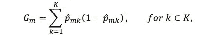

# 机器学习——随机森林分类器初学者指南(数学)

> 原文：<https://medium.com/codex/machine-learning-beginners-guide-to-random-forest-classifiers-the-maths-295fc1c2f3d7?source=collection_archive---------17----------------------->

如果你对不同的机器学习技术感兴趣，那么你可能以前遇到过随机森林算法。在这篇文章中，我将回顾它背后的数学原理，在另一篇文章中，我将介绍如何用 python 实现它们。

众所周知，考虑到它们的简单性，随机森林表现得非常好。在许多编码竞赛中，它们甚至在对抗神经网络时也能表现得很好，令人印象深刻！在你的机器学习之旅中，它们绝对是你必须知道的。随机森林是基于“决策树”的，所以我们将从这里开始。

决策树是随机森林分类器的基础。决策树的工作方式是获取 n 维预测空间，并递归地将其分割成分区，从而最大化分区内的“纯度”。纯度是一个分区中相同预测的数量，使用“基尼指数”来衡量。对于𝑚𝑡ℎ分割区，𝑅 *m* 地区的基尼指数使用以下公式计算:

其中，𝐾是预测类的总数。基尼系数衡量的是纯度，因为它是根据所选分割区域内的数据计算出错误分类的概率。找到沿预测值轴之一的点进行分割意味着找到最大纯度，这是使用质量概念完成的，其公式为:

其中，𝑁1、𝑁2、𝐺1、𝐺2 是抽样分割后区域 1 和 2 的点数和相应的基尼指数；最佳分割点使用以下公式计算:

找到每个预测器的质量，并且所有预测器的最小质量是将进行分割的地方。这被反复重复，直到满足停止分裂的条件。每个分裂被称为节点/叶，并且所进行的分裂的数量被称为深度，并且如果指定了最大节点数量或最大深度，则两者都是停止分裂的潜在条件。

好的，这就是决策树的数学原理，真的没有太多，但是掌握它是很重要的。所以记住这一点，让我们用它来理解随机森林是如何工作的，以及为什么它们更优越！

随机森林分类器是一种集成的监督学习算法。由于使用多种个体学习方法，集成方法通常优于个体学习方法。这样做的目的是减少使用单一技术产生的差异，并产生一个总体上不太过度拟合的模型。随机森林分类器可以获得比决策树更好的结果，因为它采用多个称为分支的决策树，因此被归类为集成方法，并采用分支的多数预测作为结果。

所以从一棵树到一群树，真的没有任何额外的数学运算。您需要明确的唯一概念是，它采用来自多个决策树的多数类投票。

现在你知道了！这就是随机森林分类器工作的数学原理。在付诸实践之前，这绝对值得一试，你会更好地理解这样做的结果。

我希望这有助于您了解这种令人印象深刻的机器学习技术的背景！