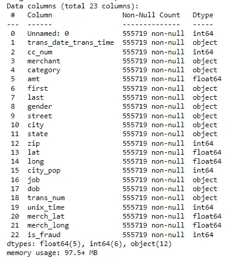
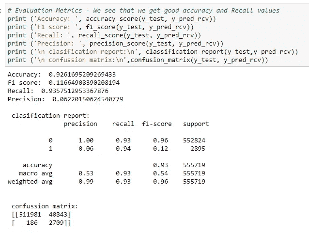

# 机器学习案例研究:信用卡欺诈检测

> 原文：<https://medium.com/codex/machine-learning-case-study-credit-card-fraud-detection-f913de370f6?source=collection_archive---------1----------------------->

## 在这篇文章中，我演示了如何端到端地执行一个机器学习问题。

照片鸣谢——斯蒂芬·菲利普斯在 Unsplash

可以说，像信用卡/借记卡这样的支付卡已经成为我们几乎所有人的生命线。信用卡是一个很有吸引力的消费选择，因为你花了钱，但从技术上讲，以后还得为此付钱。随着*买* *现付现*现象的流行，采用这种消费方式的顾客与日俱增。

此外，这些消费选项带有诱人的现金返还和信用点数，你可以进一步将其转换为现金或购买物品。此外，如今，这一领域的竞争已经变得非常激烈，新的金融科技公司推出了许多灵活便捷的消费选择。

但是，随着消费的便利，责任也随之而来，很多情况下，你的支付卡容易受到欺诈。当支付卡上的钱被不正当手段或不诚实手段窃取时，这被称为**欺诈**。实施这种欺诈的各种方式有刷卡机、篡改真卡、制造假卡、偷卡、营销欺诈等。

在机器学习模型的帮助下，可以识别欺诈触发器，并建立跟踪器。这些追踪器可以实时追踪此类欺诈行为并帮助缓解。

这是一个有趣的机器学习案例研究，我将演示如何检测像**信用卡欺诈**这样的现实世界问题，以及它的触发因素是什么。通过识别这些触发因素，银行和金融机构可以将支票放在适当的位置，这可能有助于他们减少欺诈事件的发生。

所以让我们直接进入数据集。这个数据集取自 Kaggle。所有细节和代码都在我的 GitHub 简介中，链接在本文末尾。

我们需要开发一个机器学习模型，根据客户与商家池的历史交易数据来检测欺诈交易。

## 分析流程

**1。导入所需的库**
**2。阅读并理解数据**
**3。数据清理和准备**
**4。探索性数据分析**
**5。模型建筑**
**6。超参数调整**

1.  **导入所需的库**

2.**阅读并理解数据**

数据分别作为训练集和测试集提供。

训练集和测试集中存在相同的列

我们的目标变量是 **is_fraud** 。

3.**数据清理和准备**

在分析训练集和测试集时，发现两个数据集都是不平衡的。所以我需要将两个数据集连接起来，形成一个主数据集。我把这个数据集称为‘数据’。

数据集是干净的，这意味着没有丢失的值。我删除了一些不需要的列，如“未命名:0”、“cc_num”、“street”、“zip”、“trans_num”、“unix_time”。我根据当前数据添加了某些列，比如根据客户和商家的经纬度坐标计算客户位置和商家位置之间的距离。此外，我为各种数字列形成了存储桶，比如来自计算年龄列的年龄组、来自 city pop 的人口组等。提取时、日、月、年等。来自运输日期运输时间列的信息。

4.**探索性数据分析**

is _ 欺诈可变类分布

我们可以看到，数据集是不平衡的，0.52%的交易是欺诈性的(用 1 表示)，99.48%的交易是非欺诈性的(用 0 表示)。

我对数据进行了单变量、双变量和多变量分析。以下是来自 EDA 的一些图表。

单变量分析

双变量分析

多变量分析

**检查数据的偏斜度:**在单变量分析中，发现‘AMT’列向左偏斜。所以我用了，幂变换法，来归一化。

第一幅图像中的金额列

**5。模型构建**

为了创建训练集和测试集，训练测试分割以 70:30 的比例执行。

虚拟变量是为分类列创建的。

MinMaxScaler 用于执行缩放。

我使用随机森林对最重要的特征进行特征选择。选择了 19 个特征。

现在，由于数据具有不平衡性，我们需要使用某些采样技术来平衡目标变量 *is_fraud* 中的类 0 和 1。

我们可以通过增加少数或减少多数来处理不平衡的阶级。这可以通过使用以下几种技术来实现:

1.  随机欠采样
2.  随机过采样
3.  SMOTE——合成少数过采样技术
4.  ADASYN——自适应合成采样方法
5.  smetomek—过采样后欠采样

欠采样技术减少了数据中数据点的数量，以达到类平衡。这导致信息丢失。所以通常不是首选。我使用过随机过采样、SMOTE——合成少数过采样和 ADASYN——自适应合成采样方法。

我选择了 4 个模型，从非常简单的逻辑回归开始。然后我建立了决策树。最后是 XGBoost 和随机森林等集成技术。

首先，我为上面提到的 4 种类型建立了基本模型。然后，我使用各种过采样技术构建 4 个模型。

随机过采样

重击

阿达辛

**4 个基础模型+ (3 种采样技术 X 4 个机器学习模型)= 16 个模型**

所有模型的代码都在我的 GitHub 配置文件的 python 文件中。

所有 16 个模型给出的评估参数总结如下:

由于我们需要重点识别欺诈案例，因此我们的重点是识别类别 1 的案例。因此，我们要选择那些能给我们最好的准确率和召回率的模型。如果我们比较上图中所有已执行的模型，我们会看到以下模型得到了相当好的准确率召回组合:

*   Logistic 回归 SMOTE 模型
*   决策树 SMOTE 模型
*   XGBoost ADASYN 模型
*   随机森林 ADASYN 模型

因此，我们对这些模型进行微调，以提取 10 个最重要的特征，这些特征可以更好地预测欺诈。

**6。超参数调谐**

我在逻辑回归 SMOTE 模型中使用了 RFE(递归特征消除)技术。使用交叉验证技术的超参数调整用于决策树 SMOTE、XGBoost ADASYN 和随机森林 ADASYN 模型。

现在，这个 GridSearchCV 和 RandomizedSearchCV 中有 2 个选项。

GridSearchCV 技术相当冗长，并且遍历所有给定的超参数范围列表。另一方面，RandomizedSearchCV 随机选择超参数组合。所以我用了 RandomizedSearchCV。

**最佳模特:**

XGBOOST ADASYN 模型的评估指标

由调整的 XGBOOST ADASYN 模型给出的 ROC 和特征重要性

随机森林 ADASYN 模型的评价指标

调谐随机森林 ADASYN 模型给出的 ROC 和特征重要性

正如我们所看到的，XGBOOST ADASYN 模型和随机森林 ADASYN 模型给出了最好的结果。

基于上述两个最佳模型的重要特征，可以得出以下几点。

*   **如果交易金额异常，应检查交易的真实性**
*   **所有在一天中的奇数时间(如晚上 10 点或 11 点后)执行的交易都需要检查**
*   **最大亏损交易发生在气体运输类别下**
*   **类别 shopping_net、shopping_pos、杂货 _pos、杂项 _net、杂项 _pos 也增加了欺诈交易的可能性**
*   **考虑到上述所有因素，大部分欺诈很可能是由男性客户实施的**

这些构成了欺诈识别的重要触发因素，使用这些触发因素，可以进一步构建技术来实时缓解欺诈。

这就完成了分析。希望这篇文章内容丰富，易于理解。此外，我希望您喜欢分析分析中包含的彩色图表。

请随时发表评论并给出您的反馈。

***可以在 LinkedIn 上联系我:***[***https://www.linkedin.com/in/pathakpuja/***](https://www.linkedin.com/in/pathakpuja/)

***请访问我的 GitHub 简介获取 python 代码。文中提到的代码，以及图形，可以在这里找到:***

 [## GitHub-pujappathak/信用卡欺诈-检测:开发一个机器学习模型来检测…

### 开发一个机器学习模型，根据历史交易数据检测欺诈交易…

github.com](https://github.com/pujappathak/Credit-Card-Fraud-Detection)