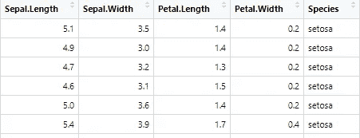
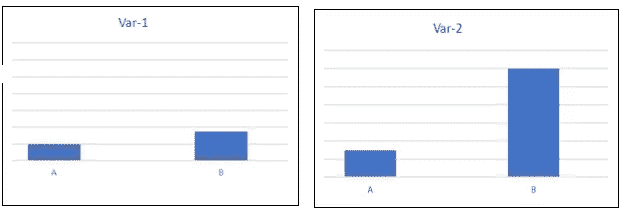
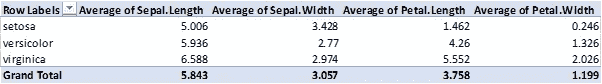
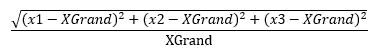
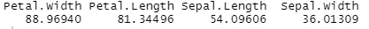
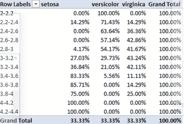
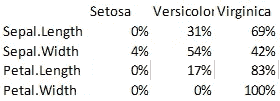
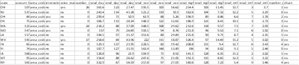
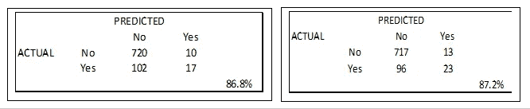

# 通过 Excel 揭开机器学习的神秘面纱

> 原文：<https://medium.com/codex/machine-learning-demystified-through-excel-6d4f88f03b5c?source=collection_archive---------15----------------------->

米卡·鲍梅斯特在 [Unsplash](https://unsplash.com?utm_source=medium&utm_medium=referral) 上的照片

在预测分析(监督学习)中，我们解决两类问题——回归和分类。分类模型在许多领域都有应用—欺诈/垃圾邮件检测、购买/不购买决策、机器故障预测、风险分类等等。在 ML 算法方面，我们有几种选择来解决这些问题。可以使用逻辑回归、决策树、集成模型、KNN、朴素贝叶斯、SVM 和人工神经网络，这取决于数据的复杂性和某些特征，如记录数量、维度、连续/离散变量数量、基数、类别数量等。

然而，在引擎盖下，这个想法在最基本的层面上保持不变。我们需要找到输入(独立变量)，它有最大的辨别能力来区分类别。我们称之为**可变重要性**，并挑选出最有效的以备后用(**降维**)。然后，我们将它们的影响与一些参数(逻辑回归、判别分析、朴素贝叶斯、人工神经网络)或无参数(决策树、KNN、SVM 等)结合起来。)来找出成为一个类的成员的可能性。前一类算法称为**参数模型**，后一类称为**非参数模型**。

让我们以更简单的方式使用同样的直觉。我们将使用 Excel 进行计算。让我们以广泛使用的虹膜数据集作为基本说明。这个数据集有一个因变量，它是离散的，有 3 个标签——“setosa”、“versicolor”和“virginica”。有 4 个独立变量，它们都是连续的。最上面的几行如下所示。

**可变重要性**

我们将使用 Excel 数据透视表来查找变量的重要性。如果一个 X 变量是一个重要的因素，那么它的值在不同的类中应该是非常不同的。另一方面，一个不重要的变量不会显示出类之间的差异。这与方差间和方差内是一样的，我们在数据科学中会遇到很多地方。在下面的图片中，Var-2 应该是一个比 Var-1 更重要的变量，因为它在两个类别(A 和 B)中的平均值非常不同。

我们计算了 4 个变量在每个类别中的平均值。然后，我们估计它们在总计(总体样本平均值)中的分散程度。它们之间的距离越大，重要性就越高。我们应该期待花瓣。宽度作为最重要的变量，因为离差最高。我们将色散计算为

花瓣宽度和花瓣宽度的离差分别为 106%、79%、19%和 16%。长度，萼片。分别为长度和萼片宽度。因此，这应该是重要性可变的顺序。在 R 中使用“ **rpart** ”库( **CART model** )可以获得相同的结果。

只有顺序是重要的，应该进行比较，因为 R 计算在内部涉及更多。现在让我们转到模型拟合和预测。

**预测**

在我们的简单计算中，没有这样的模型拟合。我们将再次使用 Excel 数据透视表，但方式不同。我们将通过计算一系列值中的行总数的百分比来寻找概率。这可以通过 Excel 数据透视表中的分组选项来完成。

它的本质意思是如果萼片。长度在 2–2.2 的范围内，则 100%可能是“杂色”，如果在 2.2–2.4 的范围内，则[14.3%，71.4%，14.3%]可能是“setosa”，“杂色”和“virginica”。同样的逻辑也适用于其他箱和其他变量。

如果面元尺寸太大，我们将无法充分捕捉模式，如果面元尺寸非常小，我们可能会捕捉到噪声。**这分别类似于 ML 中的欠拟合或过拟合模型。**

我们的简单分类器已经可以用于这些概率了。

让我们用萼片对一个新样本进行预测。长度= 6.5，萼片。宽度= 3.0，花瓣。长度= 5.2，花瓣。宽度= 2.0。

**如果我们使用 R 中内置的 CART 模型，上述样本的预测是“VIRGINICA”。**

如果我们对数据透视表中的这些值进行 vlookup，3 个类别的每个变量的概率如下。正如所料，最有力的变量预测它是“海滨”(100%概率。)与 R 结果一致，而最不重要的在“versicolor”和“Virginica”上分裂。从下表中，我们可以明智地将预测结果视为“弗吉尼亚”。**我们通过 Excel 中的基本计算建立了一个简单的模型，与 R 结果相匹配。**

为了测试这个简单但基本正确的原则，我们可以使用一个更复杂的案例。**让我们使用 Kaggle 上的电信客户流失数据集。**

它有 4250 条记录和一个二进制输出变量(关于流失的是/否)。有 19 个 X 变量。前几条记录的示例如下所示。

我们用同样的逻辑来寻找变量的重要性。前面计算的离差给出了 4 个重要的 X 变量—**Vmail 消息数量、全天分钟数、全天费用和客户服务呼叫次数**。很少有像状态这样的离散 X 变量。它们的重要性可以用同样的方式来判断，但是用否/是类的计数(%)。例如，全球范围内，否定/肯定分类的百分比分别为 85%和 14%。钙的这一比例为 74-26%，钴的这一比例为 87-13%。我们可以发现他们与全球平均 85%和 14%的差距有多大。所有 50 个州的分裂都接近全球平均水平，这并没有什么惊人之处。

我们将按照同样的逻辑创建容器，并在其中寻找概率。我们可以保留 20%的样本作为批量预测的测试数据。

做 Vlookup，我们可以找到与 4 个最重要的变量相对应的概率。**我们可以使用 50%的最大概率和阈值来将它们分类为是/否。**最大值更合适，因为平均值受极限的影响。使用此规则，结果如下所示。**与之相邻的是 R** 中运行的逻辑回归的结果。**我们可以再次看到，这个简单的分类器和 r 的一样好(或者不好)**

总之，简单探索性分析也有很多优点。我们可以明智地使用它们来补充高级分析，或者向不熟悉这个领域的人解释这些模型的工作原理。显然，高级模型对于实际数据集是必须的，因为我们不能用这些简单的计算来解决现实世界中遇到的复杂问题。但是我们不应该把 ML 模型当作一个黑箱，并鼓励其他人也去理解在幕后工作的基本原理。这些毕竟是建立在相同的基本逻辑之上的，尽管有很多数学上的严格性。