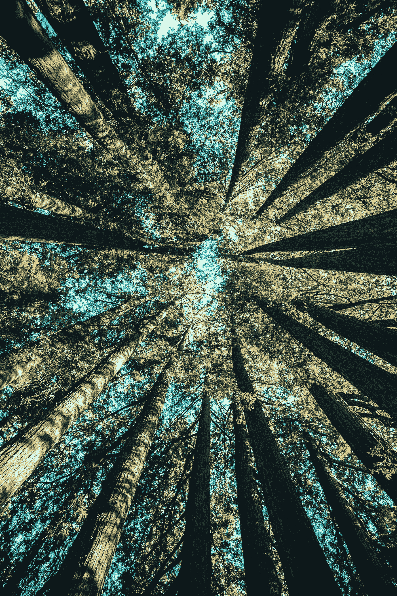

# 云中的机器学习开发—第 5 部分:环境/图像

> 原文：<https://medium.com/codex/machine-learning-development-in-the-cloud-part-5-environments-images-87e2b957debe?source=collection_archive---------18----------------------->

凯西·霍纳在 [Unsplash](https://unsplash.com/s/photos/woods?utm_source=unsplash&utm_medium=referral&utm_content=creditCopyText) 上的照片

> 如果你错过了，[请访问这个系列的第一部分](/@s.kirmer/machine-learning-development-in-the-cloud-part-1-e60920725af0)来了解我的项目概况。

由于我们已经讨论了 ML 工作流的数据、代码和 IDE 需求，现在我们进入一些不太广泛使用但仍然有价值的领域。今天的主题是环境和图像。

简而言之，这意味着将您安装的包、库和工具版本视为一个单元，并将这些东西组合在一起以描述您的工作空间的特征。当您使用这个描述构建一个映像时，它将包含精确复制设计它的工作空间所需的软件。

术语“映像”和“环境”可能会有些混淆或重叠。

一个**映像**，从广义上来说，是一个文件，它为你提供了复制你的工作环境所需的所有软件。它不仅包含了你的计算机如何获得这些东西的说明，还包含了实际的工具。

另一方面,**环境文件**或“config ”,为你的计算机提供了下载和安装的说明，但其中没有软件。

图像和环境文件在许多相同的情况下都很有用——一个需要您的计算机从互联网上下载项目，而另一个已经包含了它需要的所有内容。

这为什么有用？几个原因。

# 再现性

如果你做一些分析，制作一个模型，或者运行一个报告，数据科学的一个重要原则是**它应该在未来是可复制的。你应该能够再做一遍，得到同样的结果，或者至少能够解释为什么结果发生了变化。这其中很大一部分是确保你以前使用的工作环境在复制时是一样的。您可以手动尝试复制不同的库，但是使用映像要容易得多，也可靠得多，您可以加载映像来简单地生成整个工作环境。**

# 冲突管理

我指的不是人与人之间的冲突，而是包与包之间的冲突！如果您正在使用 python 进行图像分析，您选择的 Python 库可能特定于该用例；但是如果你需要去做 NLP，那可能需要其他人。如果这些库都能一起正常工作，那很好，但是在许多情况下，一个包可能会与另一个包冲突，或者版本号可能需要不同。通过为您的项目使用不同的图像，您可以拥有一个包含所有图像分析工具的图像，而另一个包含所有 NLP，并且它们不会有冲突的机会。

# 合作

与再现性问题相邻的是数据科学中的合作。如果您生成了一个分析，然后其他人想要修改它或者自己运行它，那么他们的工作空间将会与您的不同，这是一个真正的风险，事情可能不会正常工作。(这是“**的核心，嗯，它在我的机器上工作**的问题，你可能以前见过。)最好的解决办法是使用图像，因为您可以将正确的环境规范发送给您的同事，他们只需点击几下鼠标就可以设置好。不再有阻碍生产力的不连续性。

当使用基于云的 IDE 时，拥有组织好的图像也是非常重要的，因为与本地应用程序不同，有时自定义设置不能无限期地保存在 web 上。拥有一个环境规范文件意味着您将能够按照您想要的方式设置工作空间，而无需自己手动安装几十个库。

# 怎么会？

如果你确信这是一个好主意，那么下一个自然的问题就是如何让它发挥作用。这可能有不同程度的困难，因为没有很多好的工具可以让你轻松地组织和创建图像。

作为一个简单的起点，让我们使用 Conda 环境来理解手头的任务。如果您想保留当前工作区及其所有版本和库，这是您应该采用的方法。

1.  在命令行，[安装康达](https://conda.io/projects/conda/en/latest/user-guide/install/index.html)。
2.  通过在命令行运行以下命令创建一个 conda 环境:`conda create --name my_environment`
3.  环境现在存在！这是一个保存您的环境中所有指令和状态的对象。如果你想添加或使用它，你将运行`conda activate my_environment`

那还不算太糟。如果你想和其他人分享这个环境，你可以[把这些指令保存到一个文件](https://kapeli.com/cheat_sheets/Conda.docset/Contents/Resources/Documents/index)，然后把它发送给其他人。然而，在规模上，这变得更具挑战性—您可能希望与许多人共享图像，或者使用版本控制来跟踪您的图像以及它们如何随着时间的推移而变化。对于这个用例，使用某种云基础设施来帮助您管理这些文件是很有帮助的。

现在，您可以将环境规范文件存储在您的代码基础设施系统上，比如 Github 或 Bitbucket，这样就可以很好地工作了！如果你是超级用户，并且想要管理你的全部图像，Dockerhub 是黄金标准。然而，一些服务在更大的数据科学/机器学习工具包中提供图像或环境管理，当你与团队一起工作时，这真的很好。让我们看一下具体的产品。

# 市场亮点

# 基于图形用户界面的图像管理

如果你想要一个能让你复制一个库列表到一个盒子里然后点击“go”的系统，这些都是给你的。它们允许您通过 UI 创建一个映像或环境规范，然后在以后访问它，与他人共享它，并根据需要修改它。如果您的团队不想深入了解图像管理和/或 Docker，这些都是很好的解决方案。

*   土星云:【https://saturncloud.io/docs/using-saturn-cloud/images/ 
*   domino:[https://docs . dominodatalab . com/en/4.1/reference/environments/Environment _ management . html # managing-environments](https://docs.dominodatalab.com/en/4.1/reference/environments/Environment_management.html#managing-environments)

# docker/命令行

还有其他服务勉强让您定制图像或环境规范，但是它们需要您和您的团队做大量的工作和熟练的技术。如果你准备好迎接这个挑战，那么至少在理论上是可行的。

*   sagemaker:[https://docs . AWS . Amazon . com/sagemaker/latest/DG/studio-byoi-create . html](https://docs.aws.amazon.com/sagemaker/latest/dg/studio-byoi-create.html)
*   azure:[https://docs . Microsoft . com/en-us/azure/machine-learning/how-to-use-environments](https://docs.microsoft.com/en-us/azure/machine-learning/how-to-use-environments)

# 没有自定义图像

在这个范围的另一端是一些服务，在这些服务中，您需要使用它们提供的图像或环境规范。您可以在这些环境上手动安装其他库，但不能保存或自定义自己的库以供以后使用或共享。

*   [数据块](https://docs.databricks.com/libraries/index.html)
*   Google Colab

# 自己旋转

同样值得一提的是，您可以使用 AWS EKS 或 Kubernetes 之类的工具，为容器编排构建自己的整个基础设施，但本文假设您不一定需要这种复杂程度。但是，它确实存在，而且很多人都在使用这些系统！