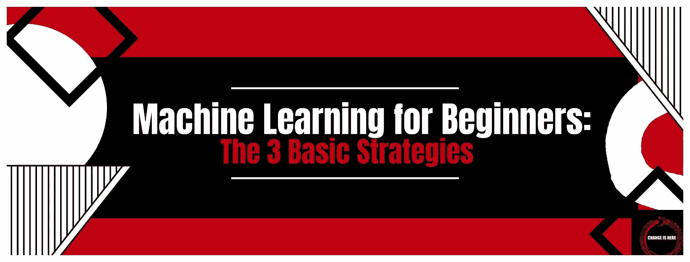

# 初学者的机器学习:3 个基本策略

> 原文：<https://medium.com/codex/machine-learning-for-beginners-the-3-basic-strategies-e14ab364cc9c?source=collection_archive---------3----------------------->

如果你是机器学习领域的新手，你可能想知道从哪里开始。机器学习有许多不同的方法，知道哪一种适合你可能很棘手。在这篇博文中，我们将讨论机器学习的三种最基本的策略:监督学习、非监督学习和强化学习。