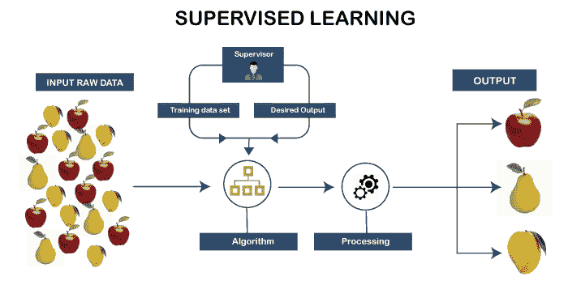
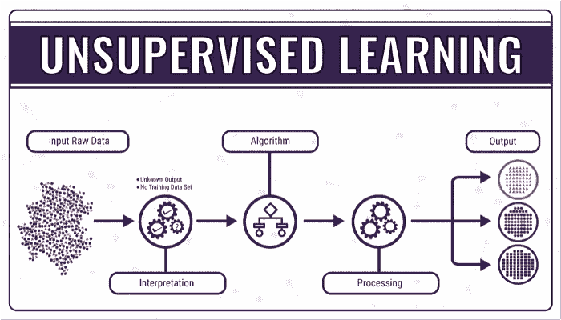
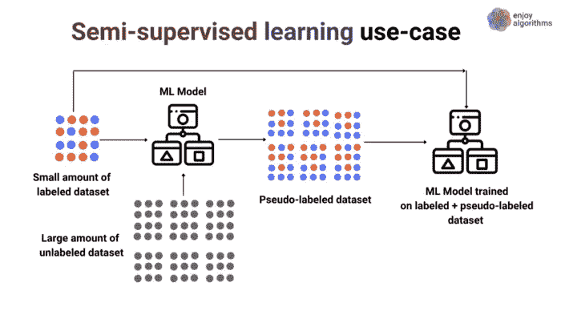
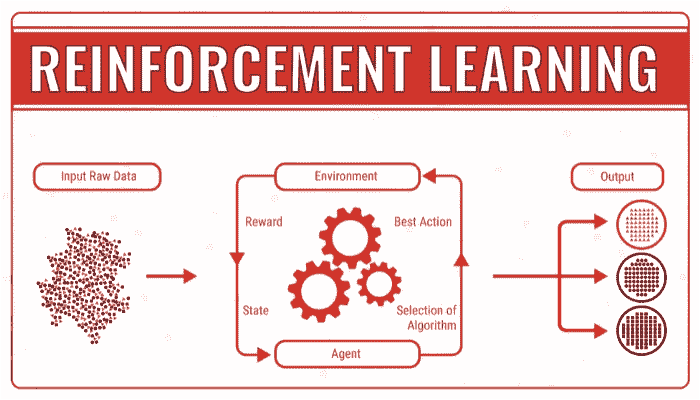

# 机器学习基础

> 原文：<https://medium.com/codex/machine-learning-fundamentals-e4e83e45aca7?source=collection_archive---------13----------------------->

(来源:[https://images . squarespace-cdn . com/content/v1/5 daddb 33 ee 92 BF 44231 C2 fef/1586994429139-7 fqy 217 xe 8 ZT 7n 4 z 9 qlh/bias-in-machine-learning . jpg？format=1000w](https://images.squarespace-cdn.com/content/v1/5daddb33ee92bf44231c2fef/1586994429139-7FQY217XE8ZT7N4Z9QLH/bias-in-machine-learning.jpg?format=1000w)

> 机器学习——一个真正令人眼花缭乱的术语，最近有大量关于它的文章。这篇文章以最明确的方式揭示了机器学习的基础及其应用。

# 我们该如何定义机器学习？

机器学习就是它听起来的样子。一台机器，学习一些东西。这是一个学习的过程，从观察输入特定机器的数据开始，机器在数据中寻找模式，以便利用它做出决策。

它的核心目标是让机器/计算机能够通过使用某些算法进行本能的学习，而无需任何人类干预或帮助，并相应地调整其方法以适应模型。

简而言之，机器学习是对计算机算法的研究，可以通过使用数据来自动改进。

# 您应该知道的先决条件:

1.  **训练数据集:**用于拟合模型的数据集，模型用于训练数据集。它帮助机器学习数据以及如何进一步使用这些数据。
2.  **验证数据集:**它是在调整模型超参数(其值用于控制学习过程的参数)时，用于提供模型在训练数据集上的无偏评估的数据样本。它也被称为开发集。
3.  **测试数据集:**它是一组独立于训练集的数据，用于提供最终模型拟合训练数据集的非基础评估。
4.  **标记数据**:标记数据是一组用一个或多个标签标记的样本。

# 机器学习的方法:

机器学习方法大致分为以下四类:

1.  **监督学习:**它是最常见、最容易使用的算法之一；使用标记良好的训练数据来训练机器。
2.  **无监督学习:**它是一种机器学习算法，其中模型使用未标记的数据集进行训练，并允许在没有任何外部监督的情况下对数据进行操作。
3.  **半监督学习:**它是一种机器学习算法，由一小部分标记数据和大部分未标记数据组成，模型根据这些数据进行所需的预测。
4.  **强化学习:**它是一种独特类型的机器学习算法，奖励期望的输出，惩罚错误，从而训练机器。

# 实现机器学习模型的步骤包括:

1.  **确定训练数据集的类型**:检查是数值数据、分类数据、时间序列数据还是基于文本的数据。还要检查有多少因变量和自变量。
2.  **收集标签化的训练数据**:识别你的目标是什么，特征是什么，得到识别模式，预测目标数据。
3.  **分割数据集**:我们需要根据需求将整个数据集分割成两个或三个部分——*训练集、验证集和测试集*。
4.  **确定训练数据集的输入特征**:了解给定数据集的特征。
5.  **确定合适的算法来训练数据集:**了解需求后，我们需要为我们的数据集确定最合适的数据集——回归/分类、聚类/关联、决策树等。
6.  **对训练数据集执行算法:**对数据应用决定的算法来训练集合。
7.  **评估模型的准确性:**通过提供测试数据，我们可以了解和评估我们的模型有多准确。

# 监督学习:

(来源:[https://www . tutorialandexample . com/WP-content/uploads/2020/11/Supervised-Machine-Learning-1 . png](https://www.tutorialandexample.com/wp-content/uploads/2020/11/Supervised-Machine-Learning-1.png))

监督学习是一种机器学习技术，其中使用良好标记的数据来训练机器。它的主要目标是找到一个映射函数来映射输入变量和输出变量。

监督学习可以分为 **2** — *单变量监督学习*和*多变量监督学习*。

**单变量监督学习**由 *1 个因变量*和 *1 个自变量*组成。

**多变量监督学习**由 *1 个因变量*和*1 个以上自变量*组成。

# 监督学习算法的类型:

**回归分析:**回归分析是一种统计方法，用于*连续变量*的输入变量和输出变量之间有关系时使用。回归分析有多种类型——*线性回归、回归树、非线性回归、贝叶斯线性回归、多项式回归*。

**分类**:当输出变量为分类变量时，使用分类方法；即*只有 2 个解*。分类算法的类型有— *逻辑回归、支持向量机、K 近邻、核 SVM、朴素贝叶斯、决策树分类、随机森林分类*。

# 监督学习的优势:

*   监督学习模型可以在使用训练集训练模型的基础上预测输出。
*   我们对我们正在处理的类有一个确切的概念，因为它们是有标签的。
*   它帮助我们解决现实世界的问题。

# 监督学习的缺点:

*   它不适合复杂的数据集。
*   如果测试数据与训练数据不同，它就不能预测正确的输出。
*   训练模型需要大量的计算。

# 监督学习的实际应用:

*   **图像识别**:图像识别是监督机器学习最重要的例子之一。它检测图像之间的模式，并做出适当的预测。这主要用于*安全和医疗目的*。
*   **语音识别**:语音识别是一种将我们所说的话转换成可读文本的方法。我们最著名的语音助手，比如 *Siri* 和 *Alexa* 都使用这个应用。

# 无监督学习:

(来源:[https://bigdata-made simple . com/WP-content/uploads/2018/02/Machine-Learning-explained 2 . png](https://bigdata-madesimple.com/wp-content/uploads/2018/02/Machine-Learning-Explained2.png))

无监督机器学习是一种机器学习技术，其中模型使用未标记的数据集进行训练，并允许在没有任何外部人类干预或监督的情况下对该数据集进行工作和操作。

无监督学习对于从数据中找到有用的见解非常有帮助。这与人类通过自身经历学习思考的方式非常相似。这种方法甚至在输入数据与输出数据不一致时也能工作。

# 无监督学习算法的类型:

**聚类**:聚类是将对象分组的方法，将最相似的对象留在特定的组中，而最不相似的对象属于另一个组。

**关联:**关联是在大型数据库中寻找变量之间关系的方法。我们开始知道一个变量是如何直接或间接地与另一个变量联系在一起的。

不同类型的算法有— *K 均值聚类、K 近邻、层次分析、词法分析、神经网络、主成分分析、独立成分分析*等。

# 无监督学习的优势:

*   无监督学习可以用来解决复杂的任务。
*   我们有更大的自由去探索现有的数据。

# 无监督学习的缺点:

*   这很难处理。
*   预测的准确性可能会降低。

# 无监督学习的实际应用:

*   **听众分割**:这个应用程序根据听众的选择来分离他们。OTT 平台根据我们之前的选择为我们提供建议。
*   **库存管理**:库存管理是商店使用的应用，在这里我们可以通过关联找到某些产品之间的联系。

# 半监督学习:

(来源:[https://cdn-images-1 . medium . com/max/1600/1 * xkhjyy 6-orygq 6s 0 txfj 1g . png](https://cdn-images-1.medium.com/max/1600/1*XkhJYY6-oRYGq6s0Txfj1g.png))

半监督学习是一种机器学习方法，其中一小部分已标记数据和大部分未标记数据用于训练模型。

# 半监督学习的优势:

*   用于半监督学习的算法本质上是稳定的。
*   它在本质上是高效的。

# 半监督学习的缺点:

*   准确率可能不高。
*   迭代结果不是很稳定。

# 半监督学习的实际应用:

*   **语音分析**:音频文件的标记是一项非常密集的任务，其中只有部分特征可以被标记，并且需要大量的人工干预。
*   **网络内容分类**:在线内容需要根据我们的搜索和关键词进行分类。

# 强化学习:

(来源:[https://cdn . data floq . com/CMS/2018/01/23/reinforcement-learning . png](https://cdn.datafloq.com/cms/2018/01/23/reinforcement-learning.png))

强化学习是一种机器学习方法，它是关于顺序决策的。输出取决于当前输入的状态，下一个输入取决于输入预览的输出。所做的决定是完全依赖的，因此给依赖决定的序列贴上标签。

# 强化学习的类型:

**正向强化**:正向强化是指某一事件的发生是由于某一特定行为增加了该特定行为发生的频率。它还可以最大限度地提高性能，并在很长一段时间内保持变化。

**负强化**:负强化定义为避免负面条件时模型行为的强化。它增加了行为，也颠覆了最低标准性能。

# 强化学习的优势:

*   它可以用来解决非常复杂的问题。
*   它实现了长期的结果。

# 强化学习的缺点:

*   过度的强化学习会导致超载，从而降低效果。
*   这对于解决简单的问题并不可取。

# 强化学习的实际应用:

*   **游戏**:我们玩的单人游戏需要我们的设备做出下一步动作，而这个动作将基于我们之前的动作。国际象棋，鲁道，乌诺等。需要强化学习。
*   **股票预测**:股票预测需要强化学习，以了解市场及其未来走势。

# 结论:

这篇文章帮助我们了解机器学习算法和模型的基础，以及它们在现实世界中的应用。

# 参考资料:

 [## 强化学习的 10 个现实应用- neptune.ai

### 在强化学习(RL)中，代理人接受奖惩机制的训练。代理人因…获得奖励

海王星. ai](https://neptune.ai/blog/reinforcement-learning-applications)  [## 监督学习简介

### 监督学习是当今机器学习最常见的分支。通常，新的机器学习…

towardsdatascience.com](https://towardsdatascience.com/a-brief-introduction-to-supervised-learning-54a3e3932590)  [## 什么是机器学习？定义。

### 机器学习是人工智能(AI)的一种应用，它为系统提供了自动…

www.expert.ai](https://www.expert.ai/blog/machine-learning-definition/)  [## 训练、验证和测试集-维基百科

### 在机器学习中，一个常见的任务是研究和构建可以学习并预测的算法…

en.wikipedia.org](https://en.wikipedia.org/wiki/Training,_validation,_and_test_sets)  [## 监督学习-维基百科

### 监督学习(SL)是机器学习任务，它学习一个函数，该函数基于…

en.wikipedia.org](https://en.wikipedia.org/wiki/Supervised_learning)  [## 监督机器学习-Java point

### 监督学习是机器学习的一种类型，在这种学习中，机器使用良好“标记”的训练数据进行训练…

www.javatpoint.com](https://www.javatpoint.com/supervised-machine-learning)