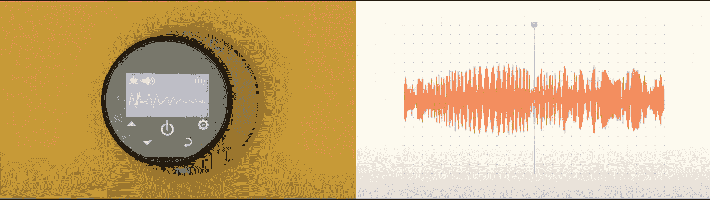
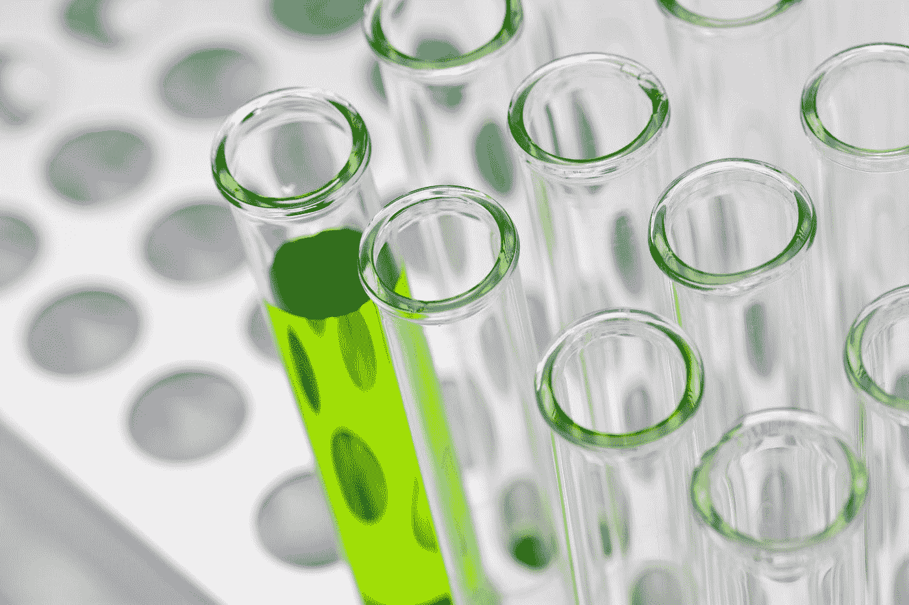

# 机器学习将生物学领域带到了一个新的高度

> 原文：<https://medium.com/codex/machine-learning-is-taking-biological-areas-to-a-next-level-c01bdeec8575?source=collection_archive---------16----------------------->

迈克尔·朗米尔在 [Unsplash](https://unsplash.com?utm_source=medium&utm_medium=referral) 上的照片

我还记得 AI 还没有普遍使用的时候。大多数人不知道人工智能。第二次 AI 寒冬之后，市场上出现了对 AI 的巨大炒作。投资者开始对这个新生领域感兴趣。然后机器学习和深度学习出现了，在很短的时间内改变了世界的面貌。**生物领域也是如此。由于机器学习，医生可以找到新的治疗方法，识别新的疾病，预测人类的问题。**

今天，如果我们环顾四周，我们可能会在不同的生物领域看到机器学习。其中有**基因组学、蛋白质组学、微阵列、系统生物学、**等。尽管如此，科学家和人工智能工程师正在努力寻找治疗疾病的新方法。在未来，医生将被机器取代，因为在这个领域使用智能机器有多重好处。

让我告诉你机器学习在生物领域的应用。先说 **Tensorflow。Tensorflow 是一个开发人工智能模型的框架，用于帮助医生预测呼吸系统疾病。这些模型不仅可以预测人类的呼吸问题，还可以识别不同动物和鸟类发出的声音。众所周知，人类的听觉频率约为 20 至 20，000 赫兹，任何低于或高于这一水平的声音都是人类无法听到的。**

这些人工智能模型接受了这种 ML 算法的训练，这些算法可以轻松识别特定动物或鸟类发出的声音。过去，医生使用听诊器通过听到来自肺部的声音来识别呼吸系统疾病。今天，他们正在使用智能系统来听这种声音，这使他们能够诊断疾病并迅速做出决定。这个模型所做的只是从数字听诊器中提取声音数据，并将其转换成计算机能够最好地识别的视觉问题。他们收集了来自不同患者的声音笔记，并在其上训练了他们的 ML 模型，然后建立了一个名为 [**Tambua**](https://www.tambuahealth.com/) 的智能应用程序，该应用程序可以离线工作，并可以通过倾听新患者的肺部声音来轻松预测任何新疾病。

预测声音的 ML 模型

这些智能应用程序正在帮助贫穷国家的医生，比如非洲的一些地方，那里的人们没有好的医院和诊所。这些 ML 模型还可以识别医生在诊断中可能遗漏的东西。真的，这是帮助我们这个世界的 [**Tensorflow**](https://www.tensorflow.org/) 的一个了不起的成就。如果你想看纪录片，别忘了观看 [**这个**](https://youtu.be/uGYJuOyIvzs) 视频。

比尔·牛津在 [Unsplash](https://unsplash.com?utm_source=medium&utm_medium=referral) 上的照片

让我们来看第二个成就，它也是由[**tensor flow**](http://www.tensorflow.org)**做出的。我们都听说过这样的情况，医生给病人开错了药，使他的病情更加严重，甚至在某些情况下导致死亡。这是医疗领域的一个大问题，因为医生不能确定正确的问题，这导致开错了药。**

不过今天这个问题已经被[**tensor flow**](http://www.Tensorflow.org)**解决了。通过与无国界医生组织的医生合作，他们建立了一个 ML 模型，可以帮助医生和生物学家解释哪种药物对病人的问题最有效。他们收集了大约 50，000 次测试的匿名图片，并能够在几天内训练出一个 ML 模型。**

[国立癌症研究所](https://unsplash.com/@nci?utm_source=medium&utm_medium=referral)在 [Unsplash](https://unsplash.com?utm_source=medium&utm_medium=referral) 上拍摄的照片

结果相当令人惊讶。然后，他们使用 [**Tensorflow lite**](https://www.tensorflow.org/lite) 开发了一个智能移动应用程序，它可以离线工作，只需拍下细菌或感染测试的照片，就可以帮助医生开出正确的抗生素处方。这是一个非常了不起的成就，可以帮助数百万农村地区的人们。别忘了观看 [**这部**](https://youtu.be/DubGH74k34k) 纪录片了解更多。

今天，机器学习使医生甚至能够预测未来的病毒和疾病，这在新冠肺炎的全球疫情之后有所增加。生物学家正在发现新的方法来治疗疾病。未来，智能应用将不仅是医院和诊所的重要组成部分，也是每个人的重要组成部分。我们都知道，如果经过正确、准确的训练，机器不可能像人类一样犯错。因此，人工智能将在生物学领域占据主要地位的时间已经不远了。

**你对 ML 取得的这些成绩有什么看法？机器比人类更准确吗？AI 未来会取代医生吗？**

不要忘记关注我，在下面的评论区获得更多令人惊叹的人工智能发现并给出你的意见。

到那时，再见！！！