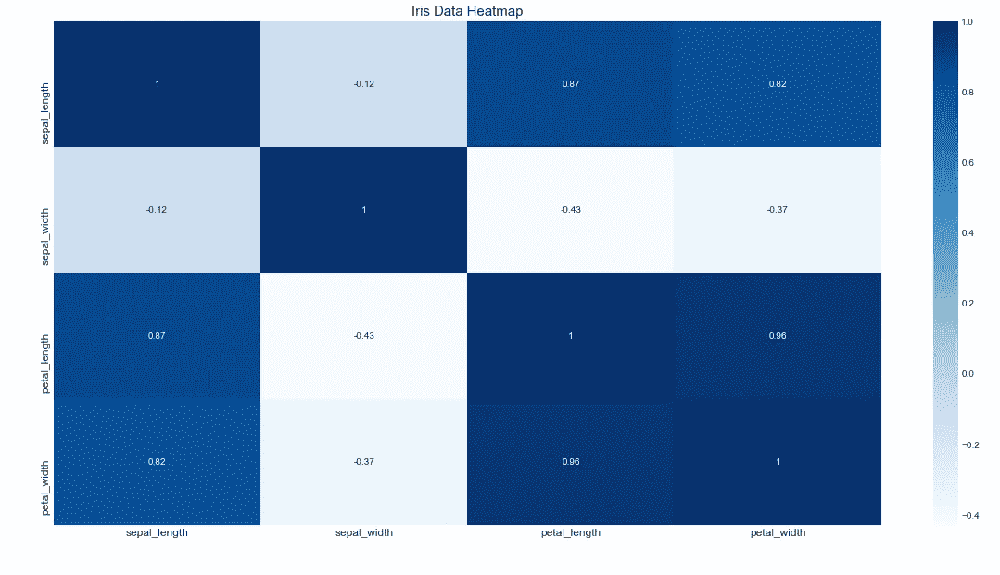

# 机器学习——基于 Python 的 K 近邻算法

> 原文：<https://medium.com/codex/machine-learning-k-nearest-neighbors-algorithm-with-python-df94b374ad41?source=collection_archive---------0----------------------->

## K-最近邻(KNN)及其 Python 实现的分步指南


由[像素](https://www.pexels.com/)上的[像素](https://www.pexels.com/@pixabay)生成的图像

# k-最近邻算法

> k-最近邻(KNN)是一种基于最相似的点对数据点进行分类的模型。它使用测试数据对一个未分类的点应该分类为什么进行“有根据的猜测”

# KNN Python 实现

我们将使用 python 最流行的机器学习包“scikit-learn”来构建我们的 KNN 模型。Scikit-learn 为数据科学家提供了执行机器学习任务的各种工具。对于我们的 KNN 模型，我们将使用*‘KNeighborsClassifier’*算法，该算法在 scikit-learn 包中很容易获得。最后，我们将使用 scikit-learn 中的*“准确度分数”*函数评估我们的 KNN 模型预测。我们开始吧！

## 步骤 1:导入所需的包

每个简单或复杂的编程任务都是从导入所需的包开始的。为了构建我们的 KNN 模型，我们的主要软件包包括用于构建模型的 scikit-learn、用于探索性数据分析(EDA)的 pandas 和用于可视化的 seaborn。

**Python 实现:**

现在我们已经导入了所有必要的包来训练和构建我们的 KNN 模型。下一步是导入数据并做一些探索性的数据分析。

## 步骤 2:导入数据集和 EDA

在本文中，我们将利用 seaborn 包提供的 iris 数据集。让我们导入数据，用 python 看一下。

**Python 实现:**

输出:

```
 **sepal_length  sepal_width  petal_length  petal_width    species
0             5.1          3.5           1.4          0.2     setosa
1             4.9          3.0           1.4          0.2     setosa
2             4.7          3.2           1.3          0.2     setosa
3             4.6          3.1           1.5          0.2     setosa
4             5.0          3.6           1.4          0.2     setosa
..            ...          ...           ...          ...        ...
145           6.7          3.0           5.2          2.3  virginica
146           6.3          2.5           5.0          1.9  virginica
147           6.5          3.0           5.2          2.0  virginica
148           6.2          3.4           5.4          2.3  virginica
149           5.9          3.0           5.1          1.8  virginica
[150 rows x 5 columns]**
```

现在让我们看看使用 python 中的*‘describe’*函数的数据的统计视图，以及使用*‘info’*函数的数据的一些信息。

**Python 实现:**

数据描述:

```
 **sepal_length  sepal_width  petal_length  petal_width
count    150.000000   150.000000    150.000000   150.000000
mean       5.843333     3.057333      3.758000     1.199333
std        0.828066     0.435866      1.765298     0.762238
min        4.300000     2.000000      1.000000     0.100000
25%        5.100000     2.800000      1.600000     0.300000
50%        5.800000     3.000000      4.350000     1.300000
75%        6.400000     3.300000      5.100000     1.800000
max        7.900000     4.400000      6.900000     2.500000**
```

数据信息:

```
**<class 'pandas.core.frame.DataFrame'>
RangeIndex: 150 entries, 0 to 149
Data columns (total 5 columns):
 #   Column        Non-Null Count  Dtype  
---  ------        --------------  -----  
 0   sepal_length  150 non-null    float64
 1   sepal_width   150 non-null    float64
 2   petal_length  150 non-null    float64
 3   petal_width   150 non-null    float64
 4   species       150 non-null    object 
dtypes: float64(4), object(1)
memory usage: 6.0+ KB**
```

在对我们的数据有了清晰的理解之后，我们可以对它进行可视化。我们将使用我们的数据和 python 中的 seaborn 和 matplotlib 创建四种不同的可视化。

**(一)散点图**

我们将创建两个不同的散点图，一个是萼片长度对萼片宽度，另一个是花瓣长度对花瓣宽度。用 python 来做吧！

**萼片散点 Python 实现:**

输出:


图片作者[作者](/@nikhiladithyan)

**花瓣散点 Python 实现:**

输出:


图片由[作者](/@nikhiladithyan)

**(二)热图**

热图对于发现数据中变量之间的相关性和关系非常有用。使用 python 中的 seaborn 可以有效地生成热图。

**Python 实现:**

输出:



图片由[作者](/@nikhiladithyan)

**(三)散布矩阵**

散布矩阵是有效地发现数据集中变量之间的关系或相关性的另一种方法。这个绘图也可以使用 python 中的 seaborn 库来完成。

**Python 实现:**

输出:


图片作者[作者](/@nikhiladithyan)

**(四)分布图**

分布图用于显示数据集中指定值的出现频率。使用 seaborn 包在 python 中实现是可行的。鉴于我们的虹膜数据集，我们将绘制萼片和花瓣的长度和宽度，以观察其分布。用 Python 来做吧！

**Python 实现:**

输出:


图片作者[作者](/@nikhiladithyan)

有了这个可视化，我们就可以进入编码的下一部分，即使用 python 中的 scikit-learn 构建和训练我们的 K 近邻模型。

## 步骤 3:构建和训练模型

首先，我们需要定义一个“X”变量和一个“Y”变量来构建我们的 KNN 模型。给定我们的数据集，“物种”变量是我们需要分类的变量，因此它可以作为“Y”变量或因变量。我们数据集中的所有其他变量都可以被视为独立变量或“X”变量。现在，让我们在 Python 中定义我们的 X 和 Y 变量！

**Python 实现:**

输出:

```
**X variable :** [[5.1 3.5 1.4 0.2]
 [4.9 3\.  1.4 0.2]
 [4.7 3.2 1.3 0.2]
 [4.6 3.1 1.5 0.2]
 [5\.  3.6 1.4 0.2]]
**Y variable :** ['setosa' 'setosa' 'setosa' 'setosa' 'setosa']
```

现在，我们必须标准化我们的“X”变量值，这在训练我们的 KNN 模型时是有用的。在此之前，规范化是针对给定的一组值构建和移除异常的过程。它还减少了数据冗余，提高了数据完整性。为了标准化这些值，我们可以使用 scikit-learn 中的*‘standard scaler’*函数。用 Python 来做吧！

**Python 实现:**

输出:

```
**[[-0.90068117  1.01900435 -1.34022653 -1.3154443 ]
 [-1.14301691 -0.13197948 -1.34022653 -1.3154443 ]
 [-1.38535265  0.32841405 -1.39706395 -1.3154443 ]
 [-1.50652052  0.09821729 -1.2833891  -1.3154443 ]
 [-1.02184904  1.24920112 -1.34022653 -1.3154443 ]]**
```

现在我们有了完美的因变量和自变量。现在，我们可以继续训练我们的 KNN 模型。为了训练我们的模型，我们必须首先将我们的数据分成训练集和测试集，其中训练集具有最多的数据点。为了拆分我们的数据，我们可以使用 python 中 scikit-learn 提供的 *'train_test_split'* 函数。

**Python 实现:**

输出:

```
**Train set shape :** (105, 4) (105,)
**Test set shape :** (45, 4) (45,)
```

在上面的代码中，我们使用‘the train _ test _ split’将数据分成训练集和测试集。在函数内部，我们指定我们的测试集应该是 30%的数据，其余的是训练集。最后，我们提到在拆分时不应该对我们的数据进行随机洗牌。

我们现在准备创建我们的 KNN 算法。用 Python 来做吧！

**Python 实现:**

输出:

```
**KNeighborsClassifier(algorithm='auto',leaf_size=30,metric=minkowski,
                   metric_params=None,n_jobs=None,n_neighbors=3,p=2,
                   weights='uniform')**
```

首先，我们指定 K 值为 3。接下来，我们定义了我们的算法，最后，将我们的训练集值拟合到算法中。在打印出该算法后，我们可以看到“metric=minkowski ”,它只是说明了用于计算邻居距离的方法是 minkowski 方法。还有其他方法，如欧几里德距离法和雅克卡指数法，但需要手动定义。

完成训练我们的 KNN 算法后，让我们通过我们训练的算法预测测试值，并使用 scikit-learn 的评估指标评估我们的预测结果。

**Python 实现:**

输出:

```
**Prediction Accuracy Score (%) :** 97.78
```

使用我们训练的 KNN 算法，我们已经预测了测试集值。最后，我们使用*‘准确性分数’*评估标准来检查我们预测结果的准确性。在输出中，我们可以看到结果的准确率为 97.78%，这意味着我们的 KNN 模型对于给定的虹膜数据集表现得非常好，并且它具有解决现实世界分类问题的能力。至此，我们已经成功地用 python 构建、训练和评估了我们的 KNN 模型。说完，我们就来到了这篇文章的结尾。

我希望，您会发现这篇文章是有用的，如果您没有遵循任何编码部分也不要担心，因为我已经为这篇文章提供了完整的源代码。

**机器学习快乐！**

完整代码: