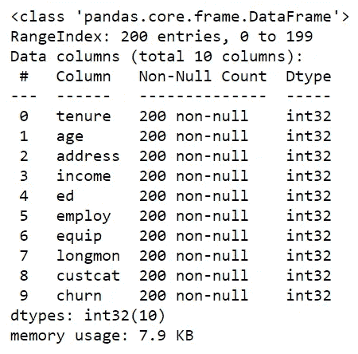

# 机器学习—使用 Python 的逻辑回归

> 原文：<https://medium.com/codex/machine-learning-logistic-regression-with-python-5ed4ded9d146?source=collection_archive---------0----------------------->

## 药典

## Python 中用于分类和预测的逻辑回归实用介绍


# 逻辑回归

L 逻辑回归是一种可用于回归和分类任务的算法，但它广泛用于分类任务。'

逻辑回归用于在因变量的帮助下预测分类变量。考虑有两个类，并且要检查一个新的数据点属于哪个类。然后算法计算范围从 0 到 1 的概率值。比如今天会不会下雨。

# 用于逻辑回归的 Python

Python 是最强大的，对于数据科学家来说，执行简单或复杂的机器学习算法非常方便。它有一个强大的机器学习包的广泛档案，以帮助数据科学家自动化他们的编码方式。在本文中，我们将使用 python 的 scikit-learn 包来构建和评估我们的逻辑回归模型。我们要解决的案例是，一家电信公司的客户是否愿意留在那里。用 python 来解吧！

## 步骤 1:导入包

对于我们的逻辑回归模型，主要的包包括用于构建和训练模型的 scikit-learn，用于数据处理的 pandas，以及用于处理数组的 NumPy。让我们用 python 导入所有需要的包！

**Python 实现:**

我们的下一步将是使用 pandas 导入和处理数据。我们还将在下一步做一些 EDA 和清洗过程。

## 步骤 2:导入和使用数据

我们将使用电信数据集来预测客户流失。这是一个历史客户数据集，其中每行代表一个客户。这些数据相对容易理解，你可能会发现你可以立即使用的见解。一般来说，留住客户比获得新客户成本更低，所以这种分析的重点是预测哪些客户会留在公司。该数据集提供的信息有助于您预测哪些行为将有助于您留住客户。您可以分析所有相关的客户数据，并制定有针对性的客户维系计划。

数据集包括以下信息:

*   上个月内离开的客户—这一列称为流失
*   每位客户已注册的服务—电话、多条线路、互联网、在线安全、在线备份、设备保护、技术支持以及流媒体电视和电影
*   客户账户信息——他们成为客户的时间、合同、支付方式、无纸化账单、每月费用和总费用
*   客户的人口统计信息—性别、年龄范围，以及他们是否有伴侣和家属

让我们使用 python 导入和清理数据吧！

**Python 实现:**

输出:


作者图片

既然我们已经将数据导入到 python 环境中。是时候使用熊猫的便捷功能来探索数据集了。

㈠数据的统计视图

**Python 实现:**

输出:


作者图片

㈡数据信息

**Python 实现:**

输出:



作者图片

至此，我们结束了工作和探索数据集的过程。接下来，我们将把数据集分成两部分，一部分是训练集，另一部分是测试集。让我们进行下一步。

## 步骤 3:拆分数据集

正如我之前提到的，在这个过程中，我们将把数据集分成训练集和测试集。为此，我们首先定义自变量为“X”变量，因变量为“Y”变量。让我们用 python 来定义变量吧！

**Python 实现:**

输出:


作者图片

使用 scikit-learn 中的*‘standard scaler’*函数，我们将标准化独立变量或‘X’变量。按照代码在 python 中规范化 X 变量。

**Python 实现:**

输出:


作者图片

现在，我们拥有了将数据分成训练集和测试集所需的所有组件。我们可以使用 python 中 scikit-learn 提供的*‘train _ test _ split’*函数来拆分我们的数据。让我们用 python 拆分我们的数据吧！

**Python 实现:**

输出:


作者图片

在将数据分成训练集和测试集之后，我们现在已经准备好用 python 进行逻辑回归建模了。所以我们进行下一步。

## 步骤 4:建模(用 scikit-learn 进行逻辑回归)

让我们使用 scikit-learn 包中的‘logistic regression’函数来构建我们的模型。该函数实现逻辑回归，并可以使用不同的数值优化器来查找参数，包括“牛顿-cg”、“lbfgs”、“liblinear”、“sag”、“saga”解算器。

Scikit-learn 中的逻辑回归版本，支持正则化。正则化是一种用于解决机器学习模型中过拟合问题的技术。*‘C’*参数表示正则化强度的倒数，它必须是正浮点数。较小的值指定较强的正则化。现在，让我们用 python 中的火车设置来拟合我们的模型。

**Python 实现:**

输出:

```
**LogisticRegression(C=0.1,class_weight=None,dual=False,          fit_intercept=True,intercept_scaling=1,l1_ratio=None,max_iter=100,
multi_class='auto',n_jobs=None,penalty='l2',random_state=None, solver='liblinear',tol=0.0001,verbose=0,warm_start=False)**
```

现在，我们可以使用经过训练的逻辑回归模型对测试集进行一些预测。按照代码用 python 做预测。

**Python 实现:**

输出:


作者图片

在上面的代码中， *'predict_proba'* 返回所有类的估计值，按类的标签排序。所以，第一列是类 1 的概率，P(Y=1|X)，第二列是类 0 的概率，P(Y=0|X)。

## 步骤 5:模型评估

在这一步中，我们将使用 scikit-learn 提供的五个评估指标来评估我们的模型，即*【JAC card _ similarity _ score】**【precision _ score】**【log _ loss】**【classification _ report】*，最后是*【混淆矩阵】*。

(i) Jaccard 相似性得分或 Jaccard 指数

我们可以将 Jaccard 定义为交集的大小除以两个标签集的并集的大小。如果样本的整个预测标签集严格匹配真实标签集，则子集准确度为 1.0；否则为 0.0。按照代码使用‘JAC card _ similarity _ score’函数来评估我们的 python 模型。

**Python 实现:**

输出:


作者图片

(二)精确评分

现在，让我们尝试使用“precision_score”评估指标来评估我们的 python 模型。

**Python 实现:**

输出:


作者图片

㈢原木损失

现在，让我们尝试对数损失进行评估。在逻辑回归中，输出可以是客户流失的概率为是(或等于 1)。这个概率是 0 到 1 之间的一个值。对数损失(对数损失)衡量分类器的性能，其中预测输出是介于 0 和 1 之间的概率值。请记住，对数损失值越低，我们的模型的准确性越高。用 python 来做吧！

**Python 实现:**

输出:


作者图片

(四)分类报告

*‘分类 _ 报告’*函数提供了我们模型的摘要。它包括精确度分数、F1 分数、召回和支持指标。观察一个分类报告，我们可以很容易地了解我们的模型的准确性和性能。用 python 来做吧！

**Python 实现:**

输出:


作者图片

基于每个部分的计数，我们可以计算每个标签的精度和召回率:

*   **精度**是在已经预测了类别标签的情况下对精度的度量。它由下式定义:精度= TP / (TP + FP)
*   **回忆**是真阳性率。它被定义为:召回= TP / (TP + FN)

所以，我们可以计算每个类的精度和召回率。

**F1 得分:**现在，我们可以根据标签的精确度和召回率来计算每个标签的 F1 得分。F1 分数是精度和召回率的调和平均值，其中 F1 分数在 1 时达到其最佳值(完美的精度和召回率),在 0 时最差。这是一个很好的方式来表明一个分类器具有良好的召回率和精确度。

最后，我们可以知道这个分类器的平均准确度是两个标签的 F1 分数的平均值，在我们的例子中是 0.74。

㈤混淆矩阵

以热图形式查看混淆矩阵比以数组形式查看更有意义。尽管 scikit-learn 有一个内置的函数来绘制混淆矩阵，我们还是打算用 python 从头开始定义和绘制它。按照代码在 python 中实现一个定制的混淆矩阵函数。

**Python 实现:**

输出:


作者图片

看第一排。第一行是测试集中实际流失值为 1 的客户。正如你所计算的，40 个客户中，17 个客户的流失率为 1。在这 17 个中，分类器正确地预测了其中 5 个为 1，12 个为 0。这意味着，对于 5 个客户，在测试集中实际的客户流失值是 1，并且分类器也正确地预测这些客户流失值是 1。然而，虽然 12 个客户的实际标签是 1，但分类器预测它们是 0，这不是很好。我们可以认为这是第一行模型的错误。

流失值为 0 的客户呢？让我们看看第二排。看起来有 43 个客户的流失率为 0。分类器正确地预测其中 42 个为 0，其中一个错误地为 1。因此，它很好地预测了流失值为 0 的客户。

混淆矩阵的一个好处是显示了模型正确预测或区分类别的能力。在二元分类器的特定情况下，比如这个例子，我们可以将这些数字解释为真阳性、假阳性、真阴性和假阴性的计数。

# 最后的想法！

经过长时间的 python 实际实现过程，我们最终构建了一个全功能的逻辑回归模型，可以用来解决现实世界的问题。即使像 scikit-learn 和 NumPy 这样的软件包可以解决所有复杂的数学问题，但拥有强大的数学基础总是好的。此外，我们在本文中构建的模型是非常基础的，因此，在构建逻辑回归模型时有很多需要探索的地方。请记住，实践学习真的很重要，当谈到机器学习时，我们往往会忘记这些概念。所以，永远不要停止学习，永远不要停止实施。如果您忘记了遵循任何编码部分，不要担心，我已经在本文末尾提供了完整的源代码。

**快乐的机器学习！**

完整代码: