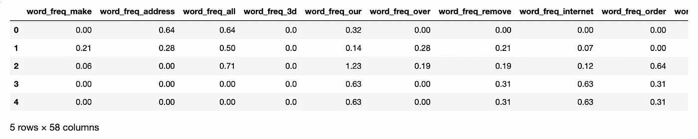
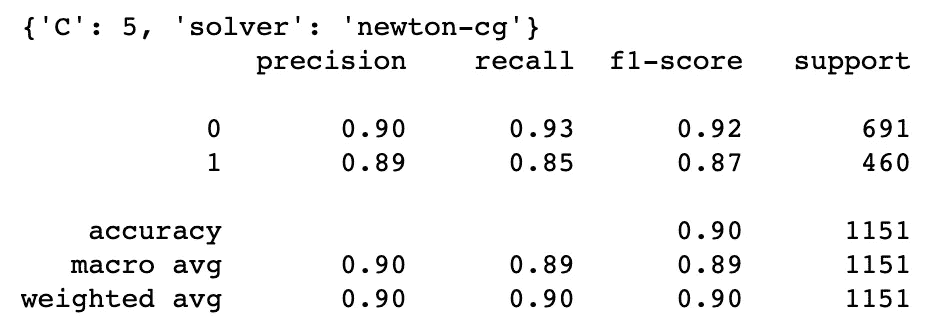
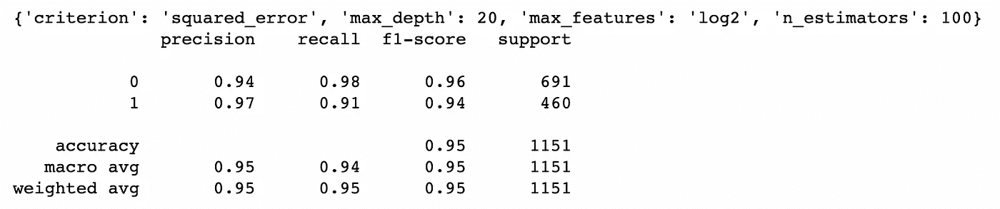
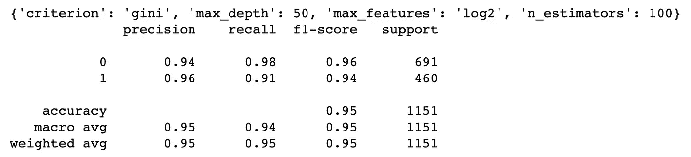
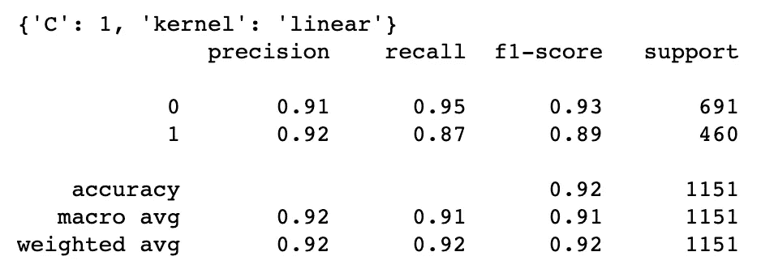

# 机器学习:我的第一个人工智能项目

> 原文：<https://medium.com/codex/machine-learning-my-very-first-ml-project-c347e12ce465?source=collection_archive---------10----------------------->


由 [Austin Distel](https://unsplash.com/@austindistel?utm_source=medium&utm_medium=referral) 在 [Unsplash](https://unsplash.com?utm_source=medium&utm_medium=referral) 拍摄

嗨伙计们！我的第一个机器学习项目来了。该项目基于 [UCI 机器学习库](https://archive.ics.uci.edu/ml/datasets/spambase)上的 [Spambase 数据集](https://archive.ics.uci.edu/ml/datasets/spambase)。这个项目的主要目标是**将电子邮件分类为垃圾邮件或非垃圾邮件**。

# 数据

我们先来看看数据。

```
import pandas as pd
import numpy as npnames = pd.read_csv('spambase/spambase.names', skiprows=32, sep=':\\s+', engine='python', names=['attr', ''])
names = names['attr']
names = list(names)
names.append('label')
print(names)['word_freq_make',
 'word_freq_address',
 'word_freq_all',
 'word_freq_3d',
 'word_freq_our',
 'word_freq_over',
 'word_freq_remove',
 'word_freq_internet',
 'word_freq_order',
 'word_freq_mail',
 'word_freq_receive',
 'word_freq_will',
 'word_freq_people',
 'word_freq_report',
 'word_freq_addresses',
 'word_freq_free',
 'word_freq_business',
 'word_freq_email',
 'word_freq_you',
 'word_freq_credit',
 'word_freq_your',
 'word_freq_font',
 'word_freq_000',
 'word_freq_money',
 'word_freq_hp',
 'word_freq_hpl',
 'word_freq_george',
 'word_freq_650',
 'word_freq_lab',
 'word_freq_labs',
 'word_freq_telnet',
 'word_freq_857',
 'word_freq_data',
 'word_freq_415',
 'word_freq_85',
 'word_freq_technology',
 'word_freq_1999',
 'word_freq_parts',
 'word_freq_pm',
 'word_freq_direct',
 'word_freq_cs',
 'word_freq_meeting',
 'word_freq_original',
 'word_freq_project',
 'word_freq_re',
 'word_freq_edu',
 'word_freq_table',
 'word_freq_conference',
 'char_freq_;',
 'char_freq_(',
 'char_freq_[',
 'char_freq_!',
 'char_freq_$',
 'char_freq_#',
 'capital_run_length_average',
 'capital_run_length_longest',
 'capital_run_length_total',
 'label']
```

数据集有 58 列，包括 word_freq 的 48 个连续属性，char_freq 的 6 个连续属性，capital_run_length_average，capital_run_length_longest，capital_run_length_total，以及目标标签(1 =垃圾邮件，0 =非垃圾邮件)。

```
df = pd.read_csv('spambase/spambase.data', names=names)
df.head()
```



因为数据集已经被清理，并且所有变量都是连续的，所以没有做进一步的处理。

然后，将数据分成两个子集，一个用于训练，一个用于测试。

```
from sklearn.model_selection import train_test_splitX = df.drop('label', axis=1)
y = df['label']X_train, X_test, y_train, y_test = train_test_split(X, y, random_state=0)
```

# 培养

## 用 GridSearchCV 进行逻辑回归

首先，我们从简单的`LogisticRegression`开始。

```
from sklearn.linear_model import LogisticRegression
from sklearn.model_selection import GridSearchCV
from sklearn.metrics import classification_reportlr = LogisticRegression(random_state=0, max_iter=10000)param_grid = {
    'C': [1, 3, 5], 
    'solver': ['lbfgs', 'newton-cg']
}model = GridSearchCV(lr, param_grid=param_grid, cv=5).fit(X_train, y_train)print(model.best_params_)y_pred = model.best_estimator_.predict(X_test)
print(classification_report(y_test, y_pred))
```



0.9 的精度已经相当不错了，但是让我们探索一下其他的模型吧！

## 基于 GridSearchCV 的梯度推进分类器

```
from sklearn.ensemble import GradientBoostingClassifiergbc = GradientBoostingClassifier(random_state=0)param_grid = {
    'n_estimators': [10, 50, 100], 
    'max_depth': [5, 10, 20, 50], 
    'max_features': ['sqrt', 'log2'], 
    'criterion': ['friedman_mse', 'squared_error']
}model = GridSearchCV(gbc, param_grid=param_grid, cv=5).fit(X_train, y_train)print(model.best_params_)y_pred = model.best_estimator_.predict(X_test)
print(classification_report(y_test, y_pred))
```



## GridSearchCV 随机森林分类器

```
from sklearn.ensemble import RandomForestClassifierrfc = RandomForestClassifier(random_state=0)param_grid = {
    'n_estimators': [10, 50, 100], 
    'max_depth': [5, 10, 20, 50], 
    'max_features': ['sqrt', 'log2'], 
    'criterion': ['gini', 'entropy']
}
model = GridSearchCV(rfc, param_grid=param_grid, cv=5, verbose=3).fit(X_train, y_train)print(model.best_params_)y_pred = model.best_estimator_.predict(X_test)
print(classification_report(y_test, y_pred))
```



## 基于 GridSearchCV 的支持向量分类

```
from sklearn.svm import SVCsvc = SVC(random_state=0)param_grid = {
    'C': [0.1, 1, 3], 
    'kernel': ['rbf', 'linear', 'poly'], 
    'degree': [1, 3, 5], 
}
model = GridSearchCV(svc, param_grid=param_grid, cv=5, verbose=2).fit(X_train, y_train)print(model.best_params_)y_pred = model.best_estimator_.predict(X_test)
print(classification_report(y_test, y_pred))
```



# 反射

总的来说，我很高兴四个模型都有很高的准确性。然而，垃圾邮件分类应该是一个 NLP 项目，其中数据处理是必不可少的。如您所见，数据集已经清理，我没有清理任何数据。因此，所有的荣誉都属于数据集的创造者:马克·霍普金斯、埃里克·里伯、乔治·福尔曼和贾普·苏尔蒙特！

[GitHub 上的视图](https://github.com/hckkiu/machine-learning/tree/main/spam)