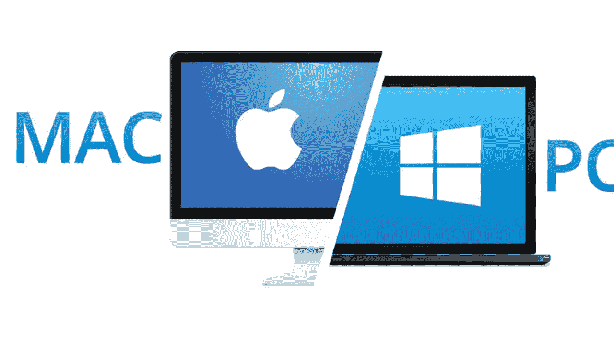

# 给 Windows 用户的 MacOS 提示

> 原文：<https://medium.com/codex/macos-tips-for-windows-users-fe812e0a2158?source=collection_archive---------3----------------------->

## macOS 让你烦吗？重要功能是否看似缺失？这里有一个 macOS 特性的指南，对于来自 Windows 或 Linux 平台的新用户来说，这些特性经常被忽略或不知道。

我经常遇到已经开始使用 macOS 的人，他们对各种他们*认为*不能在 macOS 上运行的事情感到沮丧…