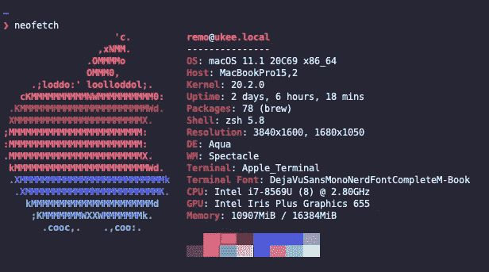

# macOS 从 Bash 到 Zsh 的过渡

> 原文：<https://medium.com/codex/macos-transition-from-bash-to-zsh-cadd367a850c?source=collection_archive---------1----------------------->

## [法典](http://medium.com/codex)

定制的 Zsh 外壳

# TL；速度三角形定位法(dead reckoning)

这篇博客文章是关于我从 Bash 到 Zsh 的个人转变的发现，描述了我如何让一些小工具(如 SSH 配置文件和 Git)自动完成以正确工作，以及我如何使用 starship 跨 shell 提示符给我的新 Zsh 一个现代 shell 的外观和感觉。

# 一个时代的终结