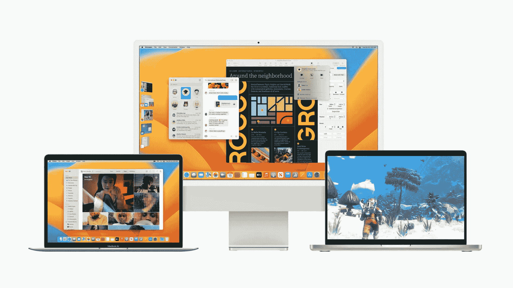
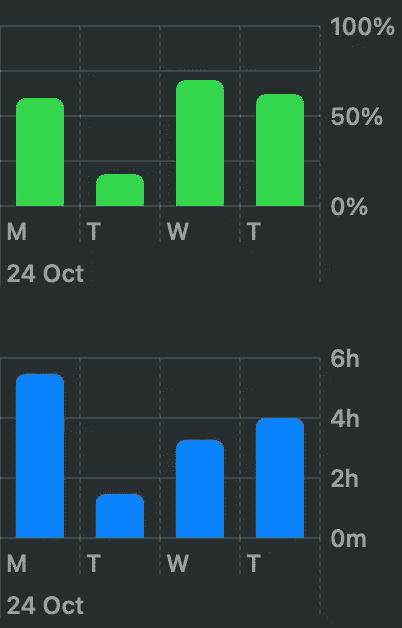

# macOS Ventura 发布版本—您应该升级吗？

> 原文：<https://medium.com/codex/macos-ventura-release-version-should-you-upgrade-3c8c60a83256?source=collection_archive---------1----------------------->

## 你最好等等。我来告诉你为什么。更新:阅读以下内容

macOS Ventura(来源:苹果)

> 2023 年 12 月 14 日更新:
> 
> 苹果昨天发布了 macOS 13.1，如果你已经在运行 macOS Ventura，我绝对推荐更新。它带来了许多错误修复和稳定性改进。这次更新之后，一切对我来说都天衣无缝，我非常高兴，包括我的 MacBook Air 的电池寿命。
> 
> 如果你运行的是 macOS Monterey，我强烈建议升级到最新版本的 macOS 12，至少是安全补丁。

日前，macOS 更新为 **macOS 13 (Ventura)** 。像往常一样，主要的苹果发布版本是首选，但在发布日更新时你应该始终小心。在这样做之前，请确保您有一个良好的备份。我在下面的文章中写了这一点。

 [## 在发布日更新您的操作系统

### 后援后援后援。你已经准备好了。

medium.com](/@tom-athos/updating-your-operating-system-on-the-release-day-6fa37ab617ac) 

正如文章中提到的，对于像 macOS Ventura 这样的重大更新，你应该总是更加谨慎。你可能会遇到更多的错误，所以做好最坏的打算总是好的。**我用苹果设备升级到主要版本时通常没有问题**。iPhones 和 iPads 上没有，iMacs 和 MacBooks 上也没有。但是这次有点不一样。

我等待 Ventura 的发布日，就像之前的其他重大更新一样。我做了备份，并在发布当天更新了我的 iMac 和 MacBook。但这一次，macOS Ventura 的 bug 似乎比之前的版本略多。

## 新功能带来新 bug

据苹果公司称，Ventura(和 iPadOS 16)被推迟是因为一个叫做**舞台管理器**的主要新功能。我对这个功能很感兴趣，我想尽快尝试一下。半个小时后，我对这个功能有些厌烦。我关机了，还是那个样子。我不打算再试一次，因为这不适合我。它应该带来更好的多任务处理体验，但它只是增加了更多的混乱。好吧，这是一个我不会使用的特性，但是网上很多人都在抱怨，尤其是抱怨它有多么的漏洞。我不能说我尝试的时间太短了，但是我遇到的主要问题是混淆。舞台管理器是如此无用的功能。

我在 Macbook 上遇到的错误是**屏幕冻结**。突然，一切都停止工作，几秒钟后，登录屏幕出现。我重新登录，几分钟后，同样的事情发生了。

我注意到我的 MacBook Air 的另一个问题是**电池耗尽**。突然，电池消耗增加了。下面你可以看到周一(仍在蒙特雷)和其他日子的电池使用情况。

Ventura 更新后的 Macbook Air 电池使用情况

周三，我在 Mac 上花了一半的时间，电池消耗几乎相同。今天好一点了，但还是不如以前。我认为这种电池消耗的罪魁祸首是一个软件错误。相反，有了 iOS 16.1，我 iPhone 上的电池就好了很多。

今天，我的 iMac 上的邮件应用崩溃了。当红色屏幕闪烁时，应用程序终止。然后弹出一个窗口向苹果举报。

由于某些原因，有些网站无法在 **Safari** 中打开。此外，一些网站停止正常工作，意味着无法点击网站链接。一个临时解决方案是关闭 Safari 并重新启动它。然而，这种情况在几天内发生了两次。

## 我会回到马科斯蒙特雷吗？

尽管有我提到的所有错误和一些我没有提到的错误(这里和那里的一些 UI 错误)，我不打算降级，因为我可以忍受它。macOS 13.1 的第一个公测版在第二天发布，我知道它很快会带来几个 bug 修复。

为了回答这个问题。

## 该不该升级到 macOS Ventura？

在这一点上，我会说没有**，没有**。最好等待下一个版本，13.1，在那里你可以期待大量的错误修复。如果你目前的 macOS 版本足够稳定，并且你没有错过 Ventura 的功能，那就等等吧。

## 结论

我把我的两台苹果电脑都升级到了 macOS Ventura，因为我喜欢尝试新功能，其中一个特别吸引了我的眼球。这是**安排一封电子邮件**，你可以稍后在邮件应用程序中发送。我喜欢邮件应用程序，足以坚持使用它，这个功能带来了一些真正有用的东西(我知道，许多竞争对手已经有一段时间了，但我不喜欢使用第三方电子邮件应用程序)。

我也喜欢对**系统设置**的彻底改革，对**天气应用**，对**连续性相机**和**信息传递的改进**。在苹果官网[这里](https://www.apple.com/macos/ventura/)看到所有好东西。

我有没有提到在每次系统升级之前做一份系统备份？只是为了确定一下。

你的系统升级到 Ventura 了吗？你的体验是什么？在评论里告诉我。

感谢您的阅读。一直很感激。

*原载于 2022 年 10 月 27 日 https://www.tomathosblog.com**T21*[。](https://www.tomathosblog.com/macos-ventura-release-version-should-you-upgrade/)