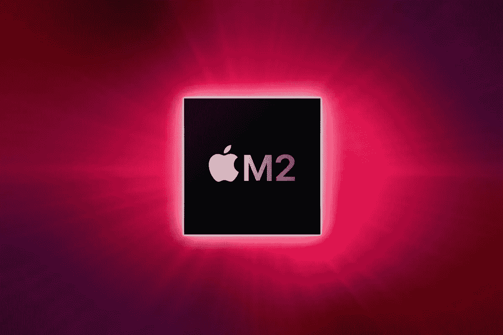

# 疯狂三月，苹果和更多

> 原文：<https://medium.com/codex/mad-march-macs-more-eeeef1904eba?source=collection_archive---------5----------------------->

## 苹果春季活动即将到来，可能会有比我们预想的更多的事情发生…

有强烈的传言称，苹果将在 3 月 8 日星期二举行他们的第一场活动(仍然是虚拟的)。如果这些谣言是正确的，那将意味着邀请在 3 月 1 日星期二前一周到达。这将略早于近年来，回到他们的老公式，在 3 月初举行今年的第一次活动。

这一事件可能会在产品发布会上相当低调——我们可能只会看到新的 iPad Air 和 iPhone SE 5G。然而，大新闻是，随着春去夏来，我们将会看到什么。

## 一，二，三，四

没错，根据备受尊敬的马克·古尔曼最新发布的 Power On 通迅，看起来不止一台，而是四台*新款 Mac 可能会在 2022 年向我们走来。我们最好掌握最新消息，为这些发布做好准备，从备受尊敬的 MacBook Air 的最新版本开始。*

**

## *苹果笔记本电脑*

*和今年所有的苹果电脑一样，这款电脑将会用最新的苹果硅胶——M2 芯片——来装饰。不如去年年底发布的 M1 Max & Pro 芯片强大，而是去年春天 M1 芯片的修订版。*

*MacBook Air 是 M1 芯片系列中最老的型号，在撰写本文时已经有一年多的历史了。除了内部的 M2 芯片，最大的变化将是美观。极具辨识度的“楔形”外形将被更为一体的外观所取代，以符合苹果目前的设计趋势。它很可能会有一个 13 英寸的屏幕，但由于更薄的边框，占地面积不会增加，因此保留了它的便携性。它将比它的前身厚一点，因为蝴蝶键盘现在已经不存在了，取而代之的是更受欢迎的魔法键盘。I/O 可能会得到改善，现在每侧都有两个 USB-C 端口& mag safe 充电的回归，可能还有一个 SD 卡插槽。显示器将是迷你 LED 灯，可能会有时髦的车身颜色，比如 2021 年的 24 英寸 iMac。由于显示器、端口和新芯片，入门价格可能会提高到 1200 英镑左右。*

* [## 信息…蓝色 v 绿色气泡

### 你知道颜色很重要！

medium.com](/@Davidtalkingtech/its-all-about-those-bubbles-f77708b32297)* 

## *MacBook Pro*

*我知道你在想什么…这是去年才发布的。好吧，为了最大限度地提高 R&D 的回报，看起来好像一个较低规格的进入模型可以使其进入阵容。除了剥离后的端口 I/O，由于 M2 芯片和较低的存储选项，冷却可能较少。这款入门级 MacBook 的显示屏可能只有 LED，而不是更大、更强、更贵的兄弟产品中华丽的 120 Hz 刷新率迷你 LED。*

* [## 成为一名 YouTuber 用户真是奇怪！

### 您需要习惯的事情…

medium.com](/@Davidtalkingtech/being-a-youtuber-is-just-odd-a7133c64a3e2)* 

## *MacMini Pro*

*装在我们现在如此习惯的旧的、熟悉的外壳中，似乎更新这个伟大机器唯一需要的改变将是 M2 芯片。仍然具有八核性能，但现在由于 M2 芯片，多核性能更快了。价格将保持在 699 英镑左右。*

## *最后…..*

*预计今年晚些时候推出的四款新 Mac 中的最后一款将是去年 24 英寸 iMac 的升级版，原因很简单，升级操作非常简单。一切都将保持原样，除了内部的 M2 和一些新的，新鲜的颜色来表示 2022 年的车型范围。值得注意和感兴趣的是，这台*可能*是有史以来第一台搭载 Face ID 的 Mac 电脑。iMac 当前的 24 英寸机身足够厚，可以直接从当前的 iphone&ipad 上拿下来，所以台式机可能*实际上*在笔记本电脑之前就有 Face ID *了！去年的 24 英寸有指纹键盘的选项，所以我很相信，这可能会发生，这是购买这种超值的消费级 iMac 的另一个原因。**

## *时间不多了*

*当苹果宣布从英特尔过渡到苹果硅胶时，他们明确表示，也将坚持两年时间。尽管有疫情，但情况看起来仍有可能如此。也就是说，iMac Pro 和 Mac Pro 也需要在今年年底前解决。苹果公司在接下来的几个月里肯定有很多工作要做。*

## *这一切什么时候会发生？*

*在春季活动上不会，这是肯定的。还有各种各样的供应链问题，因为你知道吗！苹果的第一个重点将是完成基于英特尔的机器的两年过渡，然后他们将关注上文详述的四款新 MAC。*

*看起来十月和十一月将会是库比蒂诺的提前圣诞节。*

*未来几个月，你最感兴趣的 MAC 是什么？*

*在你走之前*

*[**加入我的幕后邮件列表**](https://www.talkingtechandaudio.com)*

***原载于 2022 年 2 月 8 日 https://www.talkingtechandaudio.com/blog******。*****