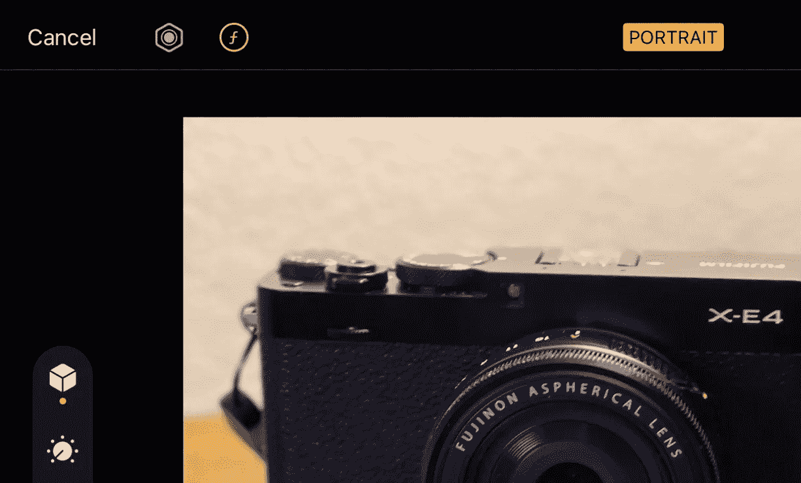

# 神奇的 iPhone 拍照技巧——拍摄后柔化背景！

> 原文：<https://medium.com/codex/magic-iphone-photo-trick-soften-the-background-after-the-shot-173b3a9f8518?source=collection_archive---------1----------------------->

“哦，那是 iPhone 图片。”

摄影师喜欢在浏览别人的肖像时小声嘀咕。

最重要的是那个极小的摄像传感器所产生的广阔的景深。一切都很清晰。我是说，*一切*。当然，它有时是有帮助的，但是从艺术的角度来说，对于…