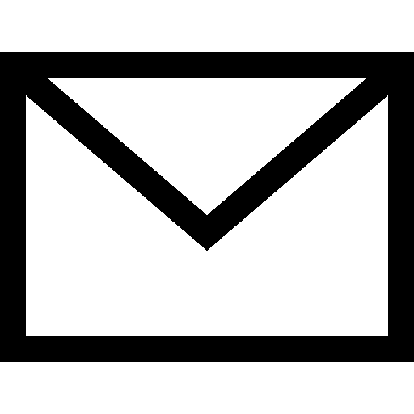
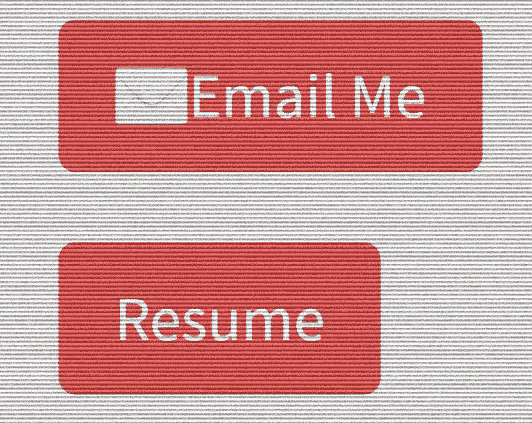

# 谷歌驱动链接上的邮件和简历。为什么不是纽扣？

> 原文：<https://medium.com/codex/mailto-and-resume-on-google-drive-links-why-not-buttons-877742c0857b?source=collection_archive---------7----------------------->

虽然链接看起来是一个更短更简单的话题，但谈论它并与其他训练营的毕业生分享还是很好的。我们大多数人都在我们的投资组合网站上工作(当我们没有研究工作面试的算法时)，我们希望我们的网站看起来令人印象深刻，并成为我们作为软件工程师甚至人类的延伸。

# 半铸钢ˌ钢性铸铁(Cast Semi-Steel)

如果我们想要格式化按钮，我们可以在样式表中创建它们。在这种情况下，我将向 CSS 样式表添加几个类。这些都是每个 HTML 标记中的类。

# 超文本标记语言

一旦样式表中的按钮格式，让我们去 index.html，并输入我们的按钮代码。首先，让我们做邮件按钮。

```
<div class="email-me">  
   <a name="email-me" href="mailto:human@mail.com" title="envelope"          class="btn btn-lg btn-primary" id="email-me"><span>&#999</span>Email Me</a>  
</div>
```

第一步将是添加一个部门，电子邮件按钮将在网站上。

```
<div class=”email-me”></div>
```

现在我们已经有了专门用于电子邮件按钮的`<div>`标签，让我们添加一个`<a>`标签，它将有一个名称、一个 id、我们在样式表中创建的按钮类和`<span>&#9993;</span>`,因为我们想变得有趣一些，而[将信封符号添加到按钮](https://www.toptal.com/designers/htmlarrows/symbols/envelope/)中。

```
<a name="email-me" href="mailto:human@mail.com" title="envelope"          class="btn btn-lg btn-primary" id="email-me"><span>&#999</span>Email Me</a>
```

我们有它，发送电子邮件按钮，点击并发送网站观众直接到他们的电子邮件应用程序。有了这种`mailto`链接，您还可以做[更多的事情。](https://css-tricks.com/snippets/html/mailto-links/)



现在，让我们把简历给那些潜在的招聘者和未来的同事。


图片来自福布斯

```
<div class="resume">      
   <a name="resume" href="drive.resumeinacloud.com" type="link"   target="_blank" rel="noopener noreferrer" class="btn btn-lg btn-primary" id="resume">Resume</a>    
</div>
```

方法将是相似的。让我们继续将部门添加到 resume 按钮。

```
<div class="resume"></div>
```

然后，`<a>`标签包含了我们需要的按钮的所有内容。请记住使用相同的类来格式化按钮 look，resume 链接的`href`，并且像您想要在新标签中打开的任何其他链接一样，执行`target=”_blank” rel=”noopener noreferrer”`。

```
<a name="resume" href="drive.resumeinacloud.com" type="link"   target="_blank" rel="noopener noreferrer" class="btn btn-lg btn-primary" id="resume">Resume</a>
```

所以这就是一切看起来的样子:



实际按钮从我的投资组合网站。

请看整个部门是如何`class=”box mrgn50"`的，就是分享我们如何使用 [flexbox](https://css-tricks.com/snippets/css/a-guide-to-flexbox/) 用 CSS 格式化它。

```
.box {    
    display: flex;    
    align-items: center;    
    justify-content: center;
}
```

这就是我们要学的东西，只是一个书签。但是希望你正在读这篇文章，在重构你的项目或者设计你的作品集页面的时候学到了一些东西。我希望它确实有帮助。编码快乐！

# 总结:

1.  HTML 中的自定义链接。
2.  CSS 类。
3.  HTML 元素。
4.  mailto 链接
5.  链接到文档云地址。
6.  使用 Flex 对齐内容。

# 参考资料:

1.  信封符号代码—[https://www . top tal . com/designers/html arrows/symbols/envelope/](https://www.toptal.com/designers/htmlarrows/symbols/envelope/)
2.  Mailto 链接—【https://css-tricks.com/snippets/html/mailto-links/ 
3.  如何创建类似链接的 HTML 按钮—[https://www . freecodecamp . org/news/how-to-Create-an-HTML-Button-That-Acts-Like-a-Link/](https://www.freecodecamp.org/news/how-to-create-an-html-button-that-acts-like-a-link/)
4.  Flexbox 完全指南—[https://css-tricks.com/snippets/css/a-guide-to-flexbox/](https://css-tricks.com/snippets/css/a-guide-to-flexbox/)