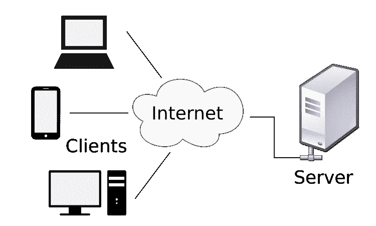

# 使用 Python 让客户端与本地服务器对话——套接字编程#1

> 原文：<https://medium.com/codex/make-a-client-talk-to-a-local-server-with-python-socket-programming-1-9be3cb4b474?source=collection_archive---------8----------------------->

客户端-服务器模式。来源:[维基共享资源](https://en.wikipedia.org/wiki/File:Client-server-model.svg)。

客户端-服务器是指发起服务请求的一个或多个客户端以及提供该功能或服务的服务器。它可以用作媒介，允许不同机器之间通过共享数据或文件进行交互。应用程序中协作程序之间的关系可以用客户机-服务器来建立。