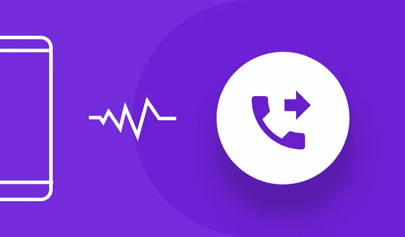
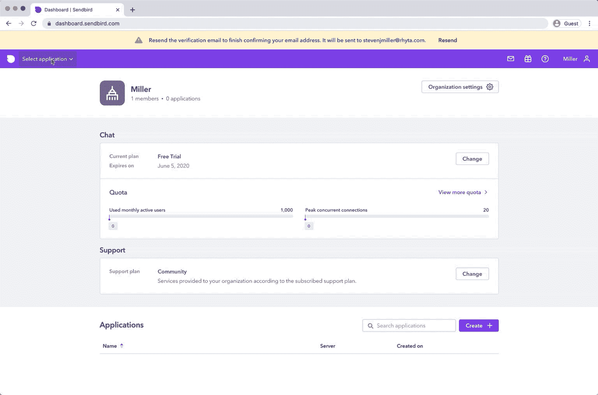
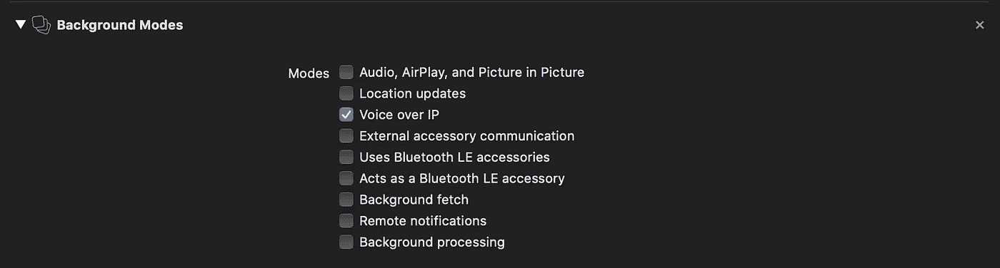
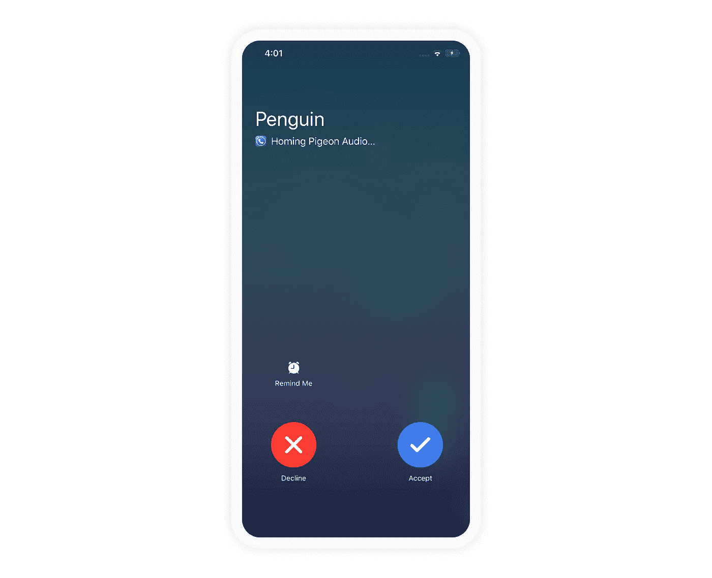
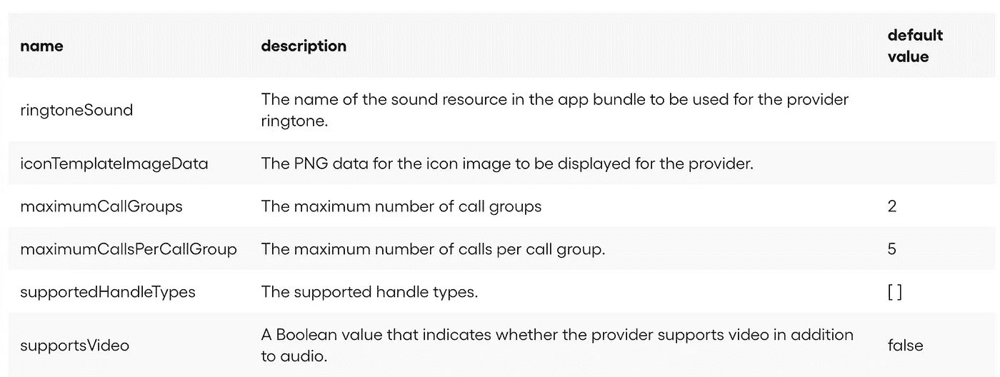
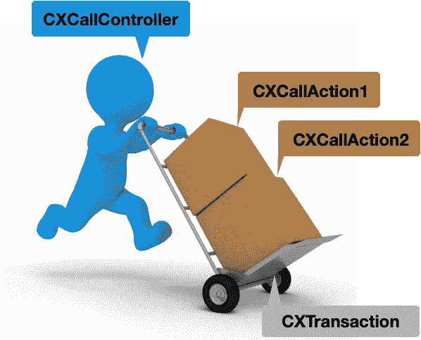
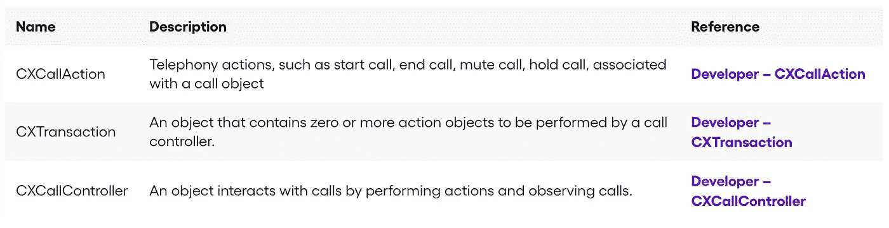
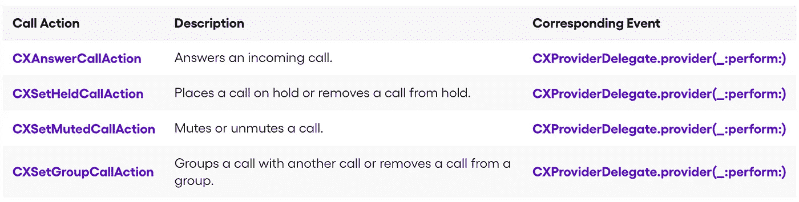
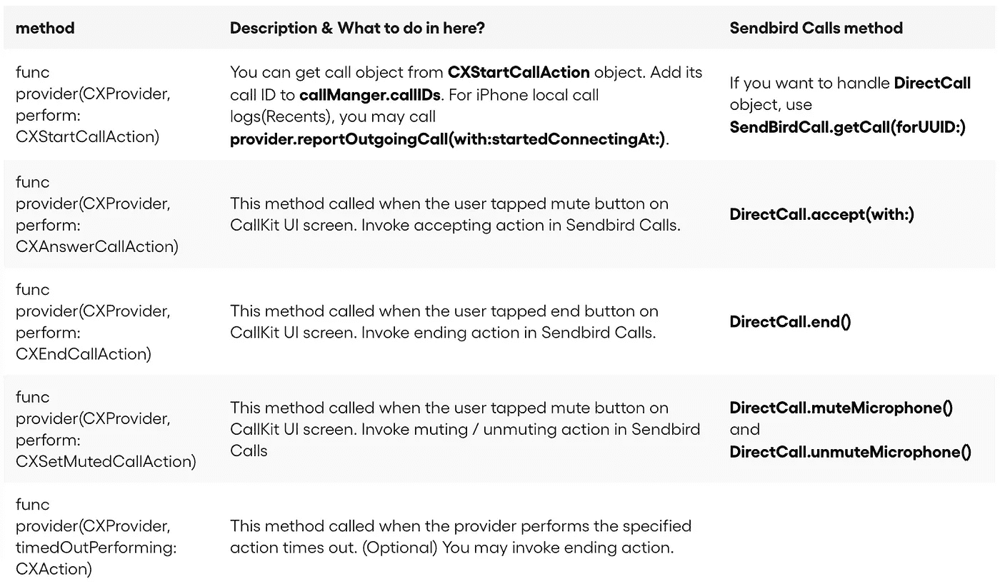

# 如何使用 iOS CallKit 和 Sendbird Calls 制作视频通话应用程序

> 原文：<https://medium.com/codex/make-a-video-call-app-with-ios-callkit-and-sendbird-calls-95b86ddbc908?source=collection_archive---------0----------------------->



作者:李在成
工程师| [仙鸟](https://www.sendbird.com)

*如果您正在寻找关于 Swift、Kotlin、reactor、颤振等的教程，请访问我们的* [*开发者门户网站*](https://sendbird.com/developer/tutorials) ***。***

*   如需完整的 iOS 视频聊天应用，请查看我们在 GitHub 上的[示例应用](https://github.com/sendbird/quickstart-calls-directcall-ios)。
*   查看我们的 iOS 视频聊天[文档](https://sendbird.com/docs/calls/v1/ios/quickstart/make-first-call#2-make-1-to-1-call-3-step-7-add-capabilities-to-your-app)。

# 介绍

本教程将指导您使用 Sendbird Calls 框架和苹果的 CallKit 框架开发 VoIP 应用程序。您将从开发一个简单的项目开始，该项目允许您使用 CallKit 拨打本地电话。

每个部分都提供了文件的完整代码。您可以将代码复制并粘贴到适当的文件中。提供的代码可能不是唯一的实现。您可以通过仔细阅读以下步骤来定制它们，以满足您的需求。这些步骤将帮助您更好地了解 CallKit。

# 第一步。创建 Sendbird 帐户

1.注册一个免费的 [Sendbird 账户](https://dashboard.sendbird.com/auth/signup)。

2.使用您的电子邮件 id 创建一个帐户，或单击“继续使用谷歌”。

3.通过输入“组织名称”和“电话号码”来设置您的组织。

4.在最靠近您所在地区的地方创建一个新的“聊天+通话”应用程序。

*   在屏幕的左侧，您应该会看到一个“来电”菜单，进入“工作室”并创建一个新的“电话亭”用户。



# 第 2 步:配置呼叫套件

## 步骤 2.1

要开发 VoIP 应用服务，您需要该应用的 VoIP 证书。转到苹果开发者页面并登录。

## 步骤 2.2

转到证书，标识符和配置文件>证书>创建新证书。您将在“服务”部分找到 VoIP 服务证书。创建 VoIP 服务证书。

## 步骤 2.3

转到目标>签名和功能。添加背景模式并启用 IP 语音。这将创建一个. rights 文件和允许您使用 VoIP 服务的适当权限。如果不启用 IP 语音，将出现呼叫工具包错误代码 1。



# 第 3 步:设计呼叫工具包用户界面



## 步骤 3.1

要为 CallKit 配置本地化信息，请创建一个名为**cxproviderconfiguration . extension . swift**的文件。

**cxp provider**

> ***CXProvider*** *是表示电话服务提供商的对象。****CX provider****用****CX provider configuration****初始化。VoIP 应用程序应该只为每个应用程序创建一个****CX provider****实例，并全局使用。更多信息请参见* [***苹果开发者文档— CXProvider。***](https://developer.apple.com/documentation/callkit/cxprovider)

每个提供者可以指定一个符合 **CXProviderDelegate** 协议的对象来响应事件，例如开始呼叫、保持呼叫或激活提供者的音频会话。

## 第 3.2 步

```
extension CXProviderConfiguration {
    static var custom: CXProviderConfiguration {
    // 1
    let configuration = CXProviderConfiguration(localizedName: "Homing Pigeon") // 2
    // Native call log shows video icon if it was video call.
    configuration.supportsVideo = true // Support generic type to handle *User ID*
    configuration.supportedHandleTypes = [.generic] // Icon image forwarding to app in CallKit View
    if let iconImage = UIImage(named: "App Icon") {
        configuration.iconTemplateImageData = iconImage.pngData()
    }
    return configuration
    }
}
```

**CXProviderConfiguration**对象控制传入和传出呼叫的本地呼叫 UI，包括提供商的本地化名称、传入呼叫要播放的铃声以及呼叫期间要显示的图标。有关更多信息，请参见 [**苹果开发者文档— CXProviderConfiguration。**](https://developer.apple.com/documentation/callkit/cxproviderconfiguration)

1.  用本地化名称初始化**CXProviderConfiguration**对象。当您的用户通过 CallKit 收到呼叫时，此名称将出现在呼叫视图中。使用适当的命名，例如您的应用服务名称，作为本地化名称。在这种情况下，我们使用“信鸽”
2.  配置用户界面及其功能。在这一步中，设置 **supportsVideo** 、 **supportedHandleTypes** 和 **iconTemplateImageData** 。如果您想进一步定制 CallKit，请参见下表。也可以参考 [**苹果开发者文档— CXProviderConfiguration。**](https://developer.apple.com/documentation/callkit/cxproviderconfiguration)



## 支持视频

```
configuration.supportsVideo = true
```

这是一个布尔值，它指示呼叫除了音频之外是否还支持视频功能。默认设置为**假**。苹果文档:[**supports video**](https://developer.apple.com/documentation/callkit/cxproviderconfiguration/1779574-supportsvideo)。

如果您的服务提供视频通话，请将**支持视频**设置为**真**。如果您的服务不提供视频通话，请跳过此设置。

## 支持的 HandleTypes

```
configuration.supportedHandleTypes = [.generic]
```

这是您想要处理的呼叫提供者的类型。参见 CXHandle.HandleType。

**CXHandle** 指的是在每次通话中如何识别你的用户。三种可能的句柄类型是:**。电话号码**，**。电子邮件**和**。通用**。根据您提供的服务和管理用户的方式，您可以选择不同的选项。如果通过电话号码或电子邮件地址识别用户，选择**。电话号码**或**。电子邮件**。但是，如果它是基于某个随机的 **UUID** 值或其他未指定的值，则使用**。通用**。**。泛型**，它是一个未指定的**字符串**值，可以更灵活地使用。

## iconTemplateImageData

```
if let iconImage = UIImage(named: "App Icon") {
    configuration.iconTemplateImageData = iconImage.pngData()
}
```

这是为提供者显示的图标图像的 PNG 数据。

图标图像应该是边长为 40 磅的正方形图像。图像的 alpha 通道用于创建白色图像蒙版，该蒙版在系统的原生调用 UI 中用于按钮，该按钮将用户从该系统 UI 带到第三方应用。

参见[T21。](https://developer.apple.com/documentation/callkit/cxproviderconfiguration/2274376-icontemplateimagedata)

设置**。iconTemplateImageData** 到图标图像，该图标图像将显示在 CallKit 屏幕上本地化名称的旁边。分配**。pngData()** 到你的应用图标。

# 第四步。请求呼叫套件操作



CallKit 提供许多与呼叫相关的功能，如拨号、结束、静音、保持等。这些特性中的每一个都应该由名为 **CXCallAction** 的适当的 CallKit 动作来执行。这些动作是从一个 **CXCallController** 对象中调用的，该对象使用 **CXTransaction** 对象来执行每个 **CXCallAction** 。为了控制 CallKit，您必须创建相应的 **CXCallActions** ，并通过使用 **CXTransaction** 请求一个事务来执行它们。

向 CallKit 发送请求有三个步骤:

1.  创建**cxcalaction**对象
2.  创建 **CXTransaction** 对象
3.  通过 **CXCallController** 请求 **CXTransaction** 对象



## 第 4.1 步。交易

```
// Allow to request for actions
let callController = CXCallController()// Request transaction
private func requestTransaction(with action: CXCallAction, completionHandler: (NSError? -> Void)?) {
    let transaction = CXTransaction(action: action)
    callController.request(transaction) { error in
        completionHandler?(error as NSError?)
    }
}
```

添加 **CXCallController** 属性和另一个名为**的方法 request transaction(with:completion handler:)**。该方法使用 **CXCallAction** 创建 **CXTransaction** ，并通过 **callController** 请求事务。在创建一个 **CXCallAction** 对象后，您总是需要调用这个方法。

# 第 4.2 步。呼叫操作

## 开始呼叫操作

下面实现了 **CXStartCallAction** 的一个方法。这个动作代表了通话的开始。如果动作请求成功，将调用相应的**cxproviderdelegate . provider(_:perform:)**事件。

```
func startCall(with uuid: UUID, calleeID: String, hasVideo: Bool, completionHandler: ((NSError?) -> Void)? = nil) {
    // 1
    let handle = CXHandle(type: .generic, value: calleeID)    
    let startCallAction = CXStartCallAction(call: uuid, handle: handle)

    // 2
    startCallAction.isVideo = hasVideo

    // 3
    self.requestTransaction(with: startCallAction, completionHandler: completionHandler)
}
```

1.  您必须创建一个与调用相关联的 **CXHandle** 对象，该对象将用于标识调用所涉及的用户。该对象将与 UUID 一起包含在 **CXStartCallAction** 中。
2.  如果通话有视频，设置**。isVideo** 到 **true** 。

```
startCallAction.isVideo = hasVideo
```

3.如步骤 1 所述，在创建一个 **CXStartCallAction** 对象后，不要忘记调用**request transaction(with:completion handler:)**方法。

## 结束通话操作

下面实现了 **CXEndCallAction** 的另一种方法。此动作表示通话已结束。如果动作请求成功，将调用相应的**cxproviderdelegate . provider(_:perform:)**事件。 **CXEndCallAction** 只需要调用的 **UUID** 。用 **UUID** 创建一个 **CXEndCallAction** 对象。

```
func endCall(with uuid: UUID, completionHandler: ((NSError?) -> Void)? = nil) {
    let endCallAction = CXEndCallAction(call: uuid)
    self.requestTransaction(with: endCallAction, completionHandler: completionHandler)
}
```

## 其他呼叫操作

其他 **CXCallActions** 可以和 **CXStartCallAction** 和 **CXEndCallAction** 一样实现。以下是其他通话操作的列表:



# 第五步。管理通话

要轻松管理 **CXCallController** 和通话 id，您可能需要创建一个通话管理器，它必须可以从任何地方访问。呼叫管理器将存储和管理正在进行的呼叫的 **UUID** 以处理呼叫事件。

> ***注意*** *您还可以使用****cxcallcontroller . call observer . calls****属性来管理活动呼叫(包括结束的呼叫)列表并观察呼叫变化。每个调用都是一个****CXCall****对象，代表 CallKit 中的一个调用。通过勾选***属性，可以处理正在进行的通话。**
> 
> **有关更多信息，请参见* [***苹果开发者文档— CallObserver***](https://developer.apple.com/documentation/callkit/cxcallobserver) *和* [***苹果开发者文档— CXCall***](https://developer.apple.com/documentation/callkit/cxcall)*

```
*import CallKit

class CallManager {
    // 1
    static let shared = CallManager()

    let callController = CXCallController()

    // 2
    private(set) var callIDs: [UUID] = []

    // MARK: Call Management
    func containsCall(uuid: UUID) -> Bool {
        return CallManager.shared.callIDs.contains(where: { $0 == uuid })
    }

    func addCall(uuid: UUID) {
        self.callIDs.append(uuid)
    }

    func removeCall(uuid: UUID) {
        self.callIDs.removeAll { $0 == uuid }
    }

    func removeAllCalls() {
        self.callIDs.removeAll()
    }
}*
```

*创建一个名为 **CallManager** 的新类。然后，添加一个共享的静态实例，以便从任何地方访问它(您可以选择使用除 singleton 之外的其他模式)。*

```
*static let shared = CallManager() // singleton*
```

*如果你想知道更多关于这个模式的信息，请看 [**使用单例管理共享资源。**](https://developer.apple.com/documentation/swift/cocoa_design_patterns/managing_a_shared_resource_using_a_singleton)*

*添加类型为**【UUID】**的 **callIDs** 属性，并添加管理 callIDs 的方法: **addCall(uuid:)** ， **removeCall(uuid:)** 和 **removeAllCalls()***

```
*private(set) var callIDs: [UUID] = []func containsCall(uuid: UUID) -> Bool { ... }func addCall(uuid: UUID) { ... }func removeCall(uuid: UUID) { ... }func removeAllCalls() { ... }*
```

# *第六步。处理呼叫工具包事件*

*要报告新的来电或响应新的 CallKit 操作，您必须使用在第 2 节中创建的**CX provider configuration**创建一个 **CXProvider** 对象。您还可以通过**cxprovidereddelegate**处理该调用的 CallKit 事件。*

```
*// ProviderDelegate.swift
class ProviderDelegate: NSObject { // 2
    private let provider: CXProvider override init() {
        provider = CXProvider(configuration: CXProviderConfiguration.custom) super.init() // If the queue is `nil`, delegate will run on the main thread.
        provider.setDelegate(self, queue: nil)
    } // 3
    func reportIncomingCall(uuid: UUID, callerID: String, hasVideo: Bool, completionHandler: ((NSError?) -> Void)? = nil) { // Update call based on DirectCall object
        let update = CXCallUpdate() // 4\. Informations for iPhone local call log
        let callerID = call.caller?.userId ?? "Unknown"
        update.remoteHandle = CXHandle(type: .generic, value: callerID)
        update.localizedCallerName = callerID
        update.hasVideo = hasVideo // 5\. Report new incoming call and add it to `callManager.calls`
        provider.reportNewIncomingCall(with: uuid, update: update) { error in
            guard error == nil else {
                completionHandler?(error as NSError?)
                return
            } // Add call to call manager
            CallManager.shared.addCall(uuid: uuid)
        }
    } // 6
    func connectedCall(uuid: UUID, startedAt: Int64) {
        let connectedAt = Date(timeIntervalSince1970: Double(startedAt)/1000)
        self.provider.reportOutgoingCall(with: uuid, connectedAt: connectedAt)
    } // 7
    func endCall(uuid: UUID, endedAt: Date, reason: CXCallEndedReason) {
        self.provider.reportCall(with: uuid, endedAt: endedAt, reason: reason)
    }
}// 1
extension ProviderDelegate: CXProviderDelegate {
    func providerDidReset(_ provider: CXProvider) { }
}*
```

1.  *导入 **CallKit** 并创建一个 **ProviderDelegate** 类，与**n object**和 **CXProviderDelegate** 保持一致。*
2.  *添加两个属性: **callManager** 和 **provider** 。**呼叫管理器**是您在第 3 节中创建的**呼叫管理器**类。提供程序报告 CallKit 的操作。当您初始化一个提供者时，使用您已经在第 2 节中创建的**cxproviderconfiguration . custom**。*

```
*private let provider: CXProvider

override init() {
    provider = CXProvider(configuration: CXProviderConfiguration.custom)

    super.init()

    // If the queue is `nil`, delegate will run on the main thread.
    provider.setDelegate(self, queue: nil)
}*
```

1.  *要报告一个新的来电，您需要创建一个 **CXCallUpdate** 实例，其中包含来电的相关信息，以及用于标识参与通话的用户的 **CXHandle** 。*
2.  *为了让你的调用更加丰富，你可以定制 **CXHandle** 和 **CXCallUpdate** 实例。如果呼叫有视频，请将 has video 设置为 true。上层 iPhone 通话记录基于 **CXHandle** 对象。*
3.  *在报告一个新的来电后，您必须使用之前添加的 **addCall(uuid:)** 方法将其添加到 **CallManager.shared.calls** 中。*
4.  *CallKit 通过侦听适当的 CallKit 事件来跟踪呼叫的接通时间和结束时间。要告诉 CallKit 呼叫已连接，请调用**reportOutgoingCall(with:connected at:)**。这将启动通话持续时间，并通知 iPhone 应用程序的通话日志中显示的通话起点。*
5.  *要告诉 CallKit 呼叫结束，调用**report call(with:ended at:reason:)**。这将通知呼叫的端点，该端点也将显示在 iPhone 应用程序的呼叫日志中。*

# *第六步。处理 CXCallAction 事件*

## *与 CallKit UI 的交互*

*当提供者执行 **CXCallActions** 时，可以调用相应的 **CXProviderDelegate** 方法。为了正确响应用户的操作，您必须在方法中实现适当的 Sendbird 调用操作。*

> ****重要*** *:在方法结束之前，不要忘记执行****action . full()****。**
> 
> ****重要*** *:要访问****【UUID】****的调用，必须使用****action . calluuid****属性，而不是****action . uuid****。**

**

*有关 **CXProviderDelegate** 方法的更多信息，请参考 [**苹果开发者文档— CXProviderDelegate**](https://developer.apple.com/documentation/callkit/cxproviderdelegate) 。*

```
*// ProviderDelegate.swift
extension ProviderDelegate: CXProviderDelegate {
    func providerDidReset(_ provider: CXProvider) {
        // Stop audio
        // End all calls because they are no longer valid
        // Remove all calls from the app's list of call CallManager.shared.removeAllCalls()
    } func provider(_ provider: CXProvider, perform action: CXStartCallAction) {
        // Get call object
        // Configure audio session
        // Add call to  `callManger.callIDs`.
        // Report connection started action.fulfill()
    } func provider(_ provider: CXProvider, perform action: CXAnswerCallAction) {
        // Configure audio session
        // Accept call
        // Notify incoming call accepted action.fulfill()
    } func provider(_ provider: CXProvider, perform action: CXEndCallAction) {
        // Mute the call
        // End the call action.fulfill() // Remove the ended call from `callManager.callIDs`.
        CallManager.shared.removeCall(uuid: action.callUUID)
    } func provider(_ provider: CXProvider, perform action: CXSetHeldCallAction) {
        // update holding state.
        // Mute the call when it's on hold.
        // Stop the video when it's a video call. action.fulfill()
    } func provider(_ provider: CXProvider, perform action: CXSetMutedCallAction) {
        // stop / start audio action.fulfill()
    } func provider(_ provider: CXProvider, didActivate audioSession: AVAudioSession) {
        // Start audio
    } func provider(_ provider: CXProvider, didDeactivate audioSession: AVAudioSession) {
        // Restart any non-call related audio now that the app's audio session has been
        // de-activated after having its priority restored to normal.
    }
}*
```

# *第七步。与用户界面的交互*

*您可以使用 CallKit 的默认视图开始和结束呼叫。接下来，让我们尝试使用带有 CallKit 的自定义 UI。为了清楚起见，本教程跳过创建相关的故事板文件和 **ViewController** 文件。相反，假设有一个文本字段用于输入远程用户的 ID，一个按钮用于发出呼叫，另一个按钮用于接收呼入，最后一个按钮用于结束呼叫。*

```
*// ViewController.swift
import UIKit

class ViewController: UIViewController {
    let providerDelegate = ProviderDelegate()

    // UUID of ongoing call
    var callID: UUID?

    // 1
    @IBAction func didTapOutgoingCall() {
        guard let calleeID = userIDTextField.text?.trimmingCharacters(in: .whitespaces) else { return }
        guard !calleeID.isEmpty else { return }
        let uuid = UUID()
        self.callID = uuid

        CallManager.shared.startCall(with: uuid, calleeID: calleeID, hasVideo: false) { error in
            // ...
        }
    }

    // 2
    @IBAction func didTapEnd() {
        guard let callID = self.callID else { return }
        CallManager.shared.endCall(with: callID) { error in
            guard error == nil else { return }
        }
        self.callID = nil
    }

    // 3
    @IBAction func didTapIncomingCall() {
        guard let callerID = userIDTextField.text?.trimmingCharacters(in: .whitespaces) else { return }
        guard !callerID.isEmpty else { return }
        let uuid = UUID()
        self.callID = uuid

        providerDelegate.reportIncomingCall(uuid: uuid, callerID: callerID, hasVideo: false) { error in
            // ...
        }
    }
}*
```

1.  *发出呼叫:因为用户正在发起呼叫，所以您必须为该呼叫创建一个请求。该操作需要被叫方的**用户 ID** 和呼叫的唯一 **UUID** 。*
2.  *实现结束按钮的动作:该动作将根据 **callID** 结束通话。*
3.  *接听音频来电:要做到这一点，你必须模拟一个音频来电。因为 CallKit 不知道来电，所以您必须向 CallKit 报告来电。此操作需要呼叫者的用户 ID 和呼叫的唯一 UUID。目前，因为来电是在本地进行的，所以您将使用随机生成的 **UUID()** 而不是真实来电者的 **UUID** 。如果要测试视频来电，将 **hasVideo** 参数的值指定为 **true** 。*

# *结论*

*本教程介绍了使用基于 WebRTC 和 Apple CallKit 框架构建的 Sendbird Calls 框架开发 VoIP 应用程序。您正在构建具有语音和视频通话功能的迷人应用。iOS 调用 app 搭建快乐！*