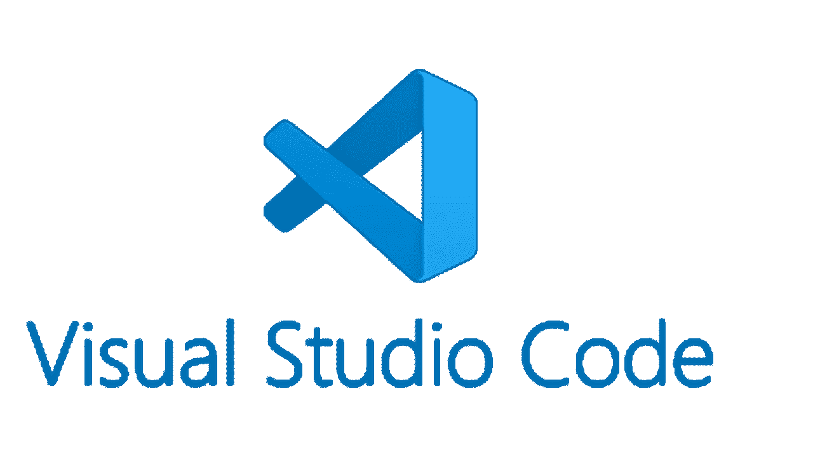

# 更好地利用 VSCode 进行 Python 开发

> 原文：<https://medium.com/codex/make-better-use-of-vscode-for-python-development-9560e776b1f9?source=collection_archive---------1----------------------->

编辑是我们最好的朋友。它们不仅简化了我们的生活，还让编程变得有趣。我个人无法想象没有他们的生活。我相信对我们大多数人来说都是如此。然而，不正确的编辑器配置有时可能是灾难性的，会降低您的速度。所以，我总是说

> “更好地了解您的 IDE”