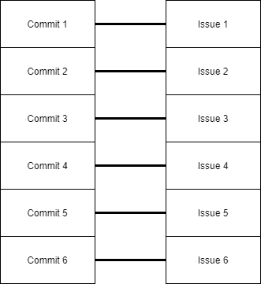

# 让别人愿意使用你的代码

> 原文：<https://medium.com/codex/make-others-want-to-work-with-your-code-93bf745bd35b?source=collection_archive---------6----------------------->

## 清理代码和清理提交


一个流行的代码库有很多人愿意使用它。

你并不总是只为自己写代码。其他人正在查看您的代码的一些情况是

*   当你的代码在像 [GitHub](https://github.com/) 这样的开源平台上共享时
*   当您的代码需要别人批准时
*   当你离开一个组织，而其他人不得不继续使用你创建的代码时
*   当潜在雇主决定是否给你一份工作时
*   当您在杂志、会议或讲座中展示您的代码时
*   当您的代码在很多人使用的库中或包中时
*   当你未来的自己需要处理你的旧代码时

你必须在编写代码时考虑到其他人。在本文中，您将了解干净代码、惯用代码和干净提交的概念。应用这些概念可以帮助您将代码的查看者转变为用户、开发人员或代码的批准者。

*免责声明:下面对特定工具和文档的一些引用是 Python 特有的，但是一般概念是跨语言通用的。*

# 编写干净的代码

一段伟大的代码实现了一个优雅而高效的解决方案，如果它不容易阅读，会让其他人不敢使用它。写代码是一回事。编写*干净的*代码本身就是一种技能。你可以有两段代码，它们都执行相同的过程，给出相同的结果，但是看起来完全不同。

通常，您希望编写易于阅读、遵循和理解的代码；解释得很好；易于修改、故障排除和调试；尽可能简单。罗伯特·c·马丁的《干净的代码》一书是一个有用的资源。

[链接到罗伯特·c·马丁的《干净的代码》一书的摘要](https://gist.github.com/wojteklu/73c6914cc446146b8b533c0988cf8d29#file-clean_code-md)

## 使其易于阅读

遵循您正在使用的特定编程语言的既定风格指南和约定。Python 的 [PEP8](https://pep8.org/) 就是风格指南的一个例子。除此之外，您应该确保建立一个 [linter](https://en.wikipedia.org/wiki/Lint_(software)) 来捕捉手工检查代码无法捕捉的违反约定的情况。通常，linter 可以作为 ide 或代码编辑器的集成扩展。


包含子程序的主程序。

典型的惯例是尽量减少不在函数内部的代码行。这样，代码就像一本书。每个函数或子程序都类似于一本书的一章。main 例程是一个以适当的顺序调用所有其他函数的函数，类似于一本书的目录。程序从调用主例程开始，依次地，主例程以正确的顺序调用所有其他的子例程。当程序到达主例程的末尾时，它就完成了运行。以这种方式构建代码有多种好处，其中之一是可以很容易地确定代码执行的正确顺序。

## 解释清楚

包含内部文件。内部文档是指程序文件内部的文档，如注释和文档字符串(也称为多行注释)。Python 的 [PEP257](https://www.python.org/dev/peps/pep-0257/) 特别描述了 Python 的 docstring 约定。它指定了文档字符串在每个模块、类、函数和方法开头的位置。函数的文档字符串可以描述:

*   参数—它的名称、预期的数据类型、它是可选的还是必需的，以及使用说明
*   返回值-其名称和数据类型
*   运行时和资源消耗
*   功能行为

下面是一个遵循 Google 风格惯例的 docstring。这个和更多的例子可以在【sphinx-doc.org】示例谷歌风格的 Python 文档串 Sphinx 文档(T5)[找到。](https://www.sphinx-doc.org/en/master/usage/extensions/example_google.html)

```
**def** **function_with_types_in_docstring**(param1, param2):
    """Example function with types documented in the docstring.

    `PEP 484`_ type annotations are supported. If attribute, 
    parameter, and return types are annotated according to `PEP
    484`_, they do not need to be included in the docstring:

    Args:
        param1 (int): The first parameter.
        param2 (str): The second parameter.

    Returns:
        bool: The return value. True for success, False otherwise.

    .. _PEP 484:
        https://www.python.org/dev/peps/pep-0484/

    """
```

通过正确使用内部文档，读者甚至在开始阅读实际的代码行之前，就可以了解代码每一部分的用途。

**包括外部文件**。外部文档是指程序文件之外的文档，如 READMEs 和用户指南。将整个应用程序/项目描述放入自述文件中。你也可以在你的子文件夹里放一些阅读材料，来解释里面应该有什么。

有一些强大的工具可以帮助你生成代码的专业文档，比如 [Sphinx](https://www.sphinx-doc.org/en/master/index.html) 和 [pydoc](https://docs.python.org/3/library/pydoc.html) 。文档对于鸟瞰您的应用程序或项目中的所有可用内容非常有用。查看您的代码的人可能希望在文档中看到以下内容:

*   所有函数、类、模块和方法的列表
*   数据结构图
*   数据库模式图
*   如何使用你的代码的指南

## 使其易于修改和调试

简单地使代码可读已经在使代码更容易修改和调试方面创造了奇迹。因为代码是可读的，所以您不太可能浪费时间去弄清楚代码的哪一部分需要修改，并且您也不太容易出错。然而，除了简单地使代码可读之外，您还可以做更多的事情。

编写单元测试。如果您希望您的代码被很多人使用，但仍然经历持续的开发，强烈建议您编写单元测试。对于 Python，有 [unittest](https://docs.python.org/3/library/unittest.html) 模块。如果您添加新功能或修复 bug，并且在这个过程中，意外地破坏或更改了现有功能的行为，您就给每个使用和依赖您的代码的人带来了问题。想象一下，如果你在[金融科技](https://en.wikipedia.org/wiki/Financial_technology)部门，你的代码的一个新版本意外地导致每个人都失去了他们的钱！你不会想成为那样的人！

无论何时修改和调试代码，单元测试都是防止意外破坏现有功能的重要保障。通常情况下，目标脚本的单元测试是一个单独的脚本，它使用不同的参数和参数运行目标脚本中的函数，检查它是否仍然正常运行并引发正确的错误。在修改了脚本之后，您运行一个脚本的单元测试，如果通过了，那么您就可以安全地向公众发布新的、修改过的代码了。这一概念只是被称为[自动化测试、持续集成和持续交付](https://www.ibm.com/cloud/learn/continuous-integration#:~:text=The%20following%20are%20a%20few%20of%20the%20most,other%20parts%20of%20the%20software%20More%20items...%20)的更大范围的 DevOps 实践的一小部分。

如果其他人看到你的代码有单元测试，他们会更倾向于改进你的代码，因为他们知道单元测试会保护他们不意外地破坏现有的特性并招致现有用户的愤怒。


如果你想避免看到标题说你的代码毁了某人的一天，运行单元测试。

**生成日志报告** *。*在飞机失事中，调查人员寻找飞机的飞行记录器，其中包含飞行过程中发生的事情的日志，并保存着飞机坠毁原因和方式的潜在线索。同样，在软件中，*日志记录*是在程序运行时记录事件和其他细节的一种实践，并且保存着关于为什么会发生错误的潜在线索。通常，每当程序遇到错误时，默认情况下您已经看到一个错误日志。然而，这有时证明是不够的或不完整的。

例如，假设您正在运行一个程序，该程序遍历一个文件夹中的所有文件。执行到一半时，程序会停止，因为其中一个文件的格式与其他文件不同。接下来要做的是确定哪个文件不同。但是，当您查看默认的错误日志时，没有指定最后读取的文件的文件名！您可以尝试通过打开每个文件并查看哪个文件不同来找出差异，但这并不实际。相反，您可以让程序在每次读取文件时都写一个日志条目。当您再次运行该程序时，最后一个日志条目中的指定文件是罪魁祸首。

在 Python 中，我们有[日志](https://docs.python.org/3/howto/logging.html)模块。“为什么不用 **print()** ？”你可能会问。 **print()** 函数实际上并不是报告事件的最佳工具。日志模块提供了将日志报告作为文件保存在磁盘上的选项。


[Python 的文档](https://docs.python.org/3/howto/logging.html#when-to-use-logging)将日志记录作为报告事件的最佳工具，而不是使用 print()。

一个好的日志报告将包含足够的细节来快速调试和隔离问题的原因，但不会有大量无用的信息来分散注意力。您必须在日志中包含过多和过少的信息之间进行平衡。

# 编写惯用代码

维基百科是这样定义编程习惯用法的:

> 一般来说，编程习语是简单任务、算法或数据结构的自然语言表达，不是正在使用的编程语言中的内置特性，或者相反，使用一种不寻常或显著的特性，即*是编程语言中内置的*。

转述一下，成语的定义似乎实际上有两个部分:

*   适用于不同编程语言的编程实践
*   正确使用特定语言中可用内容的编码实践

类似于某些专业已经建立的、众所周知的最佳实践，惯用代码是代表特定编程语言中的代码在实践中应该看起来和使用的方式的代码，无论是利用语言的特定功能还是普遍实用的东西。

前面提到的将程序构造为包含多个子例程的主例程的惯例是习语，它来自定义的第一部分，因为以这种方式在多种语言中构造程序是有意义的。使用 Python，我们有了诸如列表和字典理解、列表和字符串方法等数据类型方法、 **enumerate()** 函数等特性。，在用 Python 编写时应该充分利用这一点。根据定义的第二部分，使用这些特性是惯用的。

这不是习惯用法:

```
index = 0
for item in some_list:
    print(f'{item} is the item at index {index}')
    index += 1
```

这是习惯用法:

```
for item, index in enumerate(some_list):
    print(f'{item} is the item at index {index}')
```

**enumerate()** 函数消除了在遍历对象时使用额外的行来声明和递增指针索引的需要。

将惯用代码的概念扩展到包括“包含编程语言哲学的代码”是有意义的。有一个著名的 Python 的[禅，你可以在终端中输入‘import this’来打印。它谈到了在 Python 中“被认为是好的”实践。](https://www.python.org/dev/peps/pep-0020/)

有时，一些特殊的术语被用来指代某种语言中的惯用代码。比如惯用的 Python 代码叫做“Pythonic”，惯用的 [Pandas](https://pandas.pydata.org/) 代码叫做“Pandorable”。

您可以拥有不仅适用于特定语言，而且适用于特定库或 API 的惯用代码。前面提到的熊猫不是编程语言，而是 Python 的库。

惯用代码不仅提高了清晰度和可读性，还提高了性能。例如，在 Pandas 中，中心类对象是 DataFrame，它本质上是一个包含行和列的表。从技术上讲，您可以应用一个函数，并通过使用 FOR 循环对每列中的每个单元格进行迭代来将输出返回到数据帧的每个单元格，您将获得您想要的结果，但是与使用 **applymap()** 方法相比，这将更加昂贵和耗时，该方法可以快速有效地对每个单元格应用一个函数。


熊猫数据框只是一张桌子。

惯用代码是其他精通某种语言的人在看你的代码时希望看到的。拥有符合习惯的代码是成为该语言专业人士的标志。

# 干净利落地提交

把自己放在一个人的位置上，这个人必须决定是否批准合并到存储库的主分支的拉请求。pull 请求只包含一个 commit，但是实现了两个新特性并修复了三个 bug。你怎么知道哪个代码是第一个特性的一部分，第二个特性的一部分，第一个 bug 修复的一部分，第二个 bug 修复的一部分，第三个 bug 修复的一部分？你将不得不花时间去分辨哪个是哪个——这不是一次愉快的经历。相反，如果 pull 请求包含九个提交，但只修复了两个 bug，并且没有正确标记，该怎么办？您如何知道哪个特定的提交处理第一个 bug，哪个特定的提交处理第二个 bug？你还必须花时间去弄清楚哪个是哪个。这就是混乱无序的提交所做的——它们会造成不便。如果您正在提交类似这样的提交和拉取请求，代码审查者/批准者将会记住您是谁，以及每当您贡献代码时给您带来的额外不便。他们不会期待审查和批准你的代码。

通常，提交应该只解决一个问题或功能请求。更好的方法是进行多次小的提交，每次提交描述一个单独的修复或特性更新，而不是一次提交结合多个 bug 修复和特性更新。从技术上讲，一次代码更改可以修复多个问题或 bug，因此在某些情况下，您实际上只需提交一次代码就可以解决多个问题。这里的指导原则是，在一次提交中，您应该只包括彼此相关的或者具有相同目的的代码更改。不相关的代码应该在它们自己单独的提交中。


一次提交多个问题，一次提交多个问题。避免这个



一个问题一个承诺。更喜欢这个

提交中的其他有利条件:

*   使用[祈使句](https://www.englishclub.com/grammar/sentence/type-imperative.htm)，如“Create README.md”作为提交摘要，除非您的团队或组织另有规定。这与 Git 在制作摘要或其他日志消息时默认使用的样式相匹配。
*   除了初始摘要之外，添加一个扩展描述，以进一步描述您的提交。

```
git commit –m “Summary here” –m “Description here”
```

*   [指定合作者](https://docs.github.com/en/github/committing-changes-to-your-project/creating-and-editing-commits/creating-a-commit-with-multiple-authors)如果有人和你一起工作。

既然我们已经讨论了干净提交应该是什么样子，那么请继续阅读，了解可以轻松确保干净提交的技术。

## 不要总是使用“Stage all”。提交前有选择地暂存更改。

就命令行界面而言，“Stage All”是指

```
git add –A
```

这看起来确实很方便，因为在命令行中，有选择地将文件和更改添加到登台区会让您在提交之前输入更多内容。然而，在长时间的编码之后，您可能已经有了许多彼此不相关的代码变更，因此不适合合并到一个提交中。通过使用 GUI 工具而不是 CLI 来存放您的更改，可以避免在有选择地存放时所必需的额外输入。


在 Visual Studio 代码中暂存文件只需点击 Stage Changes 按钮。


在 [GitHub 桌面](https://desktop.github.com/)上传文件就是勾选复选框的问题。

通常，当您开始学习 Git 时，您会发现您可以向 staging 区域添加文件。如果您还不知道，您还可以将文件内部的特定代码更改添加到临时区域！这意味着，如果您有多个代码变更，*在同一个文件中，*这些变更彼此不相关，这些变更中的每一个都可以单独进行，这样您就可以很容易地将它们分成单独的提交！

在下面的示例中，两组突出显示的代码更改可以被挑选出来进行分段，从而允许您将它们放在单独的提交中。


突出显示的代码可以单独存放。

[你可以在命令行](https://nuclearsquid.com/writings/git-add/) [，](https://nuclearsquid.com/writings/git-add/)中做到这一点，但是 Visual Studio 代码让这变得很容易。在 Visual Studio 代码中，当您[查看差异](https://code.visualstudio.com/Docs/editor/versioncontrol#_viewing-diffs)时，您可以右键单击任何突出显示的代码更改，以打开包含以下选项集的上下文菜单:


注意，它说“范围”是复数。通过使用 alt+鼠标拖动突出显示代码的多个部分，可以选择多组代码更改。这是 Visual Studio 代码的[多光标选择](https://code.visualstudio.com/docs/getstarted/tips-and-tricks#_multi-cursor-selection)的一个特性。完成选择后，您可以右键单击任何突出显示的代码来打开上下文菜单并选择一个选项。

“恢复选定范围”非常有用。在检查比较时，如果您看到任何想要撤消的更改，而不是必须返回到文件，撤消更改，重新保存文件，然后返回到比较查看器，您可以只使用“恢复选定范围”来完成相同的事情。这对于撤销对空白的不必要的更改特别方便。

## 挤压提交

挤压允许您将存储库提交历史中的多个提交合并成一个提交。这允许您在工作时创建尽可能多的提交，而不必担心会弄乱提交历史！完成工作后，您可以通过压缩提交来确保每个问题解决方案只有一个提交。

挤压和其他历史重写选项一样，也允许你检查整个提交历史并清理它。

如果您使用命令行来压缩[，那么指定您想要压缩的每个提交的散列可能会很麻烦，这就是为什么使用 GUI 工具来压缩是个好主意。](https://git-scm.com/book/en/v2/Git-Tools-Rewriting-History)


在 GitHub 桌面中压缩提交

在 GitHub 桌面中压缩提交就是按住 shift 键或 ctrl 键选择多个提交，右键单击选择弹出一个上下文菜单，然后选择“压缩提交”。

您可能对图像中的“精选”选项感到好奇。“精选”是从一个分支到主分支(或其他分支)中只合并选定的提交，而不是所有提交的过程。

## 同时使用不同的 Git 工具

到目前为止，本文中已经提到了命令行、Visual Studio 代码和 GitHub 桌面。许多 ide 和代码编辑器都集成了 Git，要么是默认的，要么是通过添加扩展。甚至[记事本++都有 Git 集成](https://webdeveloperankitakulkarni.wordpress.com/2013/10/19/git-with-notepad/#:~:text=Here%20are%20a%20few%20steps%20to%20use%20git,committed%20repo%20in%20your%20computer%20More%20items...%20)。还有多个 Git 接口比如 [Git Bash](https://gitforwindows.org/) 、 [Git GUI](https://gitforwindows.org/) ，还有前面提到的 GitHub 桌面。比较这些工具的特性和接口是值得的，因为使用某些工具可以更快更容易地完成某些 Git 操作。此外，当您想要使用另一个工具时，不必关闭其中一个工具。

例如，您可以在 Visual Studio 代码中检查差异、阶段更改和提交，然后您可以启动 GitHub Desktop 来压缩您的提交，指定摘要和描述，最后推送到远程。

当前最简单的 Git 操作方式总是在变化。例如，GitHub 桌面上的“挤压提交”选项是 2021 年才出现的。请随时关注这些工具的新更新。无论您选择什么样的 Git 工作流、工具或过程，请记住目标是获得干净的提交！

# 重构您的代码

根据牛津词典，“重构”的意思是

> 重组(一个应用程序或软件的源代码)以便在不改变功能的情况下改进操作。

您还可以根据单词当前用法在定义中加入“提高可读性”。

在编写代码后进行代码重构，因为第一次编写代码并运行时，您可能没有充分注意代码的可读性，也没有优化代码的性能。除了检查所有的脚本，你甚至可以检查文件和文件夹的结构，以及它们的名字。你可以校对你的文档。您可以查看您的提交历史，看看某些提交是否最好被拆分或压缩，以及它们是否得到了正确的描述。在提高了代码的可读性之后，您可以开始考虑如何提高性能，比如通过修改代码来[利用多个 CPU 线程和内核](https://docs.python.org/3/library/multiprocessing.html)，这超出了本文的范围。

作为代码维护的一部分，您还必须不时地进行重构。通常，新版本的语言、库和 API 都带有新的特性，您应该立即将这些特性融入到您的代码中，以跟上最新的习惯用法。你还必须留意即将被[弃用的](https://en.wikipedia.org/wiki/Deprecation#Software)代码。

# 回顾

在本文中，我们讨论了:

1.  干净代码的概念

2.如何通过以下方式编写可读代码:

*   遵循一种语言的风格指南和惯例
*   使用棉绒
*   把你的程序组织成一个包含多个子程序的主程序

3.如何让你的代码更好地解释:

*   包括内部文件
*   包括外部文件

4.如何通过以下方式使代码易于修改和调试:

*   编写单元测试
*   生成日志报告

5.惯用代码的概念是:

*   适用于不同编程语言的已知最佳编程实践
*   正确使用特定语言中可用内容的编码实践
*   包含语言哲学的代码

6.如何通过以下方式进行干净提交:

*   了解理想的提交只包含服务于相同目的的相关代码更改
*   在提交前利用选择性转移，而不是“全部转移”
*   挤压提交
*   使用各种 Git 工具

7.重构代码的实践

花一些时间清理您现有的代码和存储库。用你惯用的代码打动其他开发者。通过干净提交快速批准您的请求。吸引更多的人来研究你的代码。也许有一天你会成为下一个莱纳斯·托瓦尔兹，那个编写了当今世界上最常用的代码——Linux 的人。