# 让皇家早餐真正皇家化(见 Git #5)

> 原文：<https://medium.com/codex/make-the-royal-breakfast-truly-royal-meet-git-5-b7ba8a36f91?source=collection_archive---------19----------------------->

## 如何跟踪项目的新版本并比较差异

照片由[马库斯·斯皮斯克](https://unsplash.com/@markusspiske?utm_source=medium&utm_medium=referral)在 [Unsplash](https://unsplash.com?utm_source=medium&utm_medium=referral) 拍摄

大家好，欢迎来到第五届(！)关于 Git 的系列文章，不仅面向开发人员。

之前，我们创建了一个新的存储库并保存了**皇家早餐**的初始版本。我同意，在目前的状态下很难称之为皇家早餐，但现在我们有一个很好的实验基础。

今天，你将学习:

*   如何向项目中添加新的变更
*   如何比较将要提交的差异
*   h̶o̶w̶̶t̶o̶̶r̶e̶a̶d̶̶t̶h̶e̶̶h̶i̶s̶t̶o̶r̶y̶̶o̶f̶̶t̶h̶e̶̶r̶e̶p̶o̶s̶i̶t̶o̶r̶y̶
*   h̶o̶w̶̶c̶o̶m̶m̶i̶t̶s̶̶a̶r̶e̶̶r̶e̶l̶a̶t̶e̶d̶̶t̶o̶̶t̶h̶e̶̶o̶t̶h̶e̶r̶̶o̶n̶e̶s̶

# 给早餐加点好吃的

## 检查存储库状态

此时，与存储库相比，我们的工作目录不应该包含任何更改。如果 Git 说没有什么要提交的，并且工作树是干净的，我们可以继续。

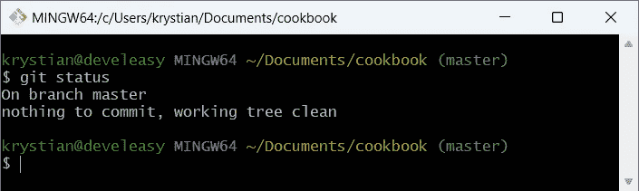

cookbook 目录与存储库相比没有变化

## 编辑食谱

除了豆芽之外，让我们添加一些蔬菜，例如鳄梨和西红柿。修改后的配方如下所示:

> 配料:
> - 1 卷
> -奶油芝士
> -芽菜
> - 1/2 个牛油果
> -3-4 个樱桃番茄
> 
> 准备:
> 将卷切成两半，在卷上抹上奶油芝士，铺上豆芽。
> 
> 将一个鳄梨在核周围切片，然后对半切开。因为我们只需要一半的鳄梨，用没有籽的那一半，另一半放在冰箱里。用勺子把鳄梨从皮里拔出来。把鳄梨和圣女果放在盘子里，放在面包卷旁边。为了带出鳄梨的味道，加入少许盐和新鲜磨碎的胡椒。

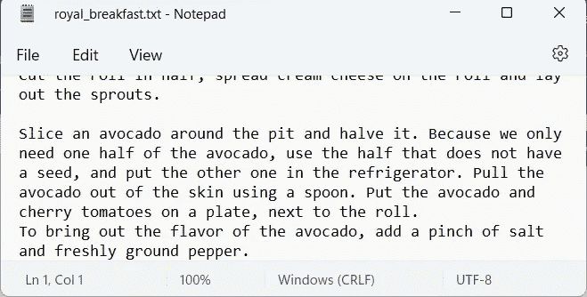

包含更多蔬菜的皇家早餐

## 保存配方后检查状态

一旦您完成了配方的编辑，并且保存了文件，Git 将会注意到文件已经被修改。

要检查 Git 是否有有趣的东西要说，可以使用你已经知道的命令，那就是`git status`。这一次，Git 告诉你`royal_breakfast.txt`被*修改了*，这意味着 Git 已经跟踪了这个文件，并且知道食谱发生了什么。

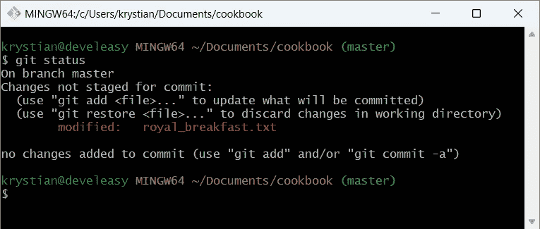

Git 显示配方被修改

## 食谱中有什么变化？

Git 提供的一个非常有用的命令是`git diff`，它向您显示文本文件中到底发生了什么变化。

`git diff`命令可用于几种情况，例如:

*   如果您修改了您的文件(例如在记事本中编辑了配方)，但是您还没有进行这些更改(因此您没有使用`git add`命令)，请使用不带参数的`git diff`，这将向您显示工作目录和*最后提交* 之间的**差异**
*   如果您修改了配方，并且您已经使用`git add`暂存了更改，使用`git diff --cached`，这将显示您暂存的更改和上次提交之间的**差异**

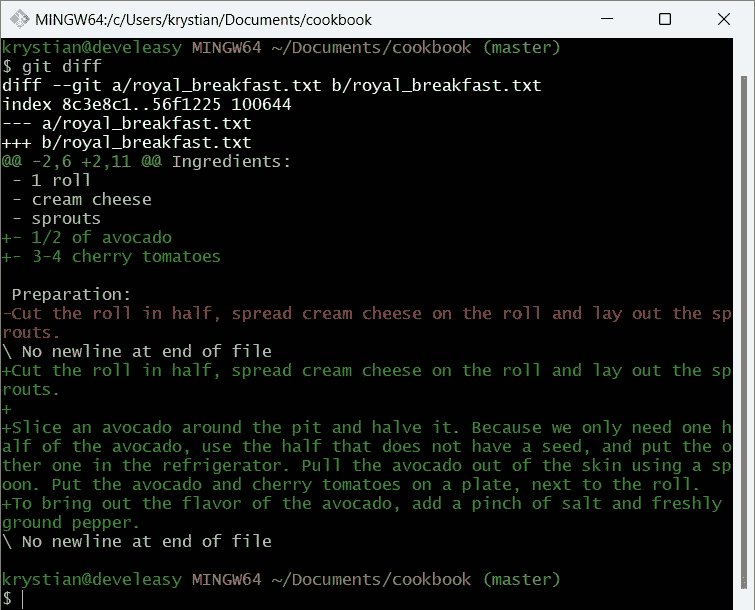

您可以使用“git diff”命令来验证确切的更改

## 向临时区域添加更改

我对菜谱中引入的修改很满意，所以是时候准备并提交这些修改了。

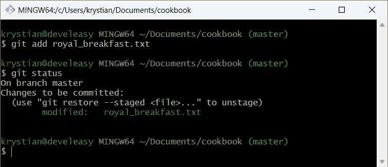

绿色突出显示的文件意味着它包含的更改将被提交

## 会犯什么事？

现在，我已经准备好了我想要提交的变更，所以`git status`用绿色突出显示了`royal_breakfast.txt`文件。但是，如果您想要仔细检查将提交哪些差异，该怎么办呢？

让我们再次进入`git diff`。如您所见，输出现在是空的，尽管更改正在索引/暂存区中等待下一次提交！

然而，如果我输入`git diff --cached`，diff 输出是正确的。

这种特殊情况只是`git diff`命令的一种特定行为，你必须记住，否则你会对正在发生的事情感到惊讶。

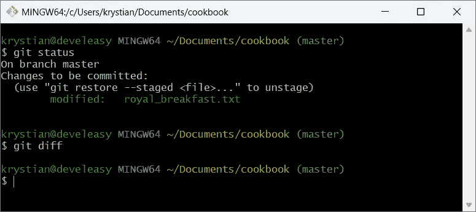

“git diff”命令在将更改移动到索引后没有显示任何差异

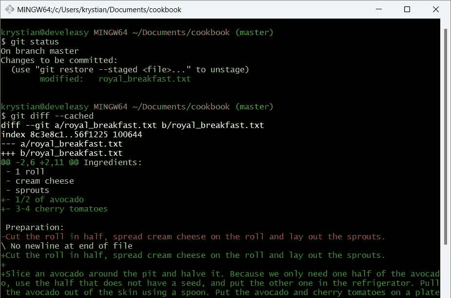

对“git diff”命令使用“cached”标志显示了在已经暂存更改后的差异

## 保存包含更多蔬菜的新快照

我们的变更被移动到临时区域，所以它们已经准备好提交了。输入`git commit -m "Add more vegetables"`，就这样—存储库有了我们早餐的另一个快照。

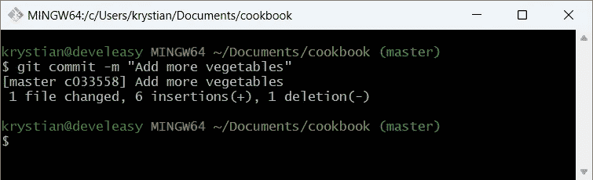

食谱中的另一个变化已提交

# 让我们添加更多的好东西！

早餐中我最喜欢的部分，是为我和我的妻子煎鸡蛋。好吧，我骗了你——比起炒鸡蛋，我更喜欢吃它们！

所以让我们加入皇家早餐的最后一部分，锦上添花:

> 配料:
> - 1 卷
> -奶油芝士
> -芽菜
> - 1/2 个牛油果
> -3-4 个樱桃番茄
> - 1/2 个洋葱
> -几片火腿
> - 2 个鸡蛋
> - 1 汤匙橄榄油
> 
> 准备:
> 将卷切成两半，在卷上抹上奶油芝士，铺上豆芽。
> 
> 将一个鳄梨在核周围切片，然后对半切开。因为我们只需要一半的鳄梨，用没有籽的那一半，另一半放在冰箱里。用勺子把鳄梨从皮里拔出来。把鳄梨和圣女果放在盘子里，放在面包卷旁边。
> 为了带出鳄梨的味道，加入少许盐和新鲜磨碎的胡椒。
> 
> 将洋葱切碎。在煎锅里，加热橄榄油，用中火煎洋葱一分钟。加入火腿，再煮一分钟。如果你像我一样，不是慕斯炒鸡蛋的粉丝，在把鸡蛋放进锅里之前不要搅拌它们——直接在锅里轻轻搅拌鸡蛋就行了。加入一撮盐。控制火候，不时轻轻搅动鸡蛋，防止粘锅。最后加入现磨的黑胡椒。
> 
> 尽情享受吧！

您可能已经猜到了，现在您应该将更改添加到临时区域(`git add`)，然后提交它们(`git commit`)。

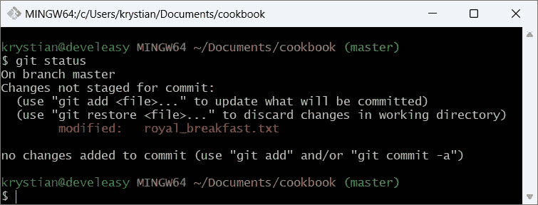

等待添加到临时区域的更多更改

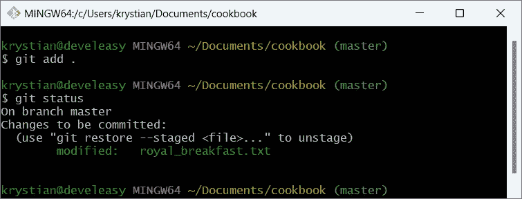

已将更改添加到临时区域

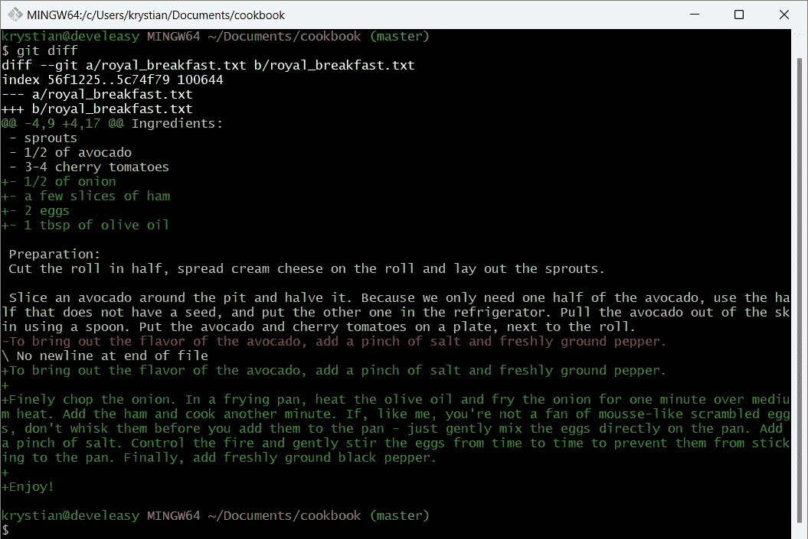

Git 显示这些变化与炒鸡蛋有关

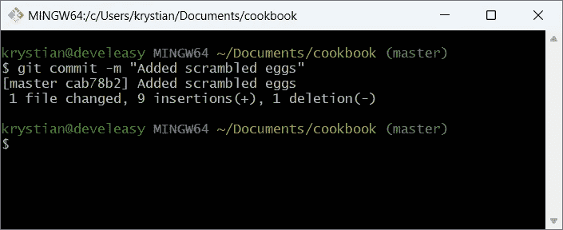

最后，皇家早餐也包括炒鸡蛋

# 辉煌的皇家早餐

终于，我可以享受我最喜欢的早餐了。但是，我不是在开头写了我将解释提交以及如何读取存储库的历史吗？

哦，是的，我会做到这一点，但在下一集，因为原来这篇文章已经成为像皇家早餐一样大。

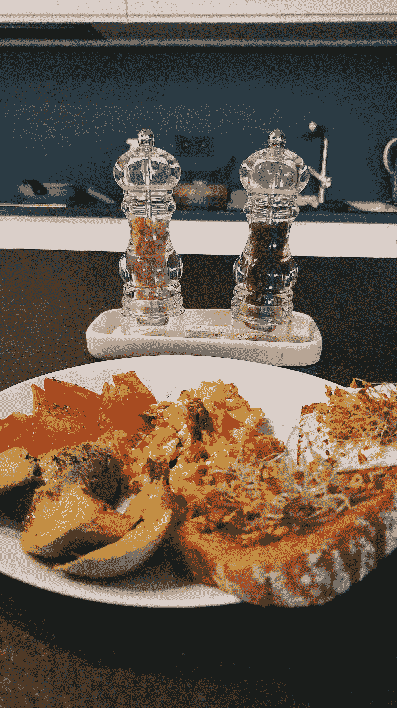

辉煌的皇家早餐

# 参考

[1]王南钧·什皮查考斯基，*如何开始用 Git 做饭(遇见 Git # 4)*[https://medium . com/codex/How-to-start-cooking-with-Git-Meet-Git-4-a 286 e4e 08109](/codex/how-to-start-cooking-with-git-meet-git-4-a286e4e08109)