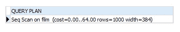
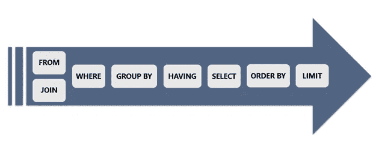

# 让你的查询更好

> 原文：<https://medium.com/codex/make-your-query-better-4c1ae9cc2b7e?source=collection_archive---------9----------------------->

## SQL 性能提示和技巧


伊恩·巴塔格利亚在 [Unsplash](https://unsplash.com?utm_source=medium&utm_medium=referral) 上拍摄的照片

SQL 代表结构化查询语言。这种查询语言允许您访问和操作数据库。

我们将执行不同的查询来获取所需的数据。

每一个应用程序或项目，甚至是一个小项目，都将其数据存储在一些数据库中。数据库很容易成为应用程序的性能瓶颈。

在本文中，我将介绍几种快速简单的方法，让您的查询更快。

在本文中，我假设您正在使用 PostgreSQL 数据库，但是所有这些技巧都可以在任何关系数据库中很好地执行，并且适用于 SQL 和数据库标准。

## **我们将在本文中看到的提示是:**

*   用**解释检查自己。**
*   SQL 子句**的执行顺序。**
*   表**分区**。
*   **索引**您的数据。
*   **窗口功能**。
*   特殊**数据类型**。

# 总是检查你的疑问

在编写完查询之后，甚至在开始修复 SQL 和表结构之前对一个有性能问题的旧查询进行处理，您可能想知道 DB 究竟是如何一步一步地运行这个查询的。

EXPLAIN 语句应该就是这样做的。EXPLAIN 语句返回 PostgreSQL 规划器为给定语句生成的执行计划。

该语句显示了如何通过索引扫描或顺序扫描来扫描表，以及使用了哪些表，将使用哪种连接算法，等等。

EXPLAIN 语句返回的一些有用数据是开始成本(在返回结果之前)、查询的总成本、扫描执行计划中每个阶段的估计行数以及这些行的加载大小。

*例如:*

```
EXPLAIN SELECT * FROM film;
```



简单扫描示例

```
EXPLAIN SELECT * FROM film WHERE film_id = 100;
```


简单扫描示例

# 提高性能的 SQL 执行顺序



条款执行顺序

SQL 有很多子句，每个子句执行不同的功能，例如:


子句命令表

子句函数以特定的顺序执行，并对到目前为止收集的数据执行。

为了获得更好的性能，我们希望在尽可能少的行上执行每个子句函数。

例如，我们希望在过滤后对数据进行排序，以便减少数据行的排序。


条款执行顺序

FROM 和 JOIN 首先执行，因为它们收集我们在查询中处理的整个数据集。然后 WHERE 子句应该过滤数据，只留给我们相关的数据。只有这样，我们才能选择并排序我们想要返回的数据。

# 对数据进行分区

您的表可以存储大量数据，并且非常大，但通常在大型表上，您只需要这些数据的特定部分。

让我们假设您有一个 GPS 跟踪表，并且您想每次只查询您所在城市的 GPS 轨迹，但仍然存储所有其他数据。在这种情况下，您的查询将加载所有的表，然后过滤数据，但是如果过滤器是经常使用的，并且表非常大，为什么我们每次都要加载整个表，对于这种情况，我们可以使用分区。

如果我们将表分割成分区，一个用于我们的城市，另一个用于其他城市，从现在起，每次运行查询时，它将只加载数据少得多的特定分区。


使用分区示例创建表


创建表分区示例

通过分区，DB 将一个大表分割成更小的物理块。

## **分区提供了几个好处:**

*   在某些情况下，通过减小索引大小，可以显著提高查询性能
*   当查询或更新经常(大量使用)使用单个分区时，可以通过利用对该分区的顺序扫描而不是访问整个表来提高性能。
*   批量加载和删除可以通过添加或删除分区来完成，比批量操作要快。这些命令(add partition 和 removing one)也完全避免了由批量删除导致的真空开销。
*   很少使用的数据可以迁移到更便宜、更慢的存储介质上(如 s3)。

# 索引您的数据

索引是提高数据库性能的常用方法。索引允许 DB 服务器更快地查找和检索特定的行。但是索引也会增加整个数据库系统的开销，所以应该明智地使用它们。

```
EXPLAIN SELECT * FROM film WHERE film_id = 100;
```

让我们来看一下这个查询，如果您在没有任何索引的情况下运行这个查询，DB 将逐行扫描整个电影表，以找到所有匹配的条目。

如果胶片台有许多行，效率可能会很低。

但是，如果您通过 film_id 列对表进行索引，DB 可能只在搜索树的几个级别中找到条目。

## **工作原理**

索引是选定列数据的副本，旨在实现高效搜索。索引通常包括指向被复制的原始数据行的链接，以便有效地检索该行。

没有索引的常规搜索是线性搜索，在一般情况下需要 O (n)，索引是一种提高查找性能的数据结构。有许多不同的数据结构可用于此目的，它们在许多方面都不同，并且可能具有不同的折衷，例如查找性能、索引大小和索引更新性能。这些数据结构中的许多被设计为 O (log (n))查找效率，并且在一些场景中，它们中的一些可能达到 O (1)性能。

# 窗口函数

窗口函数或分析函数是使用一行或多行中的值为每一行返回值的函数。

另一方面，聚合函数(如 group by 和 sum)会为多行返回一个值。

## **何时使用**

当您需要对数据执行一些聚合，但仍必须扫描整行以进行更多分析或显示时。

如果您尝试使用常规聚合函数进行这种操作，您将不得不使用子查询来再次扫描数据，这将损害查询性能并使其更加复杂。

让我们来看一个简单的窗口函数，它可以帮助我们将员工的工资与其所在部门的平均工资进行比较

```
**SELECT** depname, empno, salary, avg(salary) **OVER** (**PARTITION** **BY** depname) **FROM** empsalary;
```

**OVER** 关键字向我们揭示了这是一个窗口函数。

该查询的结果将是:


窗口函数结果示例

窗口函数在聚集之后被评估。

# 特殊数据类型

在本节中，我们将了解一些数据类型，如果您正确对待它们，您将获得更好的性能和更好的功能。

## **地理:**

当涉及到地理数据时，您需要做的就是存储点的集合，您甚至可以将它存储为包含此数据的文本或 JSON，但这样会损害您的性能，并且您会失去许多功能。

对于这种情况，每个现代数据库都有一个特殊的 geo 类型，可以索引点数据以获得更好的性能，并允许您使用 geo libs 实现复杂的功能，如联合、计算面积等。

在 PostgreSQL 中，您将使用点/线/面数据类型，并且可能会添加 PostGIS 扩展。

## **JSON:**

将 JSON 存储在数据库中有时会很有帮助或者很有必要。很多时候，作为开发人员，我们将 JSON 数据作为字符串/文本，但是当涉及到将它存储在 DB 中时，这不是最好的方法。

每个现代数据库都有一个特殊的 JSON 数据类型，支持 JSON 的索引和压缩，甚至支持查询 JSON 中的嵌套对象。

例如，在 PostgreSQL 中，您可以将 JSON 数据存储为文本数据类型，但您无法查询该 JSON 中的嵌套属性，您可以将其存储为 JSON 数据类型，但它不会压缩和索引，这可能会损害您的性能并填满您的存储，在 PostgreSQL 中存储 JSON 数据的最佳方式是在 JSONB 数据类型中，它包含所有功能、索引、压缩和查询嵌套属性。

# 简单地

数据库和 SQL 查询是任何现代应用程序的主要业务的一部分，现在任何应用程序都必须具有出色的性能。在这篇文章中，我们来看看一些让你的查询更快的方法。

最重要的部分是了解您的查询和数据库，未知的查询和错误配置可能会导致性能问题。

希望你喜欢阅读这篇文章，它将帮助你写更好的代码，并使你的更好。