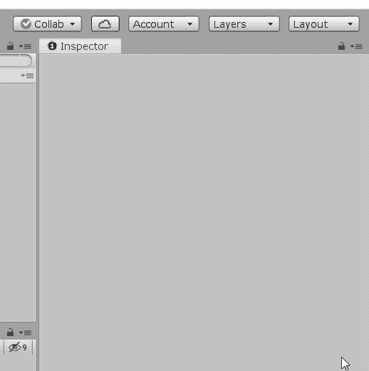
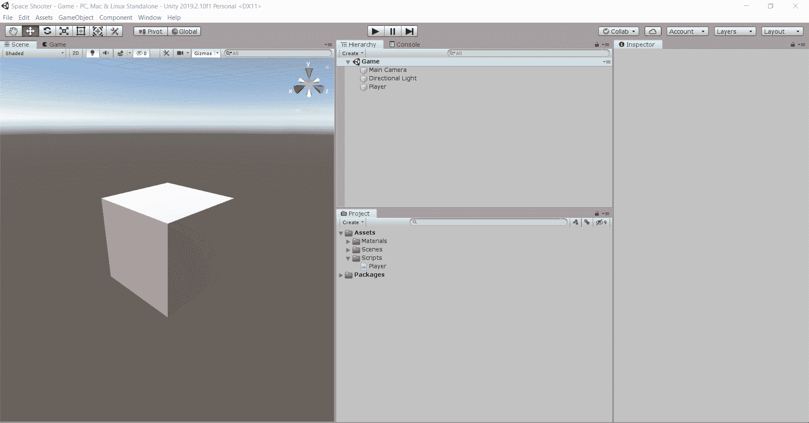
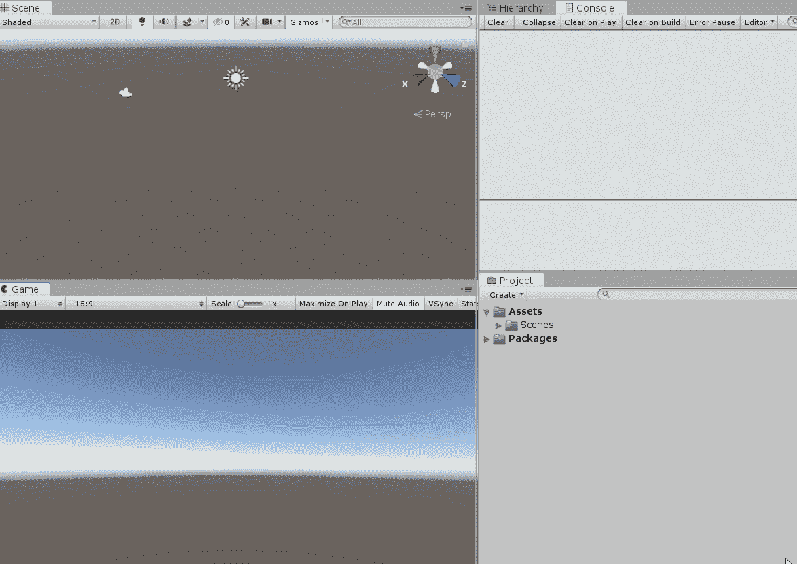
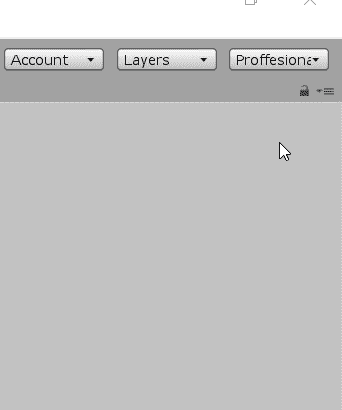

# 通过 4 个简单的步骤提高 Unity 编辑器的工作效率

> 原文：<https://medium.com/codex/make-your-unity-editor-more-productive-in-3-simple-steps-a9451c3694a3?source=collection_archive---------18----------------------->

# 专业的布局造就专业的游戏

Unity 编辑器是你的主要工作空间，布局定义了如何在其中组织事物，以及如何简化(或损害)其功能的可访问性。建议根据您的个人便利或您正在处理的项目类型来定制您的编辑器。今天我将向你展示一个最有成效的布局。

1.  首先选择高布局

2.拖动游戏视图并将其停靠在场景下方，确保向上拖动游戏窗口以匹配项目部分的高度。

3.拖动控制台窗口，然后将其停靠在游戏视图旁边。

4.用您选择的任何名称保存新布局。

添加的修改有助于您主动查看场景中所做的更改如何反映在游戏视图中。这不仅可以节省你在两者之间来回切换的时间，还可以确保你在场景中所做的一切对你的游戏来说都是明智的。