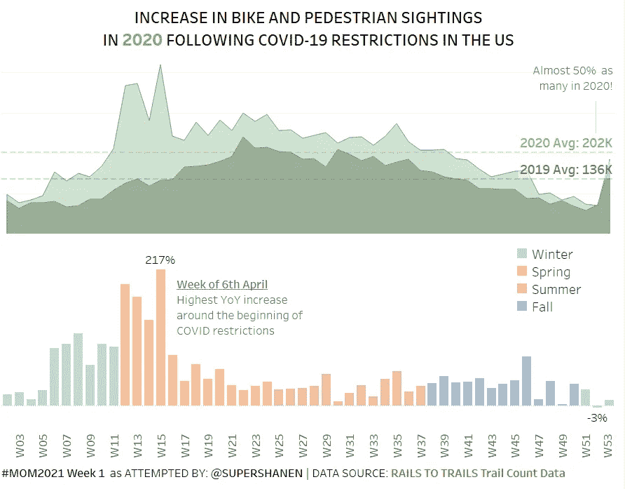

# 让我们来拍桌子:COVID 期间的自行车和行人景观

> 原文：<https://medium.com/codex/makeovermonday2021-bicycle-boom-6ca868f99227?source=collection_archive---------16----------------------->

[*视图上的 Tableau 公共*](https://public.tableau.com/views/BicycleBoom2020_16172139702350/BicycleBoomUS?:language=en-GB&:display_count=y&publish=yes&:origin=viz_share_link) *为互动版|* [*数据源*](https://drive.google.com/file/d/1ZHAw10Qy5c7c4GEGxFe_-2l5T-uRPzSX/view) *为* [*轨为步道*](https://www.railstotrails.org/COVID19/#trailcount)

这是我周一 2021 W1 的改造尝试，尽管对派对来说已经很晚了。

**我希望 viz 简单指出的主要内容:**

1.  面积图—每周观察次数的高级汇总趋势视图，介于…