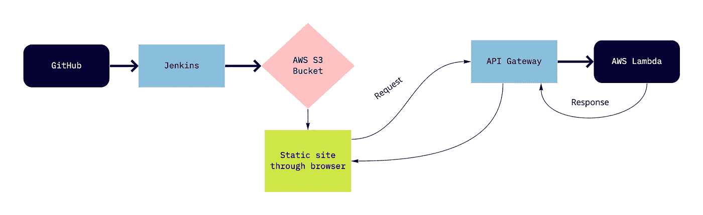
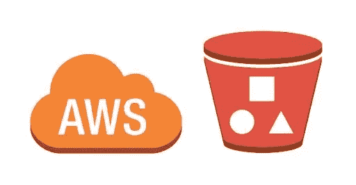
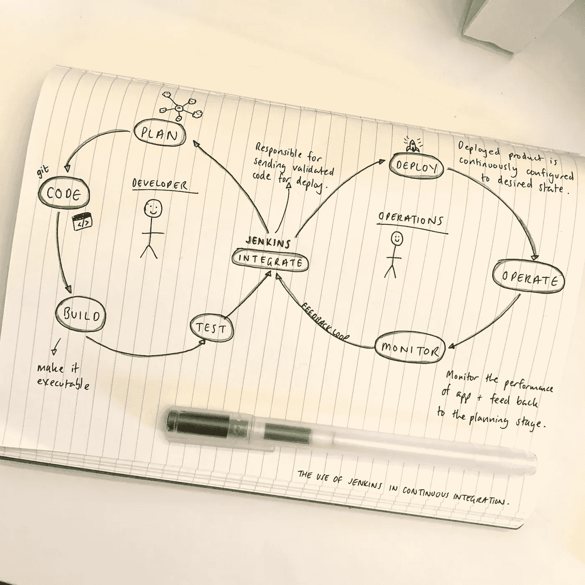
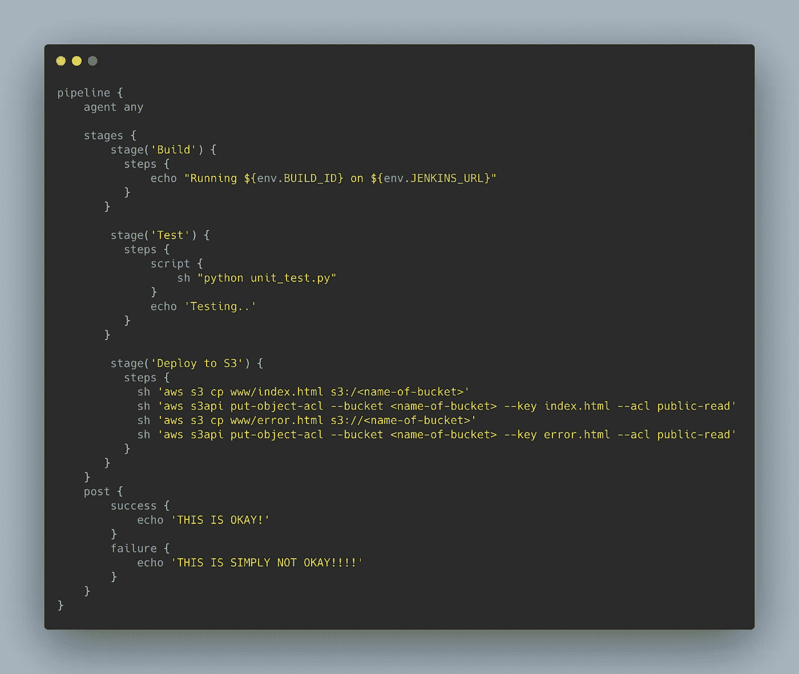
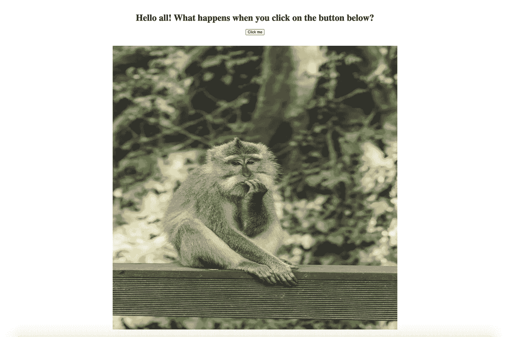
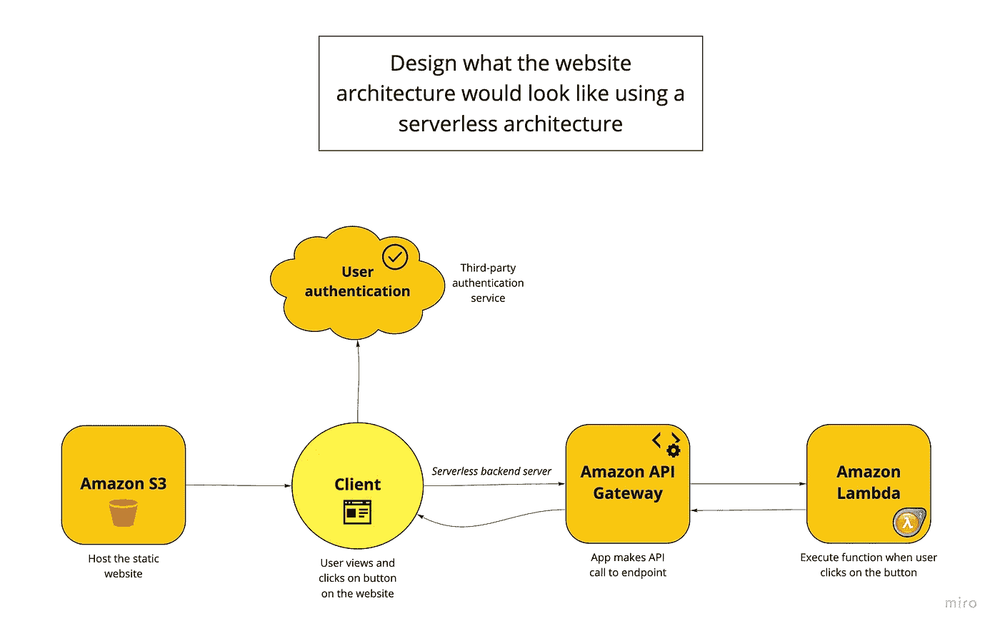
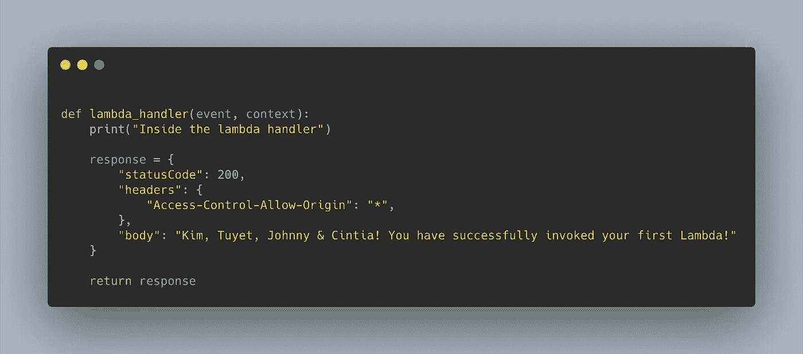
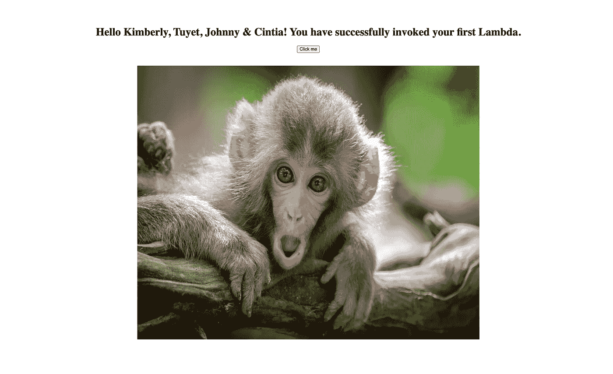

# 制造商 DevOps Bootcamp:第 2 周— CI/CD、无服务器和更多 AWS

> 原文：<https://medium.com/codex/makers-devops-bootcamp-week-2-building-our-first-serverless-ci-cd-with-jenkins-and-aws-f2e9f8210031?source=collection_archive---------7----------------------->

## [法典](http://medium.com/codex)

*(我的三国志之一* [*此处*](https://tuyet-le.medium.com/makers-devops-bootcamp-week-1-devops-containers-and-aws-elastic-beanstalk-601ce285c616) *)。)*

[Billy Huynh](https://unsplash.com/@billy_huy?utm_source=unsplash&utm_medium=referral&utm_content=creditCopyText) 在 [Unsplash](/s/photos/clouds?utm_source=unsplash&utm_medium=referral&utm_content=creditCopyText) 上拍摄的照片

我们开始了第二周，直接投入到新的每周团队项目中，目标是:

*   使用 AWS S3 桶托管静态网站应用程序；
*   使用 Jenkins 构建我们的第一个 CI/CD 管道；
*   用 AWS Lambda 和 Amazon API Gateway 部署静态网站；
*   成为比前一天更好的 DevOps 工程师；
*   为了开心！

到本周末，我们应该有一个简单的部署在 AWS 上的无服务器网站。

AWS 生态系统非常庞大，因此我很高兴能够了解更多关于其他 AWS 服务和持续集成(CI)以及持续交付/部署(CD)的信息，这是您在 DevOps 和现代软件开发实践中经常听到的。

# CI/CD 概述

CI/CD 是构成 DevOps 基础架构的实践，使工程师能够更快地交付软件和更高质量的代码。

## 海峡群岛

CI 是 DevOps 生命周期中的重要一步。由于自动化测试的帮助，这是一个频繁地将开发人员的代码变更合并到共享存储库中的过程。当开发人员发出一个合并请求时，它会触发一个管道，该管道会在合并到存储库之前自动构建、测试和验证代码更改。将测试自动化作为 CI 解决方案的一部分，有助于更快地识别错误，并确保更高质量的构建。

## 激光唱片

CD 将 CI 验证的代码部署到应用程序中。连续交付通常与连续部署互换使用。两者之间的细微差别在于，连续交付将代码部署到一个阶段环境中，在应用程序交付给客户之前，团队成员可以在这个环境中对其进行试验。另一方面，连续部署会自动将代码直接部署到生产环境中。

# 创建亚马逊 S3 桶

项目时间！

在创建我们的第一个 CI/CD 管道解决方案之前，我们首先需要在 AWS 上创建一个 S3 桶，并将其配置为托管我们的静态网站。

AWS S3 铲斗

## 亚马逊 S3 桶到底是什么？

这是亚马逊提供的一种简单的对象存储服务，用于存储和保护不同用例的数据，如图像、文本文件、网站、移动应用程序等。它最常用于托管静态网站，通常包含在应用部署的自动化管道中，并直接托管在 S3 桶上。

幸运的是，我们的教练提供了一个简单的应用程序，其中有一个简单的 HTML 文件供我们使用，所以我们不需要花时间建立一个网站，让我们专注于本周的主要目标。

# 在 AWS 上设置 Jenkins

一旦我们创建了我们的 S3 bucket，就应该学习流行的 CI 工具 Jenkins，用它来构建我们的 CI/CD 管道，并在 AWS 远程服务器上设置它。

## 詹金斯是什么？

Jenkins 管理所有类型的自动化，包括软件构建、应用测试和部署。为了帮助想象詹金斯如何在 CI/CD 中发挥作用，我涂鸦了这个流程(为贴纸图道歉😅).

Jenkins 的 CI/CD 渠道

# 创建 Amazon EC2 实例并在其上安装 Jenkins

将 Jenkins 设置到 AWS 远程服务器(也称为 EC2 实例)上，需要花费大量的时间和研究来理解和实现。关于如何在 AWS 上安装 [Jenkins 的 Jenkins 文档是我们使用的一个很好的资源，它清楚地分解了各个步骤。](https://www.jenkins.io/doc/tutorials/tutorial-for-installing-jenkins-on-AWS/)

下面是我们在 AWS 管理控制台上使用 Jenkins 设置 EC2 实例的步骤概述:

1.  创建一个密钥对— *这将创建一组由公钥和私钥组成的安全凭证，用于在连接到 EC2 实例时证明您的身份*
2.  创建一个安全组— *这为 EC2 实例创建了一个虚拟防火墙来控制传入和传出的流量*
3.  启动 EC2 实例
4.  从命令行使用 SSH 连接到 EC2 实例
5.  下载 Jenkins 并将其安装到 EC2 实例上
6.  通过安装推荐的插件来配置现在安装在 EC2 实例上的 Jenkins，将其连接到我们的 Github 存储库，并为所有团队成员设置访问 Jenkins 的用户权限*(注意:我们为所有团队成员使用了相同的密钥对凭证)*

完成这些步骤后，我们能够让 Jenkins 处理我们的 EC2 实例了！

# 构建我们的 CI/CD 渠道(Jenkinsfile 和 Webhooks)

您现在可能想知道，我们的 Jenkins 实例如何知道开发人员何时更新了存储库？输入… Webhooks！

Webhooks 允许您设置集成，以便在某些事件被触发时为其他应用程序提供实时信息。因此，在我们的例子中，当我们的一个团队成员向存储库发出一个 push 或 merge pull 请求时，webhook 会向我们的 Jenkins 实例发送一个 HTTP POST 请求。这将自动触发 Jenkins 实例上的 CI 构建作业。

## 詹金斯文件

我们通过在 Jenkinsfile 中编写脚本来定义我们的管道。Jenkinsfile 是用 *groovy* 编写的文本文件(多么有趣的名字！)创建在项目的根目录中。

我们实现了一个非常基本的三阶段连续交付管道——构建、测试和部署——用一个脚本分别打印构建的 ID、运行单元测试和将 HTML 文件部署到我们的 S3 存储桶。

我们用 grooovy 编写的非常简单的管道

这些阶段是按顺序执行的，因此如果我们的单元测试失败，管道将不会进入部署阶段。

经过大量的配置和测试管道中的不同脚本，我们的 HTML 文件成功部署了！🎉

主页

# 使用 AWS Lambda 实现无服务器

最后一步是让按钮改变猴子图像和文本。目前，该按钮在点击时不做任何事情。

我们了解到，我们可以用 AWS Lambda 设置这一功能，这是一种无服务器服务，允许您基于传入的请求或事件运行代码。包括 AWS Lambda 在内的许多无服务器解决方案的一个巨大优势是它支持事件触发器，这使得它非常适合管道。

我们召开了一个研讨会，讨论无服务器架构是什么样子，以及亚马逊 S3 如何与亚马逊 API Gateway 和亚马逊 Lambda 合作来实现这一点

除去上图中的用户认证部分，设置 Amazon API 网关和 Amazon Lambda 是创建无服务器网站的最后一部分。

我们创建了一个 Lambda 函数，在用户点击按钮时改变 HTML 主体的文本。

我们用 Python 写的 Lambda 函数

为了让 S3 桶在用户点击按钮时调用 Lambda 函数，我们首先在 AWS 上的 Lambda 控制台中配置了 S3 触发器，使其能够通过 API 网关发送事件通知。下一步是在 Amazon API Gateway 中设置一个 HTTP API，并在我们的 HTML 文件中添加端点 URL，以便将请求正确地发送给 Lambda 函数，并将函数的响应返回给客户端。

瞧啊。我们的按钮现在工作了——它显示新的文本和猴子照片！

# 反射

AWS 生态系统是巨大的，了解管道实际上是如何工作的是令人兴奋的🤯

我喜欢了解更多关于其他流行的 AWS 服务，包括 Lambda、EC2 和 S3 bucket，并看到它们如何在虚拟服务器上协同工作来托管一个简单的网站。

在我们开始构建我们的管道之前，在设置和配置 Jenkins 上花费了很多步骤和时间，所以在接下来的一周，看看使用另一个流行的 CI 工具 Github Actions 与使用 Jenkins 有何不同将是很有趣的。