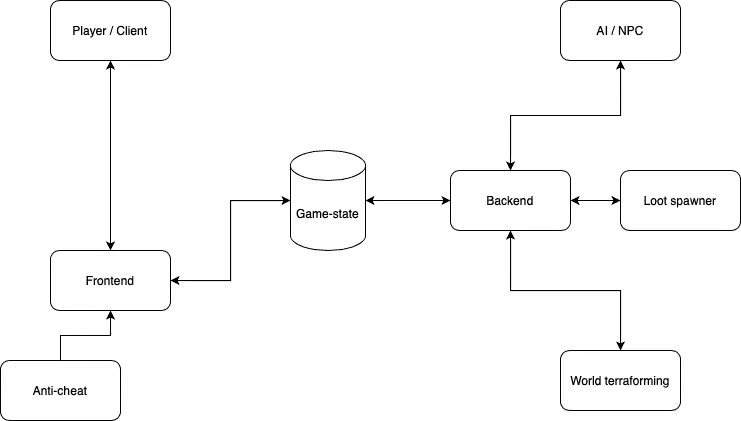
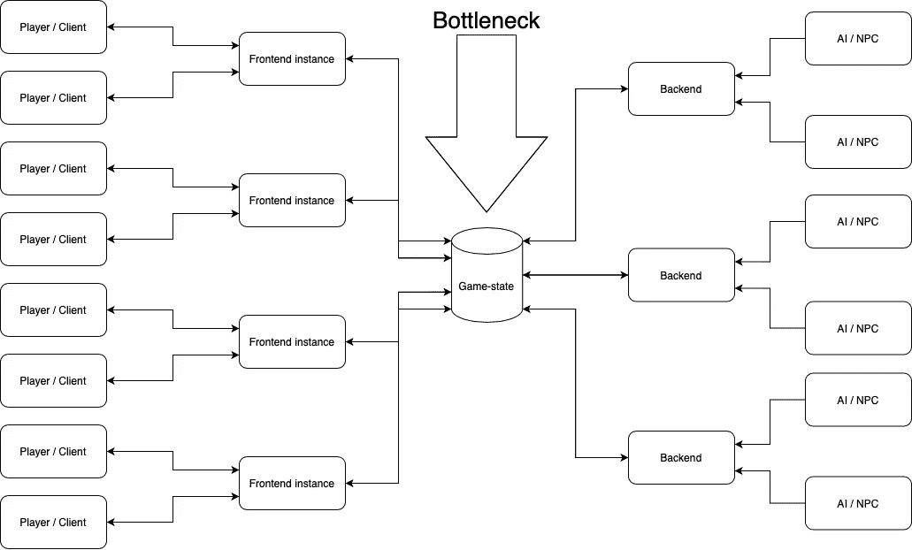

# 服务器结构——从零开始制作 MMO

> 原文：<https://medium.com/codex/making-a-mmo-from-scratch-the-server-structure-65ba6111b67f?source=collection_archive---------7----------------------->

我着迷于 MMO 的，但从来没有真正发挥他们之前。我玩过一些 PlanetSide 2，但那差不多涵盖了我对 MMO 的所有了解。

我躺在床上思考一个游戏服务器如何处理大量的玩家，以及限制因素会是什么(这是一个入睡的好方法)。当我醒来时，这个想法仍然停留在我的脑海中，所以我决定在 MMO 服务器上读一点东西，这时候我决定做一个 MMO。

现在我不知道我想做什么游戏，但是一些服务器的东西很普通，所以为什么不从那里开始呢。

希望不是运行我们 MMO 服务器所需的服务器机房…

就像我说的，我没有任何编写 MMO 服务器的经验，事实上，除了标准的 HTTP 服务器，我没有任何编写任何类型的 TCP/UDP 服务器的经验。首先，我想开发一个小词典来描述服务器的不同部分。

服务器将被分成 3 个部分(将来可能会更多？).服务器的 3 个部分被称为**前端****后端**和**游戏状态**。

**前端**是客户端连接的地方，它包含 UDP 和 TCP 连接，以及反欺骗逻辑。前端要么直接更新游戏状态，要么向后端发送信息。当游戏状态发生变化时，更新客户端也是前端的工作。

**后端**包含了所有的游戏逻辑。当一个敌人被杀死时，它会产生战利品。它运行所有的 NPC/人工智能，并确保草生长和太阳移动。所有需要几百毫秒以上计算的东西都应该在后台运行。

**游戏状态**包含每个玩家、树、鱼或飞船的所有信息。游戏中的任何东西都处于游戏状态。游戏状态也可以用于在前端和后端之间，以及一个前端实例和其他实例之间推送消息。

游戏服务器(现在)

“这怎么这么巧？”你可能会问。这是因为它可以利用横向扩展来适应巨大的玩家基础…至少在理论上…

这个想法是，当玩家基数增长时，前端服务器的数量也会增长，如果后端被推得太远，也很容易扩展。最难衡量的是游戏状态。只有当所有后端实例和所有前端实例的游戏状态都相同时，水平缩放才有效。

正如你在上面看到的，当更多的玩家连接时，我们可以实例化新的前端实例，当这些新玩家开始与 NPC 互动时，我们可以实例化更多的后端实例。我们无法衡量的是游戏状态。游戏状态可以简单地是一个 MySQL 数据库，但是因为很难扩展游戏状态，所以我们选择一个能够处理不同类型的压力的数据库是很重要的。

数据库应该能够:

*   处理很多关系。
*   处理某种发布/订阅结构。
*   处理快速读写。
*   尽可能扩大规模。

如果我们看起来像一个普通的 SQL 数据库，许多连接和 Pub/Sub 结构将会丢失(在大多数情况下),而且对普通数据库的读写(相对)很慢。这部分是由于大多数普通数据库读写磁盘。我们需要的是一个**内存数据库**。当数据存储在内存中时，读写速度要快得多。大多数内存数据库都有某种方法来扩展它们，而不只是向它们投入更多的计算。一种方法是使用读从节点，它总是与主节点保持同步。这使得在主节点上阅读更容易，主节点可以专注于写作。内存数据库的问题是它们有点贵，尤其是当我们有大量数据存储在内存中的时候。在电源故障或系统崩溃的情况下，这可能导致数据丢失。

现在我们来看看球员的移动。

当玩家想要前进时，前端只需返回玩家的新位置，并更新游戏状态。游戏状态更新后，连接到前端实例的所有其他客户端都会收到一个包含新玩家实体位置的 UDP 数据包。然后后端会查看这个新的玩家位置，并检查玩家是否踩到了地雷(或类似的东西)。如果是这种情况，游戏状态将再次更新，一个新的数据包将被发送到所有监听客户端，他们应该会显示一个爆炸。简单的柠檬榨汁机…

1.  玩家移动。
2.  前端更新游戏状态。
3.  游戏状态推送新的数据实例。
4.  前端实例更新它们连接的客户端。
5.  后端实例检查地雷和更新游戏状态。
6.  游戏状态更新实例。
7.  前端实例更新客户端发送爆炸。

每一步都是异步处理，由不同的实例处理。这意味着没有数据被保留等待新的信息。当玩家移动时，客户端在步骤 2 接收新玩家信息。在步骤 4，其他玩家接收新玩家信息。这应该让游戏至少可以玩…

现在剩下要做的就是实施它…