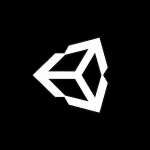

# 制作 RTS 游戏#39:提升我们的游戏场景(Unity/C#)

> 原文：<https://medium.com/codex/making-a-rts-game-39-boosting-our-game-scene-unity-c-bab128549317?source=collection_archive---------4----------------------->

## 让我们继续努力我们的 RTS:今天，我们将改善我们的游戏场景！

[*⬅️教程#38:用工人建造 3/3*](/codex/making-a-rts-game-38-using-workers-to-construct-buildings-3-3-unity-c-1469f08adb76)*|*[*TOC*](https://mina-pecheux.medium.com/making-an-rts-game-in-unity-91a8a0720edc)*|*[*教程#40:搞定我们的小地图➡️*](https://mina-pecheux.medium.com/making-a-rts-game-40-fixing-our-minimap-unity-c-dd3f46c8cfb4)

*📕* [*获取 Gumroad 上的电子书和奖励资料！*](https://mpecheux.gumroad.com/l/rrylr)🚀 [*在我的 Github 上找到这个教程系列的代码！*](https://github.com/MinaPecheux/UnityTutorials-RTS)

